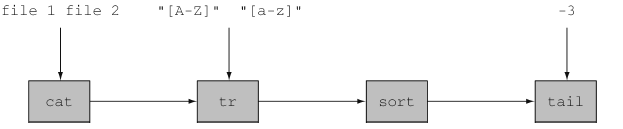
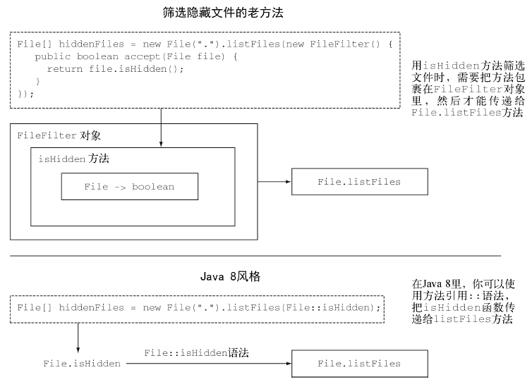
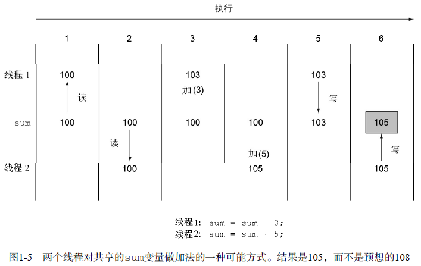
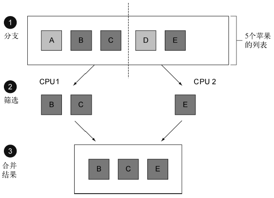

# 为什么要关心 Java 8 #

助记：

	//Java8主要有哪些新特性？

	//1.Stream API 2.接口的默认实现 3.方法晋升一级公民
	inventory.stream().filter((Apple a) -> a.getWeight() > 150)
				.collect(toList());

[1.Java 怎么还在变](#java怎么还在变)

[1.1.Java 在编程语言生态系统中的位置](#java在编程语言生态系统中的位置)

[1.2.流处理](#流处理)

[1.3.用行为参数化把代码传递给方法](#用行为参数化把代码传递给方法)

[1.4.并行与共享的可变数据](#并行与共享的可变数据)

[1.5.Java 需要演变](#java需要演变)

[2.Java 中的函数](#java中的函数)

[2.1.方法和Lambda 作为一等公民](#方法和lambda作为一等公民)

[2.2.传递代码：一个例子](#传递代码一个例子)

[2.3.从传递方法到Lambda](#从传递方法到lambda)

[3.流](#流)

[3.1.多线程并非易事](#多线程并非易事)

[4.默认方法](#默认方法)

[5.来自函数式编程的其他好思想](#来自函数式编程的其他好思想)

在Java 8之前：

	//对inventory中的苹果按照重量进行排序
	Collections.sort(inventory, new Comparator<Apple>() {
		public int compare(Apple a1, Apple a2){
			return a1.getWeight().compareTo(a2.getWeight());
		}
	});

在Java 8之后：

	//给库存排序，比较苹果重量，读起来言简意赅
	inventory.sort(comparing(Apple::getWeight));

Java 8 新特性：

- Stream API
- 向方法传递代码的技巧
- 接口中的默认方法

Java 8提供了一个新的API（称为“流”，Stream），它支持许多处理数据的并行操作，**其思路和在数据库查询语言中的思路类似**——用更高级的方式表达想要的东西，而由“实现”（在这里是Streams库）来选择最佳低级执行机制。这样就可以避免用synchronized编写代码，这一代码不仅容易出错，而且在多核CPU上执行所需的成本也比你想象的要高。(更高效利用多核CPU)

从有点修正主义的角度来看，在Java 8中加入Streams可以看作把另外两项**扩充**加入Java 8的直接原因：把**代码传递给方法的简洁方式**（方法引用、Lambda）和**接口中的默认方法**。

如果仅仅“**把代码传递给方法**”看作Streams的一个结果，那就低估了它在Java 8中的应用范围。它提供了一种新的方式，这种方式简洁地表达了行为参数化。比方说，你想要写两个只有几行代码不同的方法，那现在你只需要把不同的那部分代码作为参数传递进去就可以了。采用这种编程技巧，代码会**更短、更清晰**，也比常用的复制粘贴更不容易出错。

Java 8里面将**代码传递给方法的功能**（同时也能够返回代码并将其包含在数据结构中）还让我们能够使用一整套新技巧，通常称为**函数式编程**。一言以蔽之，这种被函数式编程界称为函数的代码，可以被来回传递并加以组合，以产生强大的编程语汇。

## Java 怎么还在变 ##

### Java 在编程语言生态系统中的位置 ###

略

### 流处理 ###

流是一系列数据项，一次只生成一项。程序可以从输入流中一个一个读取数据项，然后以同样的方式将数据项写入输出流。一个程序的输出流很可能是另一个程序的输入流。

举一个例子：Unix的cat命令会把两个文件连接起来创建一个流，tr会转换流中的字符，sort会对流中的行进行排序，而tail -3则给出流的最后三行。Unix命令行允许这些程序通过管道（|）连接在一起，命令如下

	cat file1 file2 | tr "[A-Z]" "[a-z]" | sort | tail -3

基于这一思想，Java 8在java.util.stream中添加了一个Stream API；Stream<T>就是一系列T类型的项目。你现在可以把它看成一种比较花哨的迭代器。Stream API的很多方法可以链接起来形成一个复杂的流水线，就像先前例子里面链接起来的Unix命令一样。

推动这种做法的关键在于，现在你可以在一个更高的抽象层次上写Java 8程序了：**思路变成了把这样的流变成那样的流**（就像写数据库查询语句时的那种思路），**而不是一次只处理一个项目**。另一个好处是，Java 8可以透明地把输入的不相关部分拿到几个CPU内核上去分别执行你的Stream操作流水线——**这是几乎简单易行的并行**，用不着去费劲搞Thread了

### 用行为参数化把代码传递给方法 ###

将 方法当作参数传入 方法

Java8前只能传基本类型，对象类型，不能单纯存入方法

### 并行与共享的可变数据 ###

一般情况下这就意味着，写代码时不能访问共享的可变数据。这些函数有时被称为“**纯函数**”或“**无副作用函数**”或“**无状态函数**”，

并行只有在假定你的代码的多个副本可以独立工作时才能进行。但如果要写入的是一个共享变量或对象，这就行不通了：**如果两个进程需要同时修改这个共享变量怎么办？**

**Java 8的流实现并行比Java现有的线程API更容易**，因此，尽管可以使用synchronized来打破“不能有共享的可变数据”这一规则，但这相当于是在和整个体系作对，因为它使所有围绕这一规则做出的优化都失去意义了。**在多个处理器内核之间使用synchronized，其代价往往比你预期的要大得多**，因为同步迫使代码按照顺序执行，而这与并行处理的宗旨相悖。

这两个要点（没有共享的可变数据，将方法和函数即代码传递给其他方法的能力）是**函数式编程范式**的基石。与此相反，在**命令式编程范式**中，你写的程序则是一系列改变状态的指令。

“不能有共享的可变数据”的要求意味着，一个方法是可以通过它将参数值转换为结果的方式完全描述的；换句话说，它的行为就像一个数学函数，没有可见的副作用。

### Java 需要演变 ###

你之前已经见过了Java的演变。例如，引入**泛型**，使用List<String>而不只是List，可能一开始都挺烦人的。但现在你已经熟悉了这种风格和它所带来的好处，即在编译时能发现更多错误，且代码更易读，因为你现在知道列表里面是什么了。

其他改变让普通的东西更容易表达，比如，使用**for-each循环**而不用暴露Iterator里面的套路写法。

Java 8中的主要变化反映了它开始远离常侧重改变现有值的经典**面向对象思想**，而向**函数式编程领域**转变，在大面上考虑**做什么**（例如，创建一个值代表所有从A到B低于给定价格的交通线路）被认为是头等大事，并和**如何实现**（例如，扫描一个数据结构并修改某些元素）区分开来。

**请注意**，如果极端点儿来说，传统的面向对象编程和函数式可能看起来是冲突的。但是我们的理念是获得两种编程范式中最好的东西，这样你就有更大的机会为任务找到理想的工具了。（取长补短）

**语言需要不断改进以跟进硬件的更新或满足程序员的期待**。要坚持下去，Java必须通过增加新功能来改进，而且只有新功能被人使用，变化才有意义。所以，使用Java 8，你就是在保护你作为Java程序员的职业生涯

## Java 中的函数 ##

编程语言中的函数一词通常是指方法，尤其是静态方法；这是在数学函数，也就是没有副作用的函数之外的新含义。

Java 8中新增了函数——值的一种新形式。有了它，Java 8可以进行多核处理器上的并行编程

**想想Java程序可能操作的值吧**。首先有原始值，比如42（int类型）和3.14（double类型）。其次，值可以是对象（更严格地说是对象的引用）。获得对象的唯一途径是利用new，也许是通过工厂方法或库函数实现的；对象引用指向类的一个实例。例子包括"abc"（String类型），new Integer(1111)（Integer类型），以及new HashMap<Integer,String>(100)的结果——它显然调用了HashMap的构造函数，甚至数组也是对象。

**编程语言的整个目的就在于操作值**，要是按照历史上编程语言的传统，这些值因此被称为一等值（或**一等公民**，这个术语是从20世纪60年代美国民权运动中借用来的）

编程语言中的其他结构也许有助于我们表示值的结构，但在程序执行期间不能传递，因而是**二等公民**（Java中如方法和类等）.

用方法来定义类很不错，类还可以实例化来产生值，但方法和类本身都不是值。这又有什么关系呢？

人们发现，在运行时传递方法能将方法变成一等公民。这在编程中非常有用，因此Java 8的设计者把这个功能加入到了Java中。

### 方法和Lambda 作为一等公民 ###

Scala和Groovy等语言的实践已经证明，让方法等概念作为一等值可以扩充程序员的工具库，从而让编程变得更容易。

**Java 8的第一个新功能是方法引用**

[MethodArgument](MethodArgument.java)

Java 8 之前：

	File[] hiddenFiles = new File(".").listFiles(new FileFilter() {
		public boolean accept(File file) {
			return file.isHidden();
		}
	});

Java 8 之后：

	File[] hiddenFiles = new File(".").listFiles(File::isHidden);

Java 8的方法引用::语法（即“把这个方法作为值”）将其传给listFiles方法，也开始用函数代表方法了。一个好处是，你的代码现在读起来更接近问题的陈述了。方法不再是二等值了。

与用对象引用传递对象类似（对象引用是用new创建的），在Java 8里写下File::isHidden的时候，创建了一个方法引用，同样可以传递它

---

**Lambda——匿名函数**

除了允许（命名）函数成为一等值外，Java 8还体现了更广义的将函数作为值的思想，包括Lambda（或匿名函数）。比如，你现在可以写(int x) -> x + 1，表示“调用时给定参数x，就返回x + 1值的函数”。

你可能会想这有什么必要呢？因为你可以在MyMathsUtils类里面定义一个add1方法，然后写MyMathsUtils::add1嘛！确实是可以，但要是你没有方便的方法和类可用，新的Lambda语法更简洁。

### 传递代码：一个例子 ###

[FilteringApples](FilteringApples.java)

**需求**：

假设你有一个Apple类，它有一个getColor方法，还有一个变量inventory保存着一个Apples的列表。你可能想要选出所有的**绿苹果**，并返回一个列表。

Java 8之前的写法：

	public static List<Apple> filterGreenApples(List<Apple> inventory) {
		List<Apple> result = new ArrayList<>();
		for (Apple apple : inventory) {
			if ("green".equals(apple.getColor())) {
				result.add(apple);
			}
		}
		return result;
	}

---

**另一个新需求**

可能想要选出重量超过150克的苹果

	public static List<Apple> filterHeavyApples(List<Apple> inventory) {
		List<Apple> result = new ArrayList<>();
		for (Apple apple : inventory) {
			if (apple.getWeight() > 150) {
				result.add(apple);
			}
		}
		return result;
	}

上面有代码重复，重构的气味出现

---

Java 8会把条件代码作为参数传递进去，这样可以避免filter方法出现重复的代码

	public static boolean isGreenApple(Apple apple) {
		return "green".equals(apple.getColor());
	}

	public static boolean isHeavyApple(Apple apple) {
		return apple.getWeight() > 150;
	}

	public static List<Apple> filterApples(List<Apple> inventory, java.util.function.Predicate<Apple> p) {
		List<Apple> result = new ArrayList<>();
		for (Apple apple : inventory) {
			if (p.test(apple)) {
				result.add(apple);
			}
		}
		return result;
	}

要用它的话，可以写成

	filterApples(inventory, FilteringApples::isGreenApple);

	filterApples(inventory, FilteringApples::isHeavyApple);

>什么是谓词Predicate？
>
>在数学上常常用来代表一个类似函数的东西，它接受一个参数值，并返回true或false

### 从传递方法到Lambda ###

把方法作为值来传递显然很有用，但要是为类似于isHeavyApple和isGreenApple这种可能只用一两次的短方法**写一堆定义**很烦人。

	filterApples(inventory, (Apple a) -> "green".equals(a.getColor()));

or

	filterApples(inventory, (Apple a) -> a.getWeight() > 150 );

or

	filterApples(inventory, (Apple a) -> a.getWeight() < 80
					|| "brown".equals(a.getColor()) );

都不需要为只用一次的方法写定义；代码更干净、更清晰，因为你用不着去找自己到底传递了什么代码。

但要是Lambda的长度多于几行（它的行为也不是一目了然）的话，那你还是应该用方法引用来指向一个有描述性名称的方法，而不是使用匿名的Lambda。你应该以代码的清晰度为准绳。

Java 8的设计师几乎可以就此打住了，要是没有多核CPU，可能他们真的就到此为止了。

我们迄今为止谈到的函数式编程竟然如此强大，在后面你更会体会到这一点。本来，Java加上filter和几个相关的东西作为通用库方法就足以让人满意了，比如

	static <T> Collection<T> filter(Collection<T> c, Predicate<T> p);

---

从

	filterApples(inventory, (Apple a) -> a.getWeight() > 150);

就可以直接调用库方法filter

	inventory.stream().filter((Apple a) -> a.getWeight() > 150)
				.collect(Collectors.toList())

## 流 ##

几乎每个Java应用都会制造和处理集合。但集合用起来并不总是那么理想。

**需求**

Java 8前

比方说，你需要从一个列表中筛选金额较高的交易，然后按货币分组。你需要写**一大堆套路化**的代码来实现这个数据处理命令。

	Map<Currency, List<Transaction>> transactionsByCurrencies = new HashMap<>();
	
	for (Transaction transaction : transactions) {
		if(transaction.getPrice() > 1000){
			Currency currency = transaction.getCurrency();

			List<Transaction> transactionsForCurrency = transactionsByCurrencies.get(currency);

			if (transactionsForCurrency == null) {
				transactionsForCurrency = new ArrayList<>();
				transactionsByCurrencies.put(currency,
					transactionsForCurrency);
			}
			transactionsForCurrency.add(transaction);
		}
	}

---

Java 8后

	import static java.util.stream.Collectors.toList;
	Map<Currency, List<Transaction>> transactionsByCurrencies = transactions.stream()
			.filter((Transaction t) -> t.getPrice() > 1000)
			.collect(groupingBy(Transaction::getCurrency));

和Collection API相比，Stream API处理数据的方式非常不同。用集合的话，你得自己去做迭代的过程。你得用for-each循环一个个去迭代元素，然后再处理元素。我们把这种数据迭代的方法称为**外部迭代**。

相反，有了Stream API，根本用不着操心循环的事情。数据处理完全是在库内部进行的。我们把这种思想叫作**内部迭代**。

**使用流的好处——更高效利用多核CPU**

使用集合的另一个头疼的地方是，想想看，要是你的交易量非常庞大，你要怎么处理这个巨大的列表呢？单个CPU根本搞不定这么大量的数据，但你很可能已经有了一台多核电脑。理想的情况下，你可能想让这些CPU内核共同分担处理工作，以缩短处理时间。理论上来说，要是你有八个核，那并行起来，处理数据的速度应该是单核的八倍。

**传统上是利用synchronized关键字，但是要是用错了地方，就可能出现很多难以察觉的错误。Java 8基于Stream的并行提倡很少使用synchronized的函数式编程风格，它关注数据分块而不是协调访问**。

### 多线程并非易事 ###

问题在于，通过多线程代码来利用并行（使用先前Java版本中的Thread API）并非易事。

譬如：**线程可能会同时访问并更新共享变量**。

因此，如果没有协调好，数据可能会被意外改变。相比一步步执行的顺序模型，这个模型不太好理解。

下图就展示了如果没有同步好，两个线程同时向共享变量sum加上一个数时，可能出现的问题。

Java 8也用Stream API（java.util.stream）解决了这两个问题：集合处理时的套路和晦涩，以及难以利用多核。

这样设计的第一个原因是，**有许多反复出现的数据处理模式**，类似于前一节所说的filterApples或SQL等数据库查询语言里熟悉的操作，如果在库中有这些就会很方便：根据标准筛选数据（比如较重的苹果），提取数据（例如抽取列表中每个苹果的重量字段），或给数据分组（例如，将一个数字列表分组，奇数和偶数分别列表）等。

第二个原因是，**这类操作常常可以并行化**。

例如，如下图所示，在两个CPU上筛选列表，可以让一个CPU处理列表的前一半，第二个CPU处理后一半，这称为分支步骤(1)。CPU随后对各自的半个列表做筛选(2)。最后(3)，一个CPU会把两个结果合并起来

现在最好记得，Collection主要是为了存储和访问数据，而Stream则主要用于描述对数据的计算

	// 顺序处理
	List<Apple> heavyApples3 = inventory.stream().filter((Apple a) -> a.getWeight() > 150)
			.collect(Collectors.toList());
	System.out.println(heavyApples3);

	// 并行处理
	List<Apple> heavyApples4 = inventory.parallelStream().filter((Apple a) -> a.getWeight() > 150)
			.collect(Collectors.toList());
	System.out.println(heavyApples4);

>**Java中的并行与无共享可变状态**
>
>大家都说Java里面并行很难，而且和synchronized相关的玩意儿都容易出问题。那Java 8里面有什么“灵丹妙药”呢？事实上有两个。
>
>首先，库会负责分块，即把大的流分成几个小的流，以便并行处理。
>
>其次，流提供的这个几乎免费的并行，只有在传递给filter之类的库方法的方法不会互动（比方说有可变的共享对象）时才能工作。
>
>但是其实这个限制对于程序员来说挺自然的，举个例子，我们的Apple::isGreenApple就是这样。确实，虽然函数式编程中的函数的主要意思是“把函数作为一等值”，不过它也常常隐含着第二层意思，即“执行时在元素之间无互动”。

## 默认方法 ##

Java 8中加入默认方法主要是为了支持库设计师，**让他们能够写出更容易改进的接口**。

这一方法很重要，因为你会在接口中遇到越来越多的默认方法，但由于真正需要编写默认方法的程序员相对较少，而且它们只是有助于程序改进，而不是用于编写任何具体的程序

---

譬如

	List<Apple> heavyApples1 = inventory.stream().filter((Apple a) -> a.getWeight() > 150)
				.collect(toList());

	List<Apple> heavyApples2 = inventory.parallelStream().filter((Apple a) -> a.a.getWeight() > 150)
				.collect(toList());

但**这里有个问题**：在Java 8之前，List<T>并没有stream或parallelStream方法，它实现的Collection<T>接口也没有，因为当初还没有想到这些方法嘛！可没有这些方法，**这些代码就不能编译**。

换作你自己的接口的话，最简单的解决方案就是让Java 8的设计者把stream方法加入Collection接口，并加入ArrayList类的实现。

可要是这样做，对用户来说就是噩梦了。**有很多的替代集合框架都用Collection API实现了接口。但给接口加入一个新方法，意味着所有的实体类都必须为其提供一个实现**。语言设计者没法控制Collections所有现有的实现，这下你就进退两难了：你如何改变已发布的接口而不破坏已有的实现呢？

Java 8的解决方法就是——接口如今可以包含实现类没有提供实现的方法签名
了！那谁来实现它呢？缺失的方法主体随接口提供了（因此就有了默认实现），而不是由实现类提供。

这就给接口设计者提供了一个扩充接口的方式，而不会破坏现有的代码。Java 8在接口声明中使用新的default关键字来表示这一点。

例如，在Java 8里，你现在可以直接对List调用sort方法。它是用Java 8 List接口中如下所示的默认方法实现的，它会调用Collections.sort静态方法：

	default void sort(Comparator<? super E> c) {
		Collections.sort(this, c);
	}

这意味着List的任何实体类都不需要显式实现sort，而在以前的Java版本中，除非提供了sort的实现，否则这些实体类在重新编译时都会失败。

不过慢着，一个类可以实现多个接口，不是吗？那么，如果在好几个接口里有多个默认实现，是否意味着Java中有了某种形式的**多重继承**？Java 8用一些限制来避免出现类似于C++中臭名昭著的菱形继承问题。

## 来自函数式编程的其他好思想 ##

Java 8里有一个**Optional**<T>类，如果你能一致地使用它的话，就可以帮助你避免出现NullPointer异常。它是一个容器对象，可以包含，也可以不包含一个值。Optional<T>中有方法来明确处理值不存在的情况，这样就可以避免NullPointer异常了。换句话说，它使用类型系统， 允许你表明我们知道一个变量可能会没有值。

---

**（结构）模式匹配**

模式匹配看作switch的扩展形式

