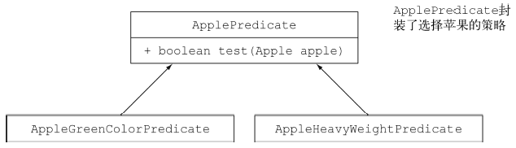
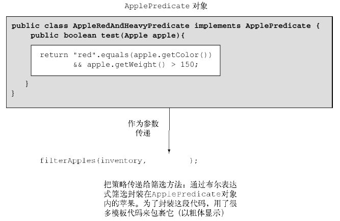
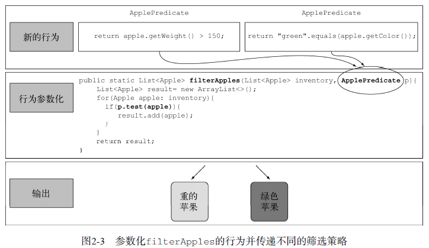
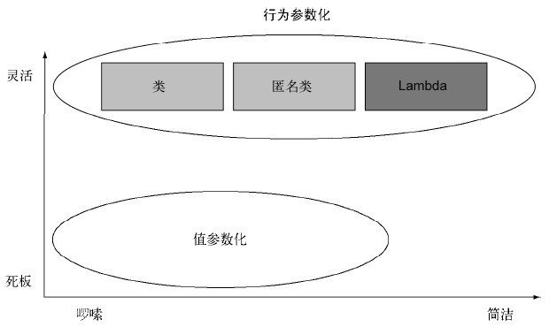

# 通过行为参数传递代码 #

[1.应对不断变化的需求](#应对不断变化的需求)

[1.1.初试牛刀：筛选绿苹果](#初试牛刀筛选绿苹果)

[1.2.再展身手：把颜色作为参数](#再展身手把颜色作为参数)

[1.3.第三次尝试：对你能想到的每个属性做筛选](#第三次尝试对你能想到的每个属性做筛选)

[2.行为参数化](#行为参数化)

[2.1.第四次尝试：根据抽象条件筛选](#第四次尝试根据抽象条件筛选)

[2.1.1.传递代码/行为](#传递代码行为)

[2.1.2.多种行为，一个参数](#多种行为一个参数)

[3.对付啰嗦](#对付啰嗦)

[3.1.匿名类](#匿名类)

[3.2.第五次尝试：使用匿名类](#第五次尝试使用匿名类)

[3.3.第六次尝试：使用Lambda 表达式](#第六次尝试使用lambda表达式)

[3.4.第七次尝试：将List 类型抽象化](#第七次尝试将list类型抽象化)

[4.真实的例子](#真实的例子)

[4.1.用Comparator来排序](#用comparator来排序)

[4.2.用Runnable执行代码块](#用runnable执行代码块)

[4.3.GUI 事件处理](#gui事件处理)

[5.小结](#小结)

## 应对不断变化的需求 ##

通过筛选苹果阐述通过行为参数传递代码

### 初试牛刀：筛选绿苹果 ###

	public static List<Apple> filterGreenApples(List<Apple> inventory){
		List<Apple> result = new ArrayList<>();
		for(Apple apple: inventory){
			if("green".equals(apple.getColor())){
				result.add(apple);
			}
		}
		return result;
	}

要是农民想要筛选多种颜色：浅绿色、暗红色、黄色等，这种方法就应付不了了。一个良好的原则是在编写类似的代码之后，尝试将其抽象化。

### 再展身手：把颜色作为参数 ###

	public static List<Apple> filterApplesByColor(List<Apple> inventory, String color){
		List<Apple> result = new ArrayList<>();
		for(Apple apple: inventory){
			if(apple.getColor().equals(color)){
				result.add(apple);
			}
		}
		return result;
	}

运用

	List<Apple> greenApples = filterApplesByColor(inventory, "green");
	List<Apple> redApples = filterApplesByColor(inventory, "red");

“要是能区分轻的苹果和重的苹果就太好了。重的苹果一般是重量大于150克。”

	public static List<Apple> filterApplesByWeight(List<Apple> inventory, int weight){
		List<Apple> result = new ArrayList<>();
		for(Apple apple: inventory){
			if(apple.getWeight() > weight){
				result.add(apple);
			}
		}
		return result;
	}

发现有重复代码，打破DRY(Don't Repeat Yourself)原则

### 第三次尝试：对你能想到的每个属性做筛选 ###

	public static List<Apple> filterApples(List<Apple> inventory, int weight, String color, boolean flag){
		List<Apple> result = new ArrayList<Apple>();
		for (Apple apple: inventory){
			if ( (flag && apple.getColor().equals(color)) || (!flag && apple.getWeight() > weight) ){
				result.add(apple);
			}
		}
		return result;
	}

你可以这么用（但真的很笨拙）

	List<Apple> greenApples = filterApples(inventory, "green", 0, true);
	List<Apple> heavyApples = filterApples(inventory, "", 150, false);

## 行为参数化 ##

定义一个接口来对选择标准建模：

	interface ApplePredicate{
		public boolean test(Apple a);
	}

现在你就可以用ApplePredicate的多个实现代表不同的选择标准了

	public class AppleWeightPredicate implements ApplePredicate{
		public boolean test(Apple apple){
			return apple.getWeight() > 150; 
		}
	}

	public class AppleColorPredicate implements ApplePredicate{
		public boolean test(Apple apple){
			return "green".equals(apple.getColor());
		}
	}

>这里有 **策略模式** 的影子
>
>策略模式：定义一系列的算法,把它们一个个封装起来, 并且使它们可相互替换。

该怎么利用ApplePredicate的不同实现呢？你需要filterApples方法接受ApplePredicate对象，对Apple做条件测试。这就是行为参数化：让方法接受多种行为（或战略）作为参数，并在内部使用，来完成不同的行为。

### 第四次尝试：根据抽象条件筛选 ###

	public static List<Apple> filter(List<Apple> inventory, ApplePredicate p){
		List<Apple> result = new ArrayList<>();
		for(Apple apple : inventory){
			if(p.test(apple)){
				result.add(apple);
			}
		}
		return result;
	}

#### 传递代码/行为 ####

	public class AppleRedAndHeavyPredicate implements ApplePredicate{
		public boolean test(Apple apple){
			return "red".equals(apple.getColor()) 
					&& apple.getWeight() > 150; 
		}
	}

	List<Apple> redAndHeavyApples = filter(inventory, new AppleRedAndHeavyPredicate());

filterApples方法的行为取决于你通过ApplePredicate对象传递的代码。换句话说，你把filterApples方法的行为参数化了！

#### 多种行为，一个参数 ####

行为参数化的好处在于你可以把迭代要筛选的集合的逻辑与对集合中每个元素应用的行为区分开来。这样你可以重复使用同一个方法，给它不同的行为来达到不同的目的。

---

**编写灵活的prettyPrintApple方法**

编写一个prettyPrintApple方法，它接受一个Apple的List，并可以对它参数化，以多种方式根据苹果生成一个String输出

	public static void prettyPrintApple(List<Apple> inventory, ???){
		for(Apple apple: inventory) {
			String output = ???.???(apple);
			System.out.println(output);
		}
	}

首先

	public interface AppleFormatter{
		String accept(Apple a);
	}

然后

	public class AppleFancyFormatter implements AppleFormatter{
		public String accept(Apple apple){
			String characteristic = apple.getWeight() > 150 ? "heavy" : "light";
			return "A " + characteristic + " " + apple.getColor() +" apple";
		}
	}

	public class AppleSimpleFormatter implements AppleFormatter{
		public String accept(Apple apple){
			return "An apple of " + apple.getWeight() + "g";
		}
	}

最后

	public static void prettyPrintApple(List<Apple> inventory, AppleFormatter formatter){
		for(Apple apple: inventory){
			String output = formatter.accept(apple);
			System.out.println(output);
		}
	}

运用

	prettyPrintApple(inventory, new AppleFancyFormatter());
	prettyPrintApple(inventory, new AppleSimpleFormatter());

输出

	A light green apple
	A heavy red apple
	…

---

	An apple of 80g
	An apple of 155g
	…

## 对付啰嗦 ##

人们都不愿意用那些很麻烦的功能或概念。目前，当要把新的行为传递给filterApples方法的时候，你不得不声明好几个实现ApplePredicate接口的类，然后实例化好几个只会提到一次的ApplePredicate对象。**这真是很啰嗦，很费时间**！

### 匿名类 ###

匿名类和你熟悉的Java局部类（块中定义的类）差不多，但匿名类没有名字。它允许你同时声明并实例化一个类。换句话说，它允许你随用随建。

### 第五次尝试：使用匿名类 ###

	List<Apple> redApples = filterApples(inventory, new ApplePredicate() {
		public boolean test(Apple apple){
			return "red".equals(apple.getColor());
		}
	});

但匿名类还是不够好。第一，它往往很笨重，因为它占用了很多空间。第二，很多程序员觉得它用起来很让人费解。

鼓励程序员使用行为参数化模式，通过引入Lambda表达式——一种更简洁的传递代码的方式。

### 第六次尝试：使用Lambda表达式 ###

	List<Apple> result = filterApples(inventory, (Apple apple) -> "red".equals(apple.getColor()));

### 第七次尝试：将List类型抽象化 ###

目前，filterApples方法还只适用于Apple。还可以将List类型抽象化，从而超越你眼前要处理的问题。

	public interface Predicate<T>{
		boolean test(T t);
	}

	public static <T> List<T> filter(List<T> list, Predicate<T> p){
		List<T> result = new ArrayList<>();
		for(T e: list){
			if(p.test(e)){
				result.add(e);
			}
		}
		return result;
	}

---

	List<Apple> redApples = filter(inventory, (Apple apple) -> "red".equals(apple.getColor()));
	
	List<Integer> evenNumbers = filter(numbers, (Integer i) -> i % 2 == 0);

## 真实的例子 ##

### 用Comparator来排序 ###

	// java.util.Comparator
	public interface Comparator<T> {
		public int compare(T o1, T o2);
	}

	inventory.sort(new Comparator<Apple>() {
		@Override
		public int compare(Apple o1, Apple o2) {
			return o1.getWeight().compareTo(o2.getWeight());
		}
	});

	inventory.sort((Apple a1, Apple a2) 
			-> a1.getWeight().compareTo(a2.getWeight()));

### 用Runnable执行代码块 ###

	//行为参数化
	Thread t = new Thread(new Runnable() {	
		@Override
		public void run() {
			System.out.println("Hello, World!");
		}
	});

	
	t = new Thread(()->System.out.println("Hello, World!")) ;

### GUI 事件处理 ###

	Button button = new Button("Send");
	button.setOnAction(new EventHandler<ActionEvent>() {
		public void handle(ActionEvent event) {
			label.setText("Sent!!");
		}
	});

	//行为参数化
	button.setOnAction((ActionEvent event) -> label.setText("Sent!!"));

## 小结 ##

- 行为参数化，就是一个方法接受多个不同的行为作为参数，并在内部使用它们，完成不同行为的能力。
- 行为参数化可让代码更好地适应不断变化的要求，减轻未来的工作量。
- 传递代码，就是将新行为作为参数传递给方法。但在Java 8之前这实现起来很啰嗦。为接口声明许多只用一次的实体类而造成的啰嗦代码，在Java 8之前可以用匿名类来减少。
- Java API包含很多可以用不同行为进行参数化的方法，包括排序、线程和GUI处理。

