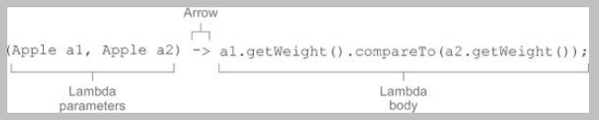
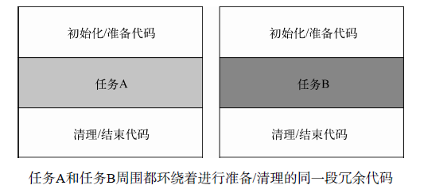
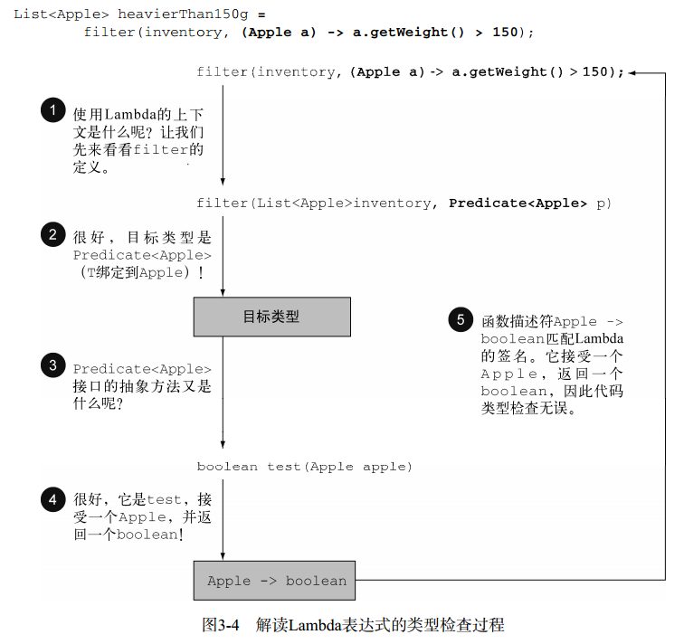
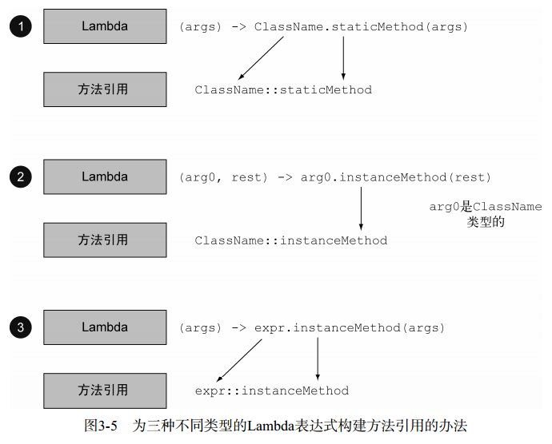
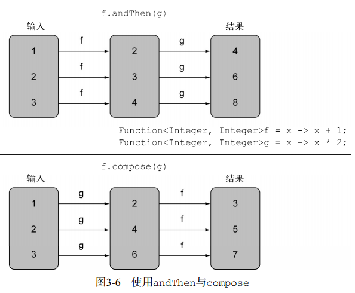
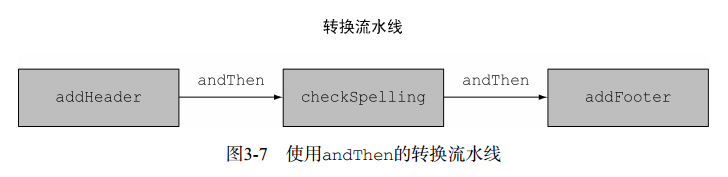

# Lambda表达式 #

[1.Lambda 管中窥豹](#lambda管中窥豹)

[2.在哪里以及如何使用Lambda](#在哪里以及如何使用lambda)

[2.1.函数式接口](#函数式接口)

[2.2.函数描述符](#函数描述符)

[3.把Lambda 付诸实践：环绕执行模式](#把lambda付诸实践环绕执行模式)

[3.1.第1步：记得行为参数化](#第1步记得行为参数化)

[3.2.第2步：使用函数式接口来传递行为](#第2步使用函数式接口来传递行为)

[3.3.第3步：执行一个行为](#第3步执行一个行为)

[3.4.第4步：传递Lambda](#第4步传递lambda)

[4.使用函数式接口](#使用函数式接口)

[4.1.Predicate](#predicate)

[4.2.Consumer](#consumer)

[4.3.Function](#function)

[4.4.原始类型特化](#原始类型特化)

[4.5.异常](#异常)

[5.类型检查、类型推断以及限制](#类型检查类型推断以及限制)

[5.1.类型检查](#类型检查)

[5.2.同样的Lambda，不同的函数式接口](#同样的lambda不同的函数式接口)

[5.3.类型推断](#类型推断)

[5.4.使用局部变量](#使用局部变量)

[6.方法引用](#方法引用)

[6.1.管中窥豹](#管中窥豹)

[6.1.1.如何构建方法引用](#如何构建方法引用)

[6.2.构造函数引用](#构造函数引用)

[7.Lambda和方法引用实战](#lambda和方法引用实战)

[7.1.第1步：传递代码](#第1步传递代码)

[7.2.第2步：使用匿名类](#第2步使用匿名类)

[7.3.第3步：使用Lambda表达式](#第3步使用lambda表达式)

[7.4.第4步：使用方法引用](#第4步使用方法引用)

[8.复合Lambda表达式的有用的方法](#复合lambda表达式的有用的方法)

[8.1.比较器复合](#比较器复合)

[8.1.1.逆序](#逆序)

[8.1.2.比较器链](#比较器链)

[8.2.谓词复合](#谓词复合)

[8.3.函数复合](#函数复合)

[8.4.数学中类似的思想](#数学中类似的思想)

[9.小结](#小结)

## Lambda 管中窥豹 ##

可以把Lambda表达式理解为简洁地表示可传递的匿名函数的一种方式：它没有名称，但它有参数列表、函数主体、返回类型，可能还有一个可以抛出的异常列表。

Lambda表达式可以让你十分简明地传递代码。

---

**Lambda组成结构**

- 参数列表——这里它采用了Comparator中compare方法的参数，两个Apple。
- 箭头——箭头->把参数列表与Lambda主体分隔开。
- Lambda主体——比较两个Apple的重量。表达式就是Lambda的返回值了。

Lambda的基本语法是

	(parameters) -> expression

或（请注意语句的花括号）

	(parameters) -> { statements; }

---

Java8先前：

	Comparator<Apple> byWeight = new Comparator<Apple>() {
		public int compare(Apple a1, Apple a2){
			return a1.getWeight().compareTo(a2.getWeight());
		}
	};

Java8之后（用了Lambda表达式）：

	Comparator<Apple> byWeight = (Apple a1, Apple a2) -> a1.getWeight().compareTo(a2.getWeight());

---

**Java 8中有效的Lambda表达式**

	(String s) -> s.length()

	(Apple a) -> a.getWeight() > 150

	(int x, int y) -> {
		System.out.println("Result:");
		System.out.println(x+y);
	}

	() -> 42

	(Apple a1, Apple a2) -> a1.getWeight().compareTo(a2.getWeight())

---

<table>

<tr>
<td>使用案例</td>
<td>Lambda示例</td>
</tr>

<tr>
<td>布尔表达式</td>
<td>(List<String> list) -> list.isEmpty()</td>
</tr>

<tr>
<td>创建对象</td>
<td>() -> new Apple(10)</td>
</tr>

<tr>
<td>消费一个对象</td>
<td>(Apple a) -> { 
System.out.println(a.getWeight()); 
} 
</td>
</tr>

<tr>
<td>从一个对象中选择/抽取</td>
<td>(String s) -> s.length()</td>
</tr>

<tr>
<td>组合两个值</td>
<td>(int a, int b) -> a * b</td>
</tr>

<tr>
<td>比较两个对象</td>
<td>(Apple a1, Apple a2) -> a1.getWeight().compareTo(a2.getWeight())</td>
</tr>

</table>

## 在哪里以及如何使用Lambda ##

你可以在**函数式接口**上使用Lambda表达式。

在上面的代码中， 你可以把Lambda 表达式作为第二个参数传给filter 方法， 因为它这里需要Predicate<T&gt;，而这是一个**函数式接口**。

### 函数式接口 ###

Predicate仅仅定义了一个抽象方法

	public interface Predicate<T>{
		boolean test (T t);
	}

一言以蔽之，函数式接口就是**只定义一个抽象方法的接口**。

Java API中的一些其他函数式接口，

	//java.util.Comparator
	public interface Comparator<T> {
		int compare(T o1, T o2);
	}

	//java.lang.Runnable
	public interface Runnable{
		void run();
	}

	//java.awt.event.ActionListener
	public interface ActionListener extends EventListener{
		void actionPerformed(ActionEvent e);
	}

	//java.util.concurrent.Callable
	public interface Callable<V>{
		V call();
	}

	//java.security.PrivilegedAction
	public interface PrivilegedAction<V>{
		V run();
	}

**用函数式接口可以干什么呢**？Lambda表达式允许你直接以内联的形式为函数式接口的抽象方法提供实现，并把整个表达式作为函数式接口的实例（具体说来，是函数式接口一个具体实现的实例）。

你用**匿名内部类**也可以完成同样的事情，只不过比较笨拙：需要提供一个实现，然后再直接内联将它实例化。下面的代码是有效的，因为Runnable是一个只定义了一个抽象方法run的函数式接口

	Runnable r1 = () -> System.out.println("Hello World 1");
	Runnable r2 = new Runnable(){
		public void run(){
			System.out.println("Hello World 2");
		}
	};
	
	public static void process(Runnable r){
		r.run();
	}
	
	process(r1);
	process(r2);
	
	process(() -> System.out.println("Hello World 3"));

### 函数描述符 ###

函数式接口的**抽象方法**的签名基本上就是Lambda表达式的签名。我们将这种**抽象方法**叫作**函数描述符**

**为什么只有在需要函数式接口的时候才可以传递Lambda呢**？语言设计者选择了现在这种方式，因为这种方式自然且能避免语言变得更复杂。

>@FunctionalInterface
>如果你去看看新的Java API，会发现函数式接口带有@FunctionalInterface的标注。这个标注用于表示该接口会设计成一个函数式接口。
>
>如果你用@FunctionalInterface定义了一个接口，而它却不是函数式接口的话，编译器将返回一个提示原因的错误。
>
>例如，错误消息可能是“Multiple non-overriding abstract methods found in interface Foo”，表明存在多个抽象方法。
>
>请注意，@FunctionalInterface不是必需的，但对于为此设计的接口而言，使用它是比较好的做法。它就像是@Override标注表示方法被重写了。

## 把Lambda 付诸实践：环绕执行模式 ##

资源处理（例如处理文件或数据库）时一个常见的模式就是打开一个资源，做一些处理，然后关闭资源。

这个设置和清理阶段总是很类似，并且会围绕着执行处理的那些重要代码。这就是所谓的**环绕执行**（execute around）模式

	public static String processFile() throws IOException {
		try (BufferedReader br = new BufferedReader(new FileReader("data.txt"))) {
			return br.readLine();//这就是做有用工作的那行代码
		}
	}

把processFile的行为参数化。需要一种方法把行为传递给processFile，以便它可以利用BufferedReader执行不同的行为。

### 第1步：记得行为参数化 ###

从

	public static String processFile() throws IOException {
		try (BufferedReader br = new BufferedReader(new FileReader("data.txt"))) {
			return br.readLine();//这就是做有用工作的那行代码
		}
	}

转化成

	String result = processFile((BufferedReader br) -> br.readLine());

### 第2步：使用函数式接口来传递行为 ###

	@FunctionalInterface
	public interface BufferedReaderProcessor {
		String process(BufferedReader b) throws IOException;
	}
现在你就可以把这个接口作为新的processFile方法的参数了：

	public static String processFile(BufferedReaderProcessor p) throws IOException {
		…
	}

### 第3步：执行一个行为 ###

	public static String processFile(BufferedReaderProcessor p) throws
	IOException {
		try (BufferedReader br = new BufferedReader(new FileReader("data.txt"))) {
			return p.process(br);
		}
	}

### 第4步：传递Lambda ###

现在你就可以通过传递不同的Lambda重用processFile方法，并以不同的方式处理文件了。

处理一行：

	String oneLine = processFile((BufferedReader br) -> br.readLine());

处理两行：

	String twoLines = processFile((BufferedReader br) -> br.readLine() + br.readLine());

## 使用函数式接口 ##

函数式接口的抽象方法的签名称为**函数描述符**。所以为了应用不同的Lambda表达式，你需要一套能够描述常见函数描述符的**函数式接口**。

### Predicate ###

java.util.function.Predicate<T&gt;接口定义了一个名叫test的抽象方法，它接受泛型T对象，并返回一个boolean。

	@FunctionalInterface
	public interface Predicate<T>{
		boolean test(T t);
	}

	public static <T> List<T> filter(List<T> list, Predicate<T> p) {
		List<T> results = new ArrayList<>();

		for(T s: list){
			if(p.test(s)){
				results.add(s);
			}
		}
		return results;
	}

	Predicate<String> nonEmptyStringPredicate = (String s) -> !s.isEmpty();
	List<String> nonEmpty = filter(listOfStrings, nonEmptyStringPredicate);

### Consumer ###

java.util.function.Consumer<T>定义了一个名叫accept的抽象方法，它接受泛型T的对象，没有返回（void）。你如果需要访问类型T的对象，并对其执行某些操作，就可以使用这个接口。比如，你可以用它来创建一个forEach方法，接受一个Integers的列表，并对其中每个元素执行操作。

	@FunctionalInterface
	public interface Consummer<T> {
	    void accept(T t);
	}
	
	public static <T> void forEach(List<T> list, Consumer<T> c) {
	    for(T i : list) c.accept(i); 
	}
	
	forEach(Arrays.asList(1,2,3,4,5,6,7), (Integer i)->System.out.println(i));

### Function ###

java.util.function.Function<T, R>接口定义了一个叫作apply的方法，它接受一个泛型T的对象，并返回一个泛型R的对象。如果你需要定义一个Lambda，将输入对象的信息映射到输出，就可以使用这个接口（比如提取苹果的重量，或把字符串映射为它的长度）

	@FunctionalInterface
	public interface Function<T, R> {
	
		R apply(T t);
	}

	public static <T,R> List<R> map(List<T> list, Function<T,R> f){
		List<R> result = new ArrayList<>();
		
		for(T s : list) {
			result.add(f.apply(s));
		}
		
		return result;
	}

	List<Integer> list2 = map(Arrays.asList("","1234","asd"),(String s)->s.length());
	System.out.println(list2);

### 原始类型特化 ###

泛型（比如Consumer<T&gt;中的T）只能绑定到引用类型。这是由泛型内部的实现方式造成的。因此，在Java里有一个将原始类型转换为对应的引用类型的机制。这个机制叫作**装箱**（boxing）。相反的操作，也就是将引用类型转换为对应的原始类型，叫作**拆箱**（unboxing）。

**但这在性能方面是要付出代价的**。装箱后的值本质上就是把原始类型包裹起来，并保存在堆里。因此，装箱后的值需要更多的内存，并需要额外的内存搜索来获取被包裹的原始值。

Java 8 提供特殊的函数式接口，以便在输入和输出都是**原始类型避免自动装箱操作**

	public interface IntPredicate{
		boolean test(int t);
	}

	//无装箱
	IntPredicate evenNumbers = (int i) -> i % 2 == 0;
	evenNumbers.test(1000);

	//装箱
	Predicate<Integer> oddNumbers = (Integer i) -> i % 2 == 1;
	oddNumbers.test(1000);

**Java 8 中的常用函数式接口**

	//助记
	
	//喂，消费者，生产者，我们一起玩（fun）吧
	Predicate,Consumer,Supplier,Function
	
	//数学 一元符，二元符
	UnaryOperator,BinaryOperator
	
	//喂，消费者，生产者,喂，消费者，生产者
	BiPredicate,BiConsumer,BiFunction

<table>

<tr>
<td>Predicate&lt;T&gt;</td>
<td>T->boolean</td>
<td>IntPredicate, 
LongPredicate, 
 DoublePredicate</td>
</tr>

<tr>
<td>Consumer&lt;T&gt;</td>
<td>T->void</td>
<td>IntConsumer, 
LongConsumer, 
DoubleConsumer</td>
</tr>

<tr>
<td>Function&lt;T,R&gt;</td>
<td>T->R</td>
<td>
IntFunction&lt;R&gt;, 
IntToDoubleFunction, 
IntToLongFunction, 
LongFunction&lt;R&gt;, 
LongToDoubleFunction, 
LongToIntFunction, 
DoubleFunction&lt;R&gt;, 
ToIntFunction&lt;T&gt;, 
ToDoubleFunction&lt;T&gt;, 
ToLongFunction&lt;T&gt; 
</td>
</tr>

<tr>
<td>Supplier&lt;T,R&gt;</td>
<td>()->T</td>
<td>BooleanSupplier, 
IntSupplier, 
LongSupplier, 
DoubleSupplier</td>
</tr>

<tr>
<td>UnaryOperator&lt;T,R&gt;</td>
<td>T->T</td>
<td>IntUnaryOperator, 
LongUnaryOperator, 
DoubleUnaryOperator</td>
</tr>

<tr>
<td>BinaryOperator&lt;T,R&gt;</td>
<td>(T,T)->T</td>
<td>IntBinaryOperator, 
LongBinaryOperator, 
DoubleBinaryOperator</td>
</tr>

<tr>
<td>BiPredicate&lt;L,R&gt;</td>
<td>(L,R)->boolean</td>
<td></td>
</tr>

<tr>
<td>BiConsumer&lt;T,U&gt;</td>
<td>(T,U)->void</td> 
<td>ObjIntConsumer&lt;T,R&gt;, 
ObjLongConsumer&lt;T,R&gt;, 
ObjDoubleConsumer&lt;T,R&gt;</td>
</tr>

<tr>
<td>BiFunction&lt;T,U,R&gt;</td>
<td>(T,U)->R</td>
<td>ToIntBiFunction&lt;T,U&gt;, 
ToLongBiFunction&lt;T,U&gt;, 
ToDoubleBiFunction&lt;T,U&gt;</td>
</tr>

</table>

---

**Lambda示例**

<table>

<tr>
<td>使用案例</td>
<td>Lambda示例</td>
<td>对应的函数式接口</td>
</tr>

<tr>
<td>布尔表达式</td>
<td>(List&lt;String&gt; list) -> list.isEmpty()</td>
<td>Predicate&lt;List&lt;String&gt;&gt;</td>
</tr>

<tr>
<td>创建对象</td>
<td>() -> new Apple(10)</td>
<td>Supplier<Apple></td>
</tr>

<tr>
<td>消费一个对象</td>
<td>(Apple a) -> { 
System.out.println(a.getWeight()); 
} 
</td>
<td>Consumer<Apple></td>
</tr>

<tr>
<td>从一个对象中选择/抽取</td>
<td>(String s) -> s.length()</td>
<td>Function&lt;String, Integer&gt;或
ToIntFunction&lt;String&gt;</td>
</tr>

<tr>
<td>组合两个值</td>
<td>(int a, int b) -> a * b</td>
<td>IntBinaryOperator</td>
</tr>

<tr>
<td>比较两个对象</td>
<td>(Apple a1, Apple a2) -> a1.getWeight().compareTo(a2.getWeight())</td>
<td>Comparator<Apple>或
BiFunction&lt;Apple, Apple, Integer&gt;
或 ToIntBiFunction&lt;Apple, Apple&gt;</td>
</tr>

</table>

### 异常 ###

任何函数式接口都不允许抛出受检异常（checked exception）。如果你需要Lambda表达式来抛出异常，有两种办法：
1. 定义一个自己的函数式接口，并声明受检异常，
2. 把Lambda包在一个try/catch块中

	@FunctionalInterface
	public interface BufferedReaderProcessor {
		String process(BufferedReader b) throws IOException;
	}

	BufferedReaderProcessor p = (BufferedReader br) -> br.readLine();

---

	Function<BufferedReader, String> f = (BufferedReader b) -> {
		try {
			return b.readLine();
		}
		catch(IOException e) {
			throw new RuntimeException(e);
		}
	};

## 类型检查、类型推断以及限制 ##

### 类型检查 ###

Lambda的类型是从使用Lambda的上下文推断出来的。上下文（比如，接受它传递的方法的参数，或接受它的值的局部变量）中Lambda表达式需要的类型称为**目标类型**。

- 首先，你要找出filter方法的声明。
- 第二，要求它是Predicate<Apple>（**目标类型**）对象的第二个正式参数。
- 第三，Predicate<Apple>是一个函数式接口，定义了一个叫作test的抽象方法。
- 第四，test方法描述了一个函数描述符，它可以接受一个Apple，并返回一个boolean。
- 最后，filter的任何实际参数都必须匹配这个要求。

### 同样的Lambda，不同的函数式接口 ###

	Comparator<Apple> c1 =
	(Apple a1, Apple a2) -> a1.getWeight().compareTo(a2.getWeight());

	ToIntBiFunction<Apple, Apple> c2 =
	(Apple a1, Apple a2) -> a1.getWeight().compareTo(a2.getWeight());

	BiFunction<Apple, Apple, Integer> c3 =
	(Apple a1, Apple a2) -> a1.getWeight().compareTo(a2.getWeight());

---

>**特殊的void兼容规则**
>
>如果一个Lambda的主体是**一个语句表达式**， 它就和一个返回void的函数描述符兼容（当然需要参数列表也兼容）。例如，以下两行都是合法的，尽管List的add方法返回了一个boolean，而不是Consumer上下文（T -> void）所要求的void：

	// Predicate返回了一个boolean
	Predicate<String> p = s -> list.add(s);
	// Consumer返回了一个void
	Consumer<String> b = s -> list.add(s);

---

>类型检查——为什么下面的代码不能编译呢？
>你该如何解决这个问题呢？

	Object o = () -> {System.out.println("Tricky example"); };

>答案：Lambda表达式的上下文是Object（**目标类型**）。但Object不是一个**函数式接口**。
>为了解决这个问题，你可以把目标类型改成Runnable，它的函数描述符是() -> void：

	Runnable r = () -> {System.out.println("Tricky example"); };

### 类型推断 ###

Java编译器会从上下文（**目标类型**）推断出用什么函数式接口来配合Lambda表达式，这意味着它也可以推断出适合Lambda的签名，因为**函数描述符**可以通过目标类型来得到。这样做的好处在于，编译器可以了解Lambda表达式的参数类型，这样就可以在Lambda语法中省去标注参数类型。

	List<Apple> greenApples = filter(inventory, a -> "green".equals(a.getColor()));

Lambda表达式有多个参数，代码可读性的好处就更为明显。例如，你可以这样来创建一个Comparator对象

	Comparator<Apple> c = (Apple a1, Apple a2) -> a1.getWeight().compareTo(a2.getWeight());

	//有类型推断
	Comparator<Apple> c = (a1, a2) -> a1.getWeight().compareTo(a2.getWeight());

### 使用局部变量 ###

**不鼓励使用外部变量**

Lambda表达式也允许使用**自由变量**（不是参数，而是在外层作用域中定义的变量），就像匿名类一样。 它们被称作**捕获Lambda**。

	int portNumber = 1337;
	Runnable r = () -> System.out.println(portNumber);
	portNumber = 31337;

**错误**： Lambda表达式引用的局部变量必须是最终的（**final**）
或事实上最终的

---

为什么局部变量有这些限制？

1. **实例变量和局部变量背后的实现有一个关键不同**。实例变量都存储在**堆**中，而局部变量则保存在**栈**上。如果Lambda可以直接访问局部变量，而且Lambda是在一个线程中使用的，则使用Lambda的线程，可能会在分配该变量的线程将这个变量收回之后，去访问该变量。因此，Java在访问自由局部变量时，实际上是在访问它的副本，而不是访问原始变量。如果局部变量仅仅赋值一次那就没有什么区别了——因此就有了这个限制。

2. 这一限制**不鼓励**你使用改变外部变量的典型命令式编程模式。

## 方法引用 ##

方法引用的基本思想是，如果一个Lambda代表的只是“直接调用这个方法”，那最好还是用名称来调用它，而不是去描述如何调用它。

事实上，方法引用就是让你根据已有的方法实现来创建
Lambda表达式。

但是，显式地指明方法的名称，你的代码的**可读性会更好**。

>PS. I don't think so.

它是如何工作的呢？当你需要使用方法引用时，目标引用放在分隔符::前，方法的名称放在后面。例如，Apple::getWeight就是引用了Apple类中定义的方法getWeight。

先前：

	inventory.sort((Apple a1, Apple a2) -> a1.getWeight().compareTo(a2.getWeight()));

之后（使用方法引用和java.util.Comparator.comparing）：

	inventory.sort(comparing(Apple::getWeight));

### 管中窥豹 ###

**Lambda及其等效方法引用的例子**

<table>

<tr>
<td>Lambda</td>
<td>等效的方法引用</td>
</tr>

<tr>
<td>(Apple a) -> a.getWeight()</td>
<td>Apple::getWeight</td>
</tr>

<tr>
<td>() -> Thread.currentThread().dumpStack()</td>
<td>Thread.currentThread()::dumpStack</td>
</tr>

<tr>
<td>(str, i) -> str.substring(i)</td>
<td>String::substring</td>
</tr>

<tr>
<td>(String s) -> System.out.println(s)</td>
<td>System.out::println</td>
</tr>

</table>

你可以把方法引用看作针对仅仅涉及单一方法的Lambda的**语法糖**，因为你表达同样的事情时要写的代码更少了。

#### 如何构建方法引用 ####

方法引用主要有三类。

1. 指向静态方法的方法引用（例如Integer的parseInt方法，写作Integer::parseInt）

2. 指向任意类型实例方法的方法引用（例如String的length方法，写作String::length）。//(String s) -> s.toUppeCase()

3. 指向现有对象的实例方法的方法引用（假设你有一个局部变量expensiveTransaction用于存放Transaction类型的对象，它支持实例方法getValue，那么你就可以写expensiveTransaction::getValue）//()->expensiveTransaction.getValue()

例子

第二种

	List<String> str = Arrays.asList("a","b","A","B");
	str.sort((s1, s2) -> s1.compareToIgnoreCase(s2));
	
	List<String> str = Arrays.asList("a","b","A","B");
	str.sort(String::compareToIgnoreCase);

---

第二种

	Function<String, Integer> stringToInteger =
	(String s) -> Integer.parseInt(s);
	
	Function<String, Integer> stringToInteger = Integer::parseInt;

---

第二种

	BiPredicate<List<String>, String> contains =
	(list, element) -> list.contains(element);
	
	BiPredicate<List<String>, String> contains = List::contains;

### 构造函数引用 ###

无参构造函数的

	Supplier<Apple> c1 = Apple::new;
	Apple a1 = c1.get();

等同

	Supplier<Apple> c1 = () -> new Apple();
	Apple a1 = c1.get();

---

若构造函数是Apple(Integer weight)

	Function<Integer, Apple> c2 = Apple::new;
	Apple a2 = c2.apply(110);

等同

	Function<Integer, Apple> c2 = (weight) -> new Apple(weight);
	Apple a2 = c2.apply(110);

---

若构造函数是Apple(String color, Integer weight)

	BiFunction<String, Integer, Apple> c3 = Apple::new;
	Apple c3 = c3.apply("green", 110);

等同

	BiFunction<String, Integer, Apple> c3 = (color, weight) -> new Apple(color, weight);
	Apple c3 = c3.apply("green", 110);

---

运用实例

	List<Integer> weights = Arrays.asList(7, 3, 4, 10);
	List<Apple> apples = map(weights, Apple::new);

	public static List<Apple> map(List<Integer> list,Function<Integer, Apple> f){
		List<Apple> result = new ArrayList<>();
		for(Integer e: list){
			result.add(f.apply(e));
		}
		return result;
	}

---

	static Map<String, Function<Integer, Fruit>> map = new HashMap<>();

	static {
		map.put("apple", Apple::new);
		map.put("orange", Orange::new);
	// etc...
	}

	public static Fruit giveMeFruit(String fruit, Integer weight){
		return map.get(fruit.toLowerCase()).apply(weight);
	}

---

**构造函数引用**

你已经看到了如何将有零个、一个、两个参数的构造函数转变为构造函数引用。那**要怎么样才能对具有三个参数的构造函数**，比如Color(int, int, int)，使用构造函数引用呢？

构造函数引用的语法是ClassName::new，那么在这个例子里面就是Color::new。但是你需要与构造函数引用的签名匹配的函数式接口。但是语言本身并没有提供这样的函数式接口，你可以自己创建一个：

	public interface TriFunction<T, U, V, R>{
		R apply(T t, U u, V v);
	}

现在你可以像下面这样使用构造函数引用了：

	TriFunction<Integer, Integer, Integer, Color> colorFactory = Color::new;

## Lambda和方法引用实战 ##

以排序为例

	inventory.sort(comparing(Apple::getWeight));

### 第1步：传递代码 ###

	void sort(Comparator<? super E> c)

	public class AppleComparator implements Comparator<Apple> {
		public int compare(Apple a1, Apple a2){
			return a1.getWeight().compareTo(a2.getWeight());
		}
	}

	inventory.sort(new AppleComparator());

### 第2步：使用匿名类 ###

	inventory.sort(new Comparator<Apple>() {
		public int compare(Apple a1, Apple a2){
			return a1.getWeight().compareTo(a2.getWeight());
		}
	});

### 第3步：使用Lambda表达式 ###

	inventory.sort((Apple a1, Apple a2)-> a1.getWeight().compareTo(a2.getWeight()));

	//进一步简化
	inventory.sort((a1, a2) -> a1.getWeight().compareTo(a2.getWeight()));

	//现在你可以把代码再改得紧凑一点了：

	Comparator<Apple> c = Comparator.comparing((Apple a) -> a.getWeight());

	import static java.util.Comparator.comparing;
	inventory.sort(comparing((a) -> a.getWeight()));

### 第4步：使用方法引用 ###

	inventory.sort(comparing(Apple::getWeight));

## 复合Lambda表达式的有用的方法 ##

### 比较器复合 ###

#### 逆序 ####

	inventory.sort(comparing(Apple::getWeight).reversed());

#### 比较器链 ####

	inventory.sort(comparing(Apple::getWeight).reversed().thenComparing(Apple::getCountry));
	//两个苹果一样重时，进一步按国家排序

### 谓词复合 ###

谓词接口包括三个方法： negate、 and和or，让你可以重用已有的Predicate来创建更复杂的谓词。

	//产生现有Predicate对象redApple的非
	Predicate<Apple> notRedApple = redApple.negate();

	Predicate<Apple> redAndHeavyApple = redApple.and(a -> a.getWeight() > 150);

	Predicate<Apple> redAndHeavyAppleOrGreen = redApple.and(a -> a.getWeight() > 150).or(a -> "green".equals(a.getColor()));

### 函数复合 ###

最后，你还可以把Function接口所代表的Lambda表达式复合起来。 Function接口为此配了andThen和compose两个默认方法，它们都会返回Function的一个实例。

	Function<Integer, Integer> f = x -> x + 1;
	Function<Integer, Integer> g = x -> x * 2;
	Function<Integer, Integer> h = f.andThen(g);
	int result = h.apply(1);//x=1,结果是4

	Function<Integer, Integer> f = x -> x + 1;
	Function<Integer, Integer> g = x -> x * 2;
	Function<Integer, Integer> h = f.compose(g);
	int result = h.apply(1);//x=1,结果是3

---

做文本转换 为例

	public class Letter{
		public static String addHeader(String text){
			return "From Raoul, Mario and Alan: " + text;
		}
		public static String addFooter(String text){
			return text + " Kind regards";
		}
		public static String checkSpelling(String text){
			return text.replaceAll("labda", "lambda");
		}
	}

函数复合

	Function<String, String> addHeader = Letter::addHeader;
	Function<String, String> transformationPipeline = addHeader.andThen(Letter::checkSpelling).andThen(Letter::addFooter);

### 数学中类似的思想 ###

积分

在这个例子里，函数f是一条直线，因此你很容易通过梯形方法（画几个三角形）来算出面积：
	1/2 × ((3 + 10) + (7 + 10)) × (7 – 3) = 60

运用Lambda表达式

	integrate((double x) -> x + 10, 3, 7)

	public double integrate(DoubleFunction<Double> f, double a, double b) {
		return (f.apply(a) + f.apply(b)) * (b-a) / 2.0;
	}

## 小结 ##

- Lambda表达式可以理解为一种匿名函数：它没有名称，但有参数列表、函数主体、返回类型，可能还有一个可以抛出的异常的列表。
- Lambda表达式让你可以简洁地传递代码。
- 函数式接口就是仅仅声明了一个抽象方法的接口。
- 只有在接受函数式接口的地方才可以使用Lambda表达式。
- Lambda表达式允许你直接内联，为函数式接口的抽象方法提供实现，并且将整个表达式作为函数式接口的一个实例。
- Java 8自带一些常用的函数式接口，放在java.util.function包里，包括Predicate<T&gt;、Function<T,R&gt;、Supplier<T&gt;、Consumer<T&gt;和BinaryOperator<T&gt;，
- 为了避免装箱操作，对Predicate<T&gt;和Function<T, R&gt;等通用函数式接口的原始类型特化：IntPredicate、IntToLongFunction等。
- 环绕执行模式（即在方法所必需的代码中间，你需要执行点儿什么操作，比如资源分配和清理）可以配合Lambda提高灵活性和可重用性。
- Lambda表达式所需要代表的类型称为目标类型。
- 方法引用让你重复使用现有的方法实现并直接传递它们。
- Comparator、Predicate和Function等函数式接口都有几个可以用来结合Lambda表达式的默认方法。
