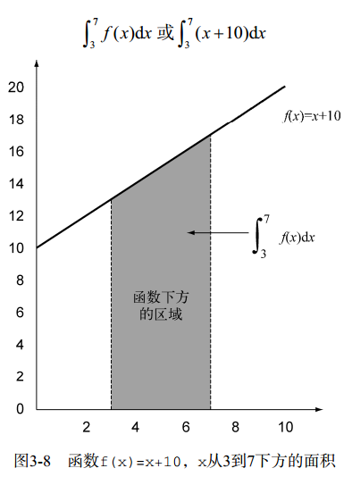

# Lambda表达式 #

Lambda表达式特点

1. 匿名
2. 函数
3. 传递（像参数那样）
4. 简洁

Lambda组成结构

**Lambda示例**

<table>

<tr>
<td>使用案例</td>
<td>Lambda示例</td>
</tr>

<tr>
<td>布尔表达式</td>
<td>(List<String> list) -> list.isEmpty()</td>
</tr>

<tr>
<td>创建对象</td>
<td>() -> new Apple(10)</td>
</tr>

<tr>
<td>消费一个对象</td>
<td>(Apple a) -> { 
System.out.println(a.getWeight()); 
} 
</td>
</tr>

<tr>
<td>从一个对象中选择/抽取</td>
<td>(String s) -> s.length()</td>
</tr>

<tr>
<td>组合两个值</td>
<td>(int a, int b) -> a * b</td>
</tr>

<tr>
<td>比较两个对象</td>
<td>(Apple a1, Apple a2) -> a1.getWeight().compareTo(a2.getWeight())</td>
</tr>

</table>

### 在哪里以及如何使用Lambda ###

#### 函数式接口 ####

只有一个抽象方法的接口

譬如
	
	//java.util.Comparator
	public interface Comparator<T>{
		int compare(T o1, T o2);
	}
	
	//java.lang.Runnable
	public interface Runnable{
		void run();
	}

用函数式接口可以干什么？

**Lambda表达式允许你直接以内联的形式为函数式接口的抽象方法提供实现，并把整个表达式作为函数式接口的实例。**

#### 函数描述符 ####

函数式接口的抽象方法的签名基本上就是Lambda表达式的签名，这抽象方法叫做**函数描述符**。

@FuntionalInterface注解用作函数式接口的说明，但是它并不是必须的

### 把Lambda付诸执行：环绕执行模式 ###

#### 1、 ####

	public static String processFileLimited() throws IOException {
		try (BufferedReader br = new BufferedReader(new FileReader("lambdasinaction/chap3/data.txt"))) {
			return br.readLine();
		}
	}

#### 2、 ####

	public static String processFile(BufferedReaderProcessor p) throws IOException {
		try (BufferedReader br = new BufferedReader(new FileReader(ReadResource.getFile("hello.txt")))) {
			return p.process(br);
		}

	}

	public interface BufferedReaderProcessor {
		public String process(BufferedReader b) throws IOException;
	}

#### 3、 ####

	String oneLine = processFile((BufferedReader b) -> b.readLine());
	System.out.println(oneLine);

	String twoLines = processFile((BufferedReader b) -> b.readLine() + b.readLine());
	System.out.println(twoLines);

### 使用函数式接口 ###

Java 8 java.util.function 引入新的函数接口

#### Predicate谓语 ####

	@FunctionalInterface
	public interface Predicate<T> {
		boolean test(T t);
	}

	public static <T> List<T> filter(List<T> list, Predicate<T> p){
		List<T> result = new ArrayList<>();
		
		for(T obj : list) {
			if(p.test(obj)) {
				result.add(obj);
			}
		}
		
		return result;
	}

	public static void main(String[] args) {
		Predicate<String> nonEmptyString = (String s) -> !s.isEmpty();
		List<String> list = filter(Arrays.asList("","1234","asd"), nonEmptyString);
		System.out.println(list);
	}

#### Consummer ####

	@FunctionalInterface
	public interface Consummer<T> {
		void accept(T t);
	}

	public static <T> void forEach(List<T> list, Consumer<T> c) {
		for(T i : list) c.accept(i); 
	}

	forEach(Arrays.asList(1,2,3,4,5,6,7), (Integer i)->System.out.println(i));

#### Function ####

	@FunctionalInterface
	public interface Function<T, R> {
	
		R apply(T t);
	}

	public static <T,R> List<R> map(List<T> list, Function<T,R> f){
		List<R> result = new ArrayList<>();
		
		for(T s : list) {
			result.add(f.apply(s));
		}
		
		return result;
	}

	List<Integer> list2 = map(Arrays.asList("","1234","asd"),(String s)->s.length());
	System.out.println(list2);

#### 原始类型特化 ####

泛型（比如Consumer<T>中的T）只能绑定到引用类型。这是由泛型内部的实现方式造成的。因此，在Java里有一个将原始类型转换为对应的引用类型的机制。这个机制叫作装箱（boxing）。相反的操作，也就是将引用类型转换为对应的原始类型，叫作拆箱（unboxing）。

Java 8 提供特殊的函数式接口，以便在输入和输出都是原始类型避免自动装箱操作

	public interface IntPredicate{
		boolean test(int t);
	}

	//
	IntPredicate evenNumbers = (int i) -> i % 2 == 0;
	evenNumbers.test(1000);

	Predicate<Integer> oddNumbers = (Integer i) -> i % 2 == 1;
	oddNumbers.test(1000);

Java 8 中的常用函数式接口

<table>

<tr>

<td>Predicate&lt;T&gt;</td>
<td>T->boolean</td>
<td>IntPredicate, 
LongPredicate, 
 DoublePredicate</td>

<tr>

<tr>

<td>Consumer&lt;T&gt;</td>
<td>T->void</td>
<td>IntConsumer, 
LongConsumer, 
DoubleConsumer</td>

<tr>

<tr>

<td>Function&lt;T,R&gt;</td>
<td>T->R</td>
<td>
IntFunction&lt;R&gt;, 
IntToDoubleFunction, 
IntToLongFunction, 
LongFunction&lt;R&gt;, 
LongToDoubleFunction, 
LongToIntFunction, 
DoubleFunction&lt;R&gt;, 
ToIntFunction&lt;T&gt;, 
ToDoubleFunction&lt;T&gt;, 
ToLongFunction&lt;T&gt; 
</td>

<tr>

<tr>

<td>Supplier&lt;T,R&gt;</td>
<td>()->T</td>
<td>BooleanSupplier, 
IntSupplier, 
LongSupplier, 
DoubleSupplier</td>

<tr>

<tr>

<td>UnaryOperator&lt;T,R&gt;</td>
<td>T->T</td>
<td>IntUnaryOperator, 
LongUnaryOperator, 
DoubleUnaryOperator</td>

<tr>

<tr>

<td>BinaryOperator&lt;T,R&gt;</td>
<td>(T,T)->T</td>
<td>IntBinaryOperator, 
LongBinaryOperator, 
DoubleBinaryOperator</td>

<tr>

<tr>

<td>BiPredicate&lt;L,R&gt;</td>
<td>(L,R)->boolean</td>
<td></td>

<tr>

<tr>

<td>BiConsumer&lt;T,U&gt;</td>
<td>(T,U)->void</td> 
<td>ObjIntConsumer&lt;T,R&gt;, 
ObjLongConsumer&lt;T,R&gt;, 
ObjDoubleConsumer&lt;T,R&gt;</td>

<tr>

<tr>

<td>BiFunction&lt;T,U,R&gt;</td>
<td>(T,U)->R</td>
<td>ToIntBiFunction&lt;T,U&gt;, 
ToLongBiFunction&lt;T,U&gt;, 
ToDoubleBiFunction&lt;T,U&gt;</td>

<tr>

</table>

**Lambda示例**

<table>

<tr>
<td>使用案例</td>
<td>Lambda示例</td>
<td>对应的函数式接口</td>
</tr>

<tr>
<td>布尔表达式</td>
<td>(List&lt;String&gt; list) -> list.isEmpty()</td>
<td>Predicate&lt;List&lt;String&gt;&gt;</td>
</tr>

<tr>
<td>创建对象</td>
<td>() -> new Apple(10)</td>
<td>Supplier<Apple></td>
</tr>

<tr>
<td>消费一个对象</td>
<td>(Apple a) -> { 
System.out.println(a.getWeight()); 
} 
</td>
<td>Consumer<Apple></td>
</tr>

<tr>
<td>从一个对象中选择/抽取</td>
<td>(String s) -> s.length()</td>
<td>Function&lt;String, Integer&gt;或
ToIntFunction&lt;String&gt;</td>
</tr>

<tr>
<td>组合两个值</td>
<td>(int a, int b) -> a * b</td>
<td>IntBinaryOperator</td>
</tr>

<tr>
<td>比较两个对象</td>
<td>(Apple a1, Apple a2) -> a1.getWeight().compareTo(a2.getWeight())</td>
<td>Comparator<Apple>或
BiFunction&lt;Apple, Apple, Integer&gt;
或 ToIntBiFunction&lt;Apple, Apple&gt;</td>
</tr>

</table>

### 类型检查、类型推断以及限制 ###

#### 类型检查 ####

#### 同样的Lambda，不同的函数式接口 ####

	Comparator<Apple> c1 =
	(Apple a1, Apple a2) -> a1.getWeight().compareTo(a2.getWeight());
	ToIntBiFunction<Apple, Apple> c2 =
	(Apple a1, Apple a2) -> a1.getWeight().compareTo(a2.getWeight());
	BiFunction<Apple, Apple, Integer> c3 =
	(Apple a1, Apple a2) -> a1.getWeight().compareTo(a2.getWeight());

#### 类型推断 ####

进一步简化

	//没类型推断
	Comparator<Apple> c =
	(Apple a1, Apple a2) -> a1.getWeight().compareTo(a2.getWeight());

	//有类型推断
	Comparator<Apple> c =
	(a1, a2) -> a1.getWeight().compareTo(a2.getWeight());

#### 使用局部变量 ####

	int portNumber = 1337;
	Runnable r = () -> System.out.println(portNumber);
	portNumber = 31337;

**错误**： Lambda表达式引用的局部变量必须是最终的（**final**）
或事实上最终的

对局部变量的限制

第一，实例变量和局部变量背后的实现有一个关键不同。

第二，这一限制不鼓励你使用改变外部变量的典型命令式编程模式。

### 方法引用 ###

先前：

	inventory.sort((Apple a1, Apple a2)
	-> a1.getWeight().compareTo(a2.getWeight()));
之后（使用方法引用和java.util.Comparator.comparing）：

	inventory.sort(comparing(Apple::getWeight));

**Lambda及其等效方法引用的例子**

<table>

<tr>

<td>Lambda</td>
<td>等效的方法引用</td>

</tr>

<tr>

<td>(Apple a) -> a.getWeight()</td>
<td>Apple::getWeight</td>

</tr>

<tr>

<td>() -> Thread.currentThread().dumpStack()</td>
<td>Thread.currentThread()::dumpStack</td>

</tr>

<tr>

<td>(str, i) -> str.substring(i)</td>
<td>String::substring</td>

</tr>

<tr>

<td>(String s) -> System.out.println(s)</td>
<td>System.out::println</td>

</tr>

</table>

#### 如何构建方法引用 ####

方法引用主要有三类。

(1) 指向静态方法的方法引用（例如Integer的parseInt方法，写作Integer::parseInt）

(2) 指 向 任 意 类 型 实 例 方 法 的 方 法 引 用 （ 例 如 String 的 length 方 法 ， 写 作String::length）。

(3) 指向现有对象的实例方法的方法引用（假设你有一个局部变量expensiveTransaction用于存放Transaction类型的对象，它支持实例方法getValue，那么你就可以写expensiveTransaction::getValue）

例子

第二种

	List<String> str = Arrays.asList("a","b","A","B");
	str.sort((s1, s2) -> s1.compareToIgnoreCase(s2));
	
	List<String> str = Arrays.asList("a","b","A","B");
	str.sort(String::compareToIgnoreCase);

---

第二种

	Function<String, Integer> stringToInteger =
	(String s) -> Integer.parseInt(s);
	
	Function<String, Integer> stringToInteger = Integer::parseInt;

---

第二种

	BiPredicate<List<String>, String> contains =
	(list, element) -> list.contains(element);
	
	BiPredicate<List<String>, String> contains = List::contains;

#### 构造函数引用 ####

无参构造函数的

	Supplier<Apple> c1 = Apple::new;
	Apple a1 = c1.get();

等同

	Supplier<Apple> c1 = () -> new Apple();
	Apple a1 = c1.get();

---

若构造函数是Apple(Integer weight)

	Function<Integer, Apple> c2 = Apple::new;
	Apple a2 = c2.apply(110);

等同

	Function<Integer, Apple> c2 = (weight) -> new Apple(weight);
	Apple a2 = c2.apply(110);

---

若构造函数是Apple(String color, Integer weight)

	BiFunction<String, Integer, Apple> c3 = Apple::new;
	Apple c3 = c3.apply("green", 110);

等同

	BiFunction<String, Integer, Apple> c3 = (color, weight) -> new Apple(color, weight);
	Apple c3 = c3.apply("green", 110);

---

运用实例

	List<Integer> weights = Arrays.asList(7, 3, 4, 10);
	List<Apple> apples = map(weights, Apple::new);

	public static List<Apple> map(List<Integer> list,Function<Integer, Apple> f){
		List<Apple> result = new ArrayList<>();
		for(Integer e: list){
			result.add(f.apply(e));
		}
		return result;
	}

### Lambda和方法引用实战 ###

以排序为例

	inventory.sort(comparing(Apple::getWeight));

1、传递代码

	void sort(Comparator<? super E> c)

	public class AppleComparator implements Comparator<Apple> {
		public int compare(Apple a1, Apple a2){
			return a1.getWeight().compareTo(a2.getWeight());
		}
	}
	inventory.sort(new AppleComparator());

2、使用匿名类

	inventory.sort(new Comparator<Apple>() {
		public int compare(Apple a1, Apple a2){
			return a1.getWeight().compareTo(a2.getWeight());
		}
	});

3、使用Lambda表达式

	inventory.sort((Apple a1, Apple a2)-> a1.getWeight().compareTo(a2.getWeight()));

	//进一步简化
	inventory.sort((a1, a2) -> a1.getWeight().compareTo(a2.getWeight()));

	//现在你可以把代码再改得紧凑一点了：

	Comparator<Apple> c = Comparator.comparing((Apple a) -> a.getWeight());

	import static java.util.Comparator.comparing;
	inventory.sort(comparing((a) -> a.getWeight()));

4、使用方法引用

	inventory.sort(comparing(Apple::getWeight));

### 复合Lambda表达式的有用的方法 ###

#### 比较器复合 ####

##### 逆序 #####

	inventory.sort(comparing(Apple::getWeight).reversed());

##### 比较器 #####

	inventory.sort(comparing(Apple::getWeight).reversed().thenComparing(Apple::getCountry));
	//两个苹果一样重时，进一步按国家排序

#### 谓词复合 ####

谓词接口包括三个方法： negate、 and和or，让你可以重用已有的Predicate来创建更复杂的谓词。

	//产生现有Predicate对象redApple的非
	Predicate<Apple> notRedApple = redApple.negate();

	Predicate<Apple> redAndHeavyApple = redApple.and(a -> a.getWeight() > 150);

	Predicate<Apple> redAndHeavyAppleOrGreen = redApple.and(a -> a.getWeight() > 150).or(a -> "green".equals(a.getColor()));

#### 函数复合 ####

最后，你还可以把Function接口所代表的Lambda表达式复合起来。 Function接口为此配了andThen和compose两个默认方法，它们都会返回Function的一个实例。

	Function<Integer, Integer> f = x -> x + 1;
	Function<Integer, Integer> g = x -> x * 2;
	Function<Integer, Integer> h = f.andThen(g);
	int result = h.apply(1);//x=1,结果是4

	Function<Integer, Integer> f = x -> x + 1;
	Function<Integer, Integer> g = x -> x * 2;
	Function<Integer, Integer> h = f.compose(g);
	int result = h.apply(1);//x=1,结果是3

---

做文本转换 为例

	public class Letter{
		public static String addHeader(String text){
			return "From Raoul, Mario and Alan: " + text;
		}
		public static String addFooter(String text){
			return text + " Kind regards";
		}
		public static String checkSpelling(String text){
			return text.replaceAll("labda", "lambda");
		}
	}

函数复合

	Function<String, String> addHeader = Letter::addHeader;
	Function<String, String> transformationPipeline = addHeader.andThen(Letter::checkSpelling).andThen(Letter::addFooter);

### 数学中类似的思想 ###

积分

在这个例子里，函数f是一条直线，因此你很容易通过梯形方法（画几个三角形）来算出面积：
	1/2 × ((3 + 10) + (7 + 10)) × (7 – 3) = 60

运用Lambda表达式

	integrate((double x) -> x + 10, 3, 7)

	public double integrate(DoubleFunction<Double> f, double a, double b) {
		return (f.apply(a) + f.apply(b)) * (b-a) / 2.0;
	}