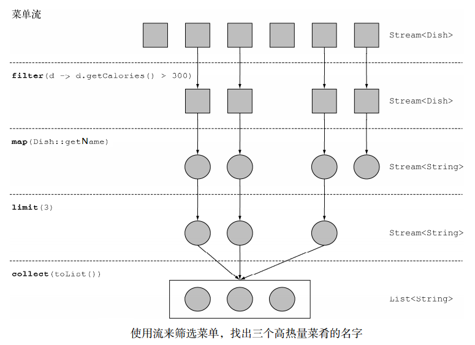

# 引入流 #

### 流是什么？ ###

流是Java API的新成员，它允许你以声明性方式处理数据集合（通过查询语句来表达，而不是临时编写一个实现）。就现在来说，你可以把它们看成遍历数据集的高级迭代器。

此外，流还可以透明地并行处理，你无需写任何多线程代码了！

	import static java.util.Comparator.comparing;
	import static java.util.stream.Collectors.toList;
	
	public class StreamBasic {
	
		public static void main(String... args) {
			// Java 7
			getLowCaloricDishesNamesInJava7(Dish.menu).forEach(System.out::println);
	
			System.out.println("---");
	
			// Java 8
			getLowCaloricDishesNamesInJava8(Dish.menu).forEach(System.out::println);
	
		}
	
		//Java 7 的处理方式
		public static List<String> getLowCaloricDishesNamesInJava7(List<Dish> dishes) {
			List<Dish> lowCaloricDishes = new ArrayList<>();
			for (Dish d : dishes) {
				if (d.getCalories() < 400) {
					lowCaloricDishes.add(d);
				}
			}
			List<String> lowCaloricDishesName = new ArrayList<>();
			Collections.sort(lowCaloricDishes, new Comparator<Dish>() {
				public int compare(Dish d1, Dish d2) {
					return Integer.compare(d1.getCalories(), d2.getCalories());
				}
			});
			for (Dish d : lowCaloricDishes) {
				lowCaloricDishesName.add(d.getName());
			}
			return lowCaloricDishesName;
		}
	
		//Java8的处理方式
		public static List<String> getLowCaloricDishesNamesInJava8(List<Dish> dishes) {
			return dishes.stream()//并行处理的则使用paralleStream()
					.filter(d -> d.getCalories() < 400)
					.sorted(comparing(Dish::getCalories))
					.map(Dish::getName).collect(toList());
		}
	}

数据准备

	public class Dish {
	
		private final String name;
		private final boolean vegetarian;
		private final int calories;
		private final Type type;
	
		public Dish(String name, boolean vegetarian, int calories, Type type) {
			this.name = name;
			this.vegetarian = vegetarian;
			this.calories = calories;
			this.type = type;
		}
	
		public String getName() {
			return name;
		}
	
		public boolean isVegetarian() {
			return vegetarian;
		}
	
		public int getCalories() {
			return calories;
		}
	
		public Type getType() {
			return type;
		}
	
		public enum Type {
			MEAT, FISH, OTHER
		}
	
		@Override
		public String toString() {
			return name;
		}
	
		public static final List<Dish> menu = Arrays.asList(new Dish("pork", false, 800, Dish.Type.MEAT),
				new Dish("beef", false, 700, Dish.Type.MEAT), 
				new Dish("chicken", false, 400, Dish.Type.MEAT),
				new Dish("french fries", true, 530, Dish.Type.OTHER),
				new Dish("rice", true, 350, Dish.Type.OTHER),
				new Dish("season fruit", true, 120, Dish.Type.OTHER),
				new Dish("pizza", true, 550, Dish.Type.OTHER),
				new Dish("prawns", false, 400, Dish.Type.FISH),
				new Dish("salmon", false, 450, Dish.Type.FISH));
	}

### 流简介 ###

**流定义**

**从支持数据处理操作的源生成的元素序列**

- 元素序列——就像集合一样，流也提供了一个接口，可以访问特定元素类型的一组有序值。因为集合是数据结构，所以它的主要目的是以特定的时间/空间复杂度存储和访问元素（如ArrayList 与 LinkedList）。但流的目的在于表达计算，比如你前面见到的filter、 sorted和map。集合讲的是数据，流讲的是计算。
- 源——流会使用一个提供数据的源，如集合、数组或输入/输出资源。 请注意，从有序集合生成流时会保留原有的顺序。由列表生成的流，其元素顺序与列表一致。
- 数据处理操作——流的数据处理功能支持类似于数据库的操作，以及函数式编程语言中的常用操作，如filter、 map、 reduce、 find、 match、 sort等。流操作可以顺序执行，也可并行执行。

**此外，流操作有两个重要的特点。**

- 流水线——很多流操作本身会返回一个流，这样多个操作就可以链接起来，形成一个大的流水线。这让我们下一章中的一些优化成为可能，如延迟和短路。流水线的操作可以看作对数据源进行数据库式查询。
- 内部迭代——与使用迭代器显式迭代的集合不同，流的迭代操作是在背后进行的。

---

	import static java.util.stream.Collectors.toList;

	List<String> threeHighCaloricDishNames = menu.stream().filter(d -> d.getCalories() > 300).map(Dish::getName).limit(3).collect(toList());
	System.out.println(threeHighCaloricDishNames);

流程图

### 流与集合 ###

#### 只能遍历一次 ####

请注意，和迭代器类似，流只能遍历一次。遍历完之后，我们就说这个流已经被消费掉了。你可以从原始数据源那里再获得一个新的流来重新遍历一遍

	List<String> title = Arrays.asList("Java8", "In", "Action");
	Stream<String> s = title.stream();
	s.forEach(System.out::println);
	s.forEach(System.out::println);//java.lang.IllegalStateException:流已被操作或关闭

#### 外部迭代与内部迭代 ####

外部迭代

	List<String> names = new ArrayList<>();
	
	for(Dish d: menu){
		names.add(d.getName());
	}

	//使用迭代器模式
	List<String> names = new ArrayList<>();
	Iterator<String> iterator = menu.iterator();
	
	while(iterator.hasNext()) {
		Dish d = iterator.next();
		names.add(d.getName());
	}

内部迭代

	List<String> names = menu.stream().map(Dish::getName).collect(toList());

外部迭代一个集合，显式地取出每个项目再加以处理。

内部迭代时，项目可以透明地并行处理，或者用更优化的顺
序进行处理。

流利用了内部迭代：替你把迭代做了。但是，只有你已经预先定义好了能够隐藏迭代的操作列表，例如filter或map，这个才有用。

### 流操作 ###

	List<String> names = menu.stream()
		.filter(d -> d.getCalories() > 300)
		.map(Dish::getName)
		.limit(3)
		.collect(toList())

- **中间操作** filter、 map和limit可以连成一条流水线；
- **终端操作** collect触发流水线执行并关闭它。

总而言之，流的使用一般包括三件事：

- 一个数据源（如集合）来执行一个查询；
- 一个中间操作链，形成一条流的流水线；
- 一个终端操作，执行流水线，并能生成结果。

流的流水线背后的理念类似于构建器模式Builder。

**中间操作**

<table>

<tr>
<td>操作</td>
<td>类型</td>
<td>返回类型</td>
<td>操作参数</td>
<td>函数描述符</td>
</tr>

<tr>
<td>map</td>
<td rowspan='5'>中间</td>
<td>Stream&lt;R&gt;</td>
<td>Function&lt;T, R&gt;</td>
<td>T -> R</td>
</tr>

<tr>
<td>filter</td>
<td rowspan='4'>Stream&lt;T&gt;</td>
<td>Predicate&lt;T&gt;</td>
<td>T -> boolean</td>
</tr>

<tr>
<td>limit</td>
<td></td>
<td></td>
</tr>

<tr>
<td>sorted</td>
<td>Comparator&lt;T&gt;</td>
<td>(T, T) -> int</td>
</tr>

<tr>
<td>distinct</td>
<td></td>
<td></td>
</tr>

</table>

**终端操作**

<table>

<tr>
<td>操作</td>
<td>类型</td>
<td>目的</td>
</tr>

<tr>
<td>forEach</td>
<td rowspan='3'>终端</td>
<td>消费流中的每个元素并对其应用 Lambda。这一操作返回 void</td>
</tr>

<tr>
<td>count</td>
<td>返回流中元素的个数。这一操作返回 long</td>
</tr>

<tr>
<td>collect</td>
<td>把流归约成一个集合，比如 List、 Map 甚至是 Integer。</td>
</tr>

</table>

