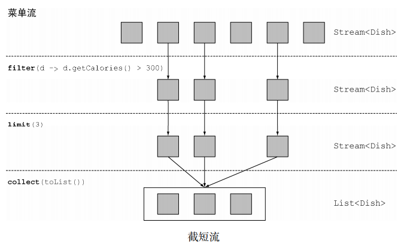
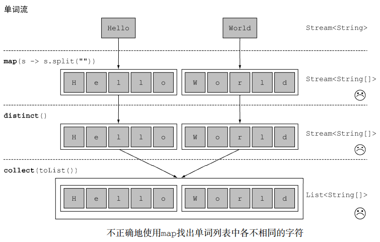

# 使用流 #

### 筛选和切片 ###

#### 用谓词Predicate筛选 ####

	List<Dish> vegetarianMenu = menu.stream()//
			.filter(Dish::isVegetarian)//Predicate<T>做参数
			.collect(toList());

	vegetarianMenu.forEach(System.out::println);

#### 筛选各异的元素（去重） ####

	// Filtering unique elements
	List<Integer> numbers = Arrays.asList(1, 2, 1, 3, 3, 2, 4);
	numbers.stream()//
		.filter(i -> i % 2 == 0)//
		.distinct()//
		.forEach(System.out::println);
	System.out.println("---");

#### 截短流 ####

	// Truncating a stream
	List<Dish> dishesLimit3 = menu.stream()//
			.filter(d -> d.getCalories() > 300)//
			.limit(3)//
			.collect(toList());

	dishesLimit3.forEach(System.out::println);

#### 跳过元素 ####

	List<Dish> dishesSkip2 = menu.stream()//
			.filter(d -> d.getCalories() > 300)//
			.skip(2)//
			.collect(toList());

	dishesSkip2.forEach(System.out::println);

### 映射 ###

#### 对流中每一个元素应用函数 ####

	// map
	List<String> dishNames = Dish.menu.stream()
			.map(Dish::getName)
			.collect(toList());
	System.out.println(dishNames);

	// map
	List<String> words = Arrays.asList("Hello", "World");
	List<Integer> wordLengths = words.stream()
			.map(String::length)
			.collect(toList());
	System.out.println(wordLengths);

#### 流的扁平化 ####

任务

	给定单词列表["Hello","World"]，
	想要返回列表["H","e","l", "o","W","r","d"]

第一版本

	words.stream()
		.map(word -> word.split(""))
		.distinct()
		.collect(toList());

这个方法的问题在于，传递给map方法的Lambda为每个单词返回了一个String[]（String列 表 ）。 因 此 ， map 返 回 的 流 实 际 上 是 **Stream<String[]>** 类 型 的 。 你 真 正 想 要 的 是 用Stream<String>来表示一个字符流。

**解决之道**

1.尝试使用map和Array.stream()

	String[] arrayOfWords = {"Goodbye", "World"};
	Stream<String> streamOfwords = Arrays.stream(arrayOfWords);

	//返回的并不是想要的List<String>
	List<Stream<String>> list = words.stream()
		.map(word -> word.split(""))
		.map(Arrays::stream)
		.distinct()
		.collect(toList());

2.使用flatMap

	List<String> uniqueCharacters =
		words.stream()
		.map(w -> w.split(""))
		.flatMap(Arrays::stream)
		.distinct()
		.collect(Collectors.toList());

	//简化了一些
	words.stream()
		.flatMap((String line) -> Arrays.stream(line.split("")))
		.distinct()
		.forEach(System.out::println);

**更多实例**

1.给定两个数字列表，如何返回所有的数对呢？例如，给定列表[1, 2, 3]和列表[3, 4]，应该返回[[1, 3], [1, 4], [2, 3], [2, 4], [3, 3], [3, 4]]。为简单起见，你可以用有两个元素的数组来代表数对。

	List<Integer> numbers1 = Arrays.asList(1, 2, 3);
	List<Integer> numbers2 = Arrays.asList(3, 4);
	List<int[]> pairs = numbers1.stream()
			.flatMap(i -> numbers2.stream()
					.map(j -> new int[]{i, j})
			)
			.collect(toList());

2.如何扩展前一个例子，只返回总和能被3整除的数对呢？例如[2, 4]和[3, 3]是可以的。

	List<Integer> numbers1 = Arrays.asList(1, 2, 3);
	List<Integer> numbers2 = Arrays.asList(3, 4);
	List<int[]> pairs =
		numbers1.stream()
		.flatMap(i ->
			numbers2.stream()
				.filter(j -> (i + j) % 3 == 0)
				.map(j -> new int[]{i, j})
		)
		.collect(toList());

### 查找和匹配 ###

#### 检查谓词是否至少匹配一个元素anyMatch ####

	private static boolean isVegetarianFriendlyMenu() {
		return Dish.menu.stream().anyMatch(Dish::isVegetarian);
	}

#### 检查谓词是否匹配所有元素allMatch ####

	private static boolean isHealthyMenu() {
		return Dish.menu.stream().allMatch(d -> d.getCalories() < 1000);
	}

#### 检查谓词是否不匹配所有元素noneMatch ####

	private static boolean isHealthyMenu2() {
		return Dish.menu.stream().noneMatch(d -> d.getCalories() >= 1000);
	}

#### 查找元素 ####

	Optional<Dish> dish =
		menu.stream()
			.filter(Dish::isVegetarian)
			.findAny();

Optional&lt;T&gt;类（java.util.Optional）是一个容器类，代表一个值存在或不存在。在上面的代码中， findAny可能什么元素都没找到。 Java 8的库设计人员引入了Optional&lt;T&gt;，这样就不用返回众所周知容易出问题的null了。

Optional里面几种可以迫使你显式地检查值是否存在或处理值不存在的情形的方法也不错。

- isPresent()将在Optional包含值的时候返回true, 否则返回false。
- ifPresent(Consumer<T> block)会在值存在的时候执行给定的代码块。我们在第3章
介绍了Consumer函数式接口；它让你传递一个接收T类型参数，并返回void的Lambda表达式。
- T get()会在值存在时返回值，否则抛出一个NoSuchElement异常。
- T orElse(T other)会在值存在时返回值，否则返回一个默认值。

---

	menu.stream()
		.filter(Dish::isVegetarian)
		.findAny()
		.ifPresent(d -> System.out.println(d.getName());

#### 查找第一个元素 ####

	List<Integer> someNumbers = Arrays.asList(1, 2, 3, 4, 5);
	Optional<Integer> firstSquareDivisibleByThree =
		someNumbers.stream()
			.map(x -> x * x)
			.filter(x -> x % 3 == 0)
			.findFirst();

### 归约 ###

#### 元素求和 ####

	int sum = numbers.stream().reduce(0, (a, b) -> a + b);

	//or

	int sum = numbers.stream().reduce(0, Integer::sum);

reduce接受两个参数：

- 一个初始值，这里是0；
- 一个BinaryOperator<T>来将两个元素结合起来产生一个新值，这里我们用的是lambda (a, b) -> a + b

**无初始值**

	Optional<Integer> sum = numbers.stream().reduce((a, b) -> (a + b));

为什么它返回一个Optional<Integer>呢？考虑流中没有任何元素的情况。reduce操作无法返回其和，因为它没有初始值。这就是为什么结果被包裹在一个Optional对象里，以表明和可能不存在。

#### 最大值和最小值 ####

	Optional<Integer> max = numbers.stream().reduce(Integer::max);
	Optional<Integer> min = numbers.stream().reduce(Integer::min);

	//当然也可以写成Lambda (x, y) -> x < y ? x : y而不是Integer::min，不过后者比较易读

#### 总数 ####

	int count = menu.stream()
		.map(d -> 1)
		.reduce(0, (a, b) -> a + b);

	long count = menu.stream().count();

**并行处理**

stream()换成parallelStream（）

有状态和无状态

有状态——如sort或distinct，需要些中间值保存些结果进行处理

无状态——如map和filter,则不需要中间值处理结果

### 实战 ###

需求

执行交易的交易员

(1) 找出2011年发生的所有交易，并按交易额排序（从低到高）。

(2) 交易员都在哪些不同的城市工作过？

(3) 查找所有来自于剑桥的交易员，并按姓名排序。

(4) 返回所有交易员的姓名字符串，按字母顺序排序。

(5) 有没有交易员是在米兰工作的？

(6) 打印生活在剑桥的交易员的所有交易额。

(7) 所有交易中，最高的交易额是多少？

(8) 找到交易额最小的交易。

**准备要素**

Trader和Transaction类

	public  class Trader{
		
		private String name;
		private String city;
	
		public Trader(String n, String c){
			this.name = n;
			this.city = c;
		}
	
		public String getName(){
			return this.name;
		}
	
		public String getCity(){
			return this.city;
		}
	
		public void setCity(String newCity){
			this.city = newCity;
		}
	
		public String toString(){
			return "Trader:"+this.name + " in " + this.city;
		}
	}

---

	public class Transaction{
	
		private Trader trader;
		private int year;
		private int value;
	
		public Transaction(Trader trader, int year, int value)
		{
			this.trader = trader;
			this.year = year;
			this.value = value;
		}
	
		public Trader getTrader(){ 
			return this.trader;
		}
	
		public int getYear(){
			return this.year;
		}
	
		public int getValue(){
			return this.value;
		}
		
		public String toString(){
		    return "{" + this.trader + ", " +
		           "year: "+this.year+", " +
		           "value:" + this.value +"}";
		}
	}

准备数据

	Trader raoul = new Trader("Raoul", "Cambridge");
	Trader mario = new Trader("Mario", "Milan");
	Trader alan = new Trader("Alan", "Cambridge");
	Trader brian = new Trader("Brian", "Cambridge");

	List<Transaction> transactions = Arrays.asList(new Transaction(brian, 2011, 300),
			new Transaction(raoul, 2012, 1000),
			new Transaction(raoul, 2011, 400),
			new Transaction(mario, 2012, 710),
			new Transaction(mario, 2012, 700),
			new Transaction(alan, 2012, 950));

**实战开始**

找出2011年的所有交易并按交易额排序（从低到高）

	List<Transaction> tr2011 = transactions.stream()
			.filter(transaction -> transaction.getYear() == 2011)
			.sorted(comparing(Transaction::getValue))
			.collect(toList());

---

交易员都在哪些不同的城市工作过

	List<String> cities = transactions.stream()
		.map(transaction -> transaction.getTrader().getCity())
		.distinct()
		.collect(toList());、

	//or

	Set<String> cities =
		transactions.stream()
		.map(transaction -> transaction.getTrader().getCity())
		.collect(toSet());

---

查找所有来自于剑桥的交易员，并按姓名排序

	List<Trader> traders = transactions.stream()
			.map(Transaction::getTrader)
			.filter(trader -> trader.getCity().equals("Cambridge"))
			.distinct()
			.sorted(comparing(Trader::getName))
			.collect(toList());

---

返回所有交易员的姓名字符串，按字母顺序排序

	String traderStr = transactions.stream()
			.map(transaction -> transaction.getTrader().getName())
			.distinct()
			.sorted()
			.reduce("", (n1, n2) -> n1 + n2);

	String traderStr =
			transactions.stream()
			.map(transaction -> transaction.getTrader().getName())
			.distinct()
			.sorted()
			.collect(joining());

---

有没有交易员是在米兰工作的

	boolean milanBased = transactions.stream()
				.anyMatch(transaction -> transaction.getTrader().getCity().equals("Milan"));
	System.out.println(milanBased);

---

打印生活在剑桥的交易员的所有交易额

	transactions.stream()
		.filter(t -> "Cambridge".equals(t.getTrader().getCity()))
		.map(Transaction::getValue)
		.forEach(System.out::println);

---

所有交易中，最高的交易额是多少

	Optional<Integer> highestValue =
		transactions.stream()
		.map(Transaction::getValue)
		.reduce(Integer::max);

---

找到交易额最小的交易

	Optional<Transaction> smallestTransaction =
		transactions.stream()
		.reduce((t1, t2) ->
		t1.getValue() < t2.getValue() ? t1 : t2);

	Optional<Transaction> smallestTransaction =
		transactions.stream()
		.min(comparing(Transaction::getValue));

### 数值流 ###

#### 原始类型流特化 ####

##### 映射到数值流 #####

将流转换为特化版本的常用方法是mapToInt、 mapToDouble和mapToLong。

	int calories = menu.stream()
		.mapToInt(Dish::getCalories)
		.sum();

##### 转换回对象流 #####

	IntStream intStream = menu.stream().mapToInt(Dish::getCalories);
	Stream<Integer> stream = intStream.boxed();

##### 默认值OptionalInt #####

例如，要找到IntStream中的最大元素，可以调用max方法，它会返回一个OptionalInt：

	OptionalInt maxCalories = menu.stream()
	.mapToInt(Dish::getCalories)
	.max();

现在，如果没有最大值的话，你就可以显式处理OptionalInt去定义一个默认值了：

	int max = maxCalories.orElse(1);

#### 数值范围 ####

	IntStream evenNumbers = IntStream.rangeClosed(1, 100)//范围[1,100]，IntStream.range(1, 100)范围为[1,100)
		.filter(n -> n % 2 == 0);
	System.out.println(evenNumbers.count());

#### 数值流应用:勾股数 ####
	
	//符合形成直角三角形
	Stream<int[]> pythagoreanTriples =
		IntStream.rangeClosed(1, 100).boxed()
		.flatMap(a ->
			IntStream.rangeClosed(a, 100)
				.filter(b -> Math.sqrt(a*a + b*b) % 1 == 0)
				.mapToObj(b ->new int[]{a, b, (int)Math.sqrt(a * a + b * b)})
		);

	//限制
	pythagoreanTriples.limit(5)
		.forEach(t ->System.out.println(t[0] + ", " + t[1] + ", " + t[2]));

	//比上一步优化了点
	Stream<double[]> pythagoreanTriples2 =
		IntStream.rangeClosed(1, 100).boxed()
			.flatMap(a ->IntStream.rangeClosed(a, 100)
			.mapToObj(b -> new double[]{a, b, Math.sqrt(a*a + b*b)})
			.filter(t -> t[2] % 1 == 0));

#### 构建流 ####

#### 由值创建流 ####

	Stream<String> stream = Stream.of("Java 8 ", "Lambdas ", "In ", "Action");
	stream.map(String::toUpperCase).forEach(System.out::println);
	//你可以使用empty得到一个空流，如下所示：
	Stream<String> emptyStream = Stream.empty();

#### 由数组创建流 ####

	int[] numbers = {2, 3, 5, 7, 11, 13};
	int sum = Arrays.stream(numbers).sum();

#### 由文件生成流 ####

	long uniqueWords = 0;

	//流会自动关闭
	try(Stream<String> lines = Files.lines(Paths.get("data.txt"), Charset.defaultCharset())){
		uniqueWords = lines.flatMap(line -> Arrays.stream(line.split(" ")))
			.distinct()
			.count();
	}
	catch(IOException e){
	}

#### 由函数生成流：创建无限流 ####

##### 迭代 #####

	Stream.iterate(0, n -> n + 2)
		.limit(10)
		.forEach(System.out::println);

	//斐波纳契数列
	Stream.iterate(new int[]{0, 1},t -> new int[]{t[1], t[0]+t[1]})
		.limit(20)
		.forEach(t -> System.out.println("(" + t[0] + "," + t[1] +")"));

	Stream.iterate(new int[]{0, 1},t -> new int[]{t[1],t[0] + t[1]})
		.limit(10)
		.map(t -> t[0])
		.forEach(System.out::println);

##### 生成 #####

	Stream.generate(Math::random)
		.limit(5)
		.forEach(System.out::println);

	IntStream.generate(() -> 1)
		.limit(5)
		.forEach(System.out::println);

	//
	IntSupplier fib = new IntSupplier(){
		private int previous = 0;
		private int current = 1;
		public int getAsInt(){
			int oldPrevious = this.previous;
			int nextValue = this.previous + this.current;
			this.previous = this.current;
			this.current = nextValue;

			return oldPrevious;
		}
	};

	IntStream.generate(fib).limit(10).forEach(System.out::println);

