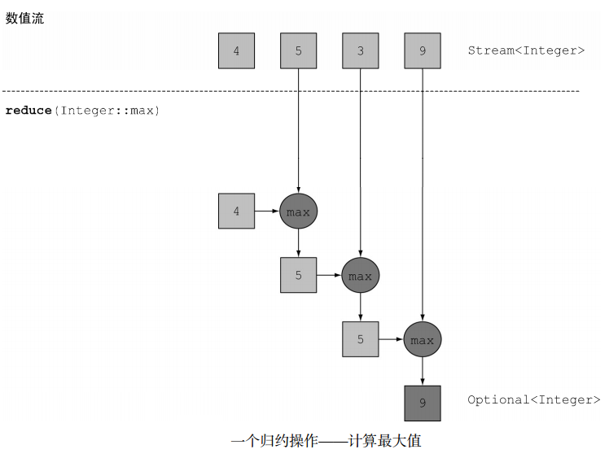

# 使用流 #

[1.筛选和切片](#筛选和切片)

[1.1.用谓词Predicate筛选-filter](#用谓词predicate筛选filter)

[1.2.筛选各异的元素-去重-distinct](#筛选各异的元素去重distinct)

[1.3.截短流-limit](#截短流limit)

[1.4.跳过元素-skip](#跳过元素skip)

[2.映射-map](#映射map)

[2.1.对流中每一个元素应用函数-map](#对流中每一个元素应用函数map)

[2.2.流的扁平化-flatMap](#流的扁平化flatmap)

[2.2.1.更多流的扁平化例子](#更多流的扁平化例子)

[3.查找和匹配-find-match](#查找和匹配findmatch)

[3.1.检查谓词是否至少匹配一个元素-anyMatch](#检查谓词是否至少匹配一个元素anymatch)

[3.2.检查谓词是否匹配所有元素-allMatch](#检查谓词是否匹配所有元素allmatch)

[3.3.检查谓词是否不匹配所有元素-noneMatch](#检查谓词是否不匹配所有元素nonematch)

[3.4.查找元素-findAny](#查找元素findany)

[3.4.1.Optional一览](#optional一览)

[3.5.查找第一个元素-findFirst](#查找第一个元素findfirst)

[3.6.何时使用findFirst和findAny](#何时使用findfirst和findany)

[4.归约-reduce](#归约reduce)

[4.1.元素求和](#元素求和)

[4.2.元素求积](#元素求积)

[4.3.最大值和最小值](#最大值和最小值)

[4.4.总数](#总数)

[4.5.归约方法的优势与并行化](#归约方法的优势与并行化)

[4.6.流操作：无状态和有状态](#流操作无状态和有状态)

[4.7.中间操作和终端操作小结](#中间操作和终端操作小结)

[5.付诸实践](#付诸实践)

[5.1.领域：交易员和交易](#领域交易员和交易)

[5.2.解答](#解答)

[6.数值流](#数值流)

[6.1.原始类型流特化](#原始类型流特化)

[6.1.1.映射到数值流-mapToXXX](#映射到数值流maptoxxx)

[6.1.2.转换回对象流-boxed](#转换回对象流boxed)

[6.1.3.默认值-OptionalInt](#默认值optionalint)

[6.2.数值范围-range](#数值范围range)

[6.3.数值流应用:勾股数](#数值流应用勾股数)

[6.3.1.勾股数](#勾股数)

[6.3.2.表示三元数](#表示三元数)

[6.3.3.筛选成立的组合](#筛选成立的组合)

[6.3.4.生成三元组](#生成三元组)

[6.3.5.生成b值](#生成b值)

[6.3.6.生成值](#生成值)

[6.3.7.运行代码](#运行代码)

[6.3.8.更上一层楼](#更上一层楼)

[7.构建流](#构建流)

[7.1.由值创建流](#由值创建流)

[7.2.由数组创建流](#由数组创建流)

[7.3.由文件生成流](#由文件生成流)

[7.4.由函数生成流：创建无限流](#由函数生成流创建无限流)

[7.4.1.迭代-iterate](#迭代iterate)

[7.4.2.迭代-斐波纳契数列](#迭代斐波纳契数列)

[7.4.3.生成](#生成)

[7.4.4.生成-斐波纳契数列](#生成斐波纳契数列)

[8.小结](#小结)

## 筛选和切片 ##

[Filtering](Filtering.java)

### 用谓词Predicate筛选-filter ###

	List<Dish> vegetarianMenu = menu.stream()//
			.filter(Dish::isVegetarian)//Predicate<T>做参数
			.collect(toList());

	vegetarianMenu.forEach(System.out::println);

### 筛选各异的元素-去重-distinct ###

	// Filtering unique elements
	List<Integer> numbers = Arrays.asList(1, 2, 1, 3, 3, 2, 4);
	numbers.stream()//
		.filter(i -> i % 2 == 0)//
		.distinct()//
		.forEach(System.out::println);

### 截短流-limit ###

	// Truncating a stream
	List<Dish> dishesLimit3 = menu.stream()//
			.filter(d -> d.getCalories() > 300)//
			.limit(3)//
			.collect(toList());

	dishesLimit3.forEach(System.out::println);

### 跳过元素-skip ###

	List<Dish> dishesSkip2 = menu.stream()//
			.filter(d -> d.getCalories() > 300)//
			.skip(2)//
			.collect(toList());

	dishesSkip2.forEach(System.out::println);

## 映射-map ##

### 对流中每一个元素应用函数-map ###

	// map
	List<String> dishNames = Dish.menu.stream()
			.map(Dish::getName)
			.collect(toList());
	System.out.println(dishNames);

	// map
	List<String> words = Arrays.asList("Hello", "World");
	List<Integer> wordLengths = words.stream()
			.map(String::length)
			.collect(toList());
	System.out.println(wordLengths);

### 流的扁平化-flatMap ###

>PS.多重map压扁

任务

	给定单词列表["Hello","World"]，
	想要返回列表["H","e","l","o","W","r","d"]

第一版本

	words.stream()
		.map(word -> word.split("")) //返回Stream<String[]>
		.distinct()
		.collect(toList());

这个方法的问题在于，传递给map方法的Lambda为每个单词返回了一个String[]（String列 表 ）。 因 此 ， map 返 回 的 流 实 际 上 是 **Stream<String[]>** 类 型 的 。 你 真 正 想 要 的 是 用Stream<String>来表示一个字符串流。

**解决之道**

1.尝试使用map和Array.stream()

	String[] arrayOfWords = {"Goodbye", "World"};
	Stream<String> streamOfwords = Arrays.stream(arrayOfWords);

	//返回的并不是想要的List<String>
	List<Stream<String>> list = words.stream()
		.map(word -> word.split(""))// 返回Stream<String[]>
		.map(Arrays::stream)// 返回Stream<Stream<String>> 
		.distinct()
		.collect(toList());

2.使用flatMap

	List<String> uniqueCharacters =
		words.stream()
		.map(w -> w.split(""))// 返回Stream<String[]>
		.flatMap(Arrays::stream)// 返回Stream<String>，把Stream<Stream<String>> 压成 Stream<String>
		.distinct()
		.collect(Collectors.toList());

一言以蔽之，flatmap方法让你把一个流中的每个值都换成另一个流，然后把所有的流连接起来成为一个流。

>PS. flatmap 能把Stream<Stream<String>> 压成 Stream<String>

	//简化了一些
	words.stream()
		.flatMap((String line) -> Arrays.stream(line.split("")))
		.distinct()
		.forEach(System.out::println);

#### 更多流的扁平化例子 ####

0.给定一个数字列表，如何返回一个由每个数的平方构成的列表呢？例如，给定[1, 2, 3, 4, 5]，应该返回[1, 4, 9, 16, 25]

	List<Integer> numbers = Arrays.asList(1, 2, 3, 4, 5);
	List<Integer> squares = numbers.stream()
					.map(n -> n * n)
					.collect(toList());

1.给定两个数字列表，如何返回所有的数对呢？例如，给定列表[1, 2, 3]和列表[3, 4]，应该返回[[1, 3], [1, 4], [2, 3], [2, 4], [3, 3], [3, 4]]。为简单起见，你可以用有两个元素的数组来代表数对。

	List<Integer> numbers1 = Arrays.asList(1, 2, 3);
	List<Integer> numbers2 = Arrays.asList(3, 4);
	List<int[]> pairs = numbers1.stream()
			.flatMap(i -> numbers2.stream()
					.map(j -> new int[]{i, j})
			)
			.collect(toList());

2.如何扩展前一个例子，只返回总和能被3整除的数对呢？例如[2, 4]和[3, 3]是可以的。

	List<Integer> numbers1 = Arrays.asList(1, 2, 3);
	List<Integer> numbers2 = Arrays.asList(3, 4);
	List<int[]> pairs =
		numbers1.stream()
		.flatMap(i ->
			numbers2.stream()
				.filter(j -> (i + j) % 3 == 0)
				.map(j -> new int[]{i, j})
		)
		.collect(toList());

## 查找和匹配-find-match ##

[Finding](Finding.java)

### 检查谓词是否至少匹配一个元素-anyMatch ###

	private static boolean isVegetarianFriendlyMenu() {
		return Dish.menu.stream().anyMatch(Dish::isVegetarian);
	}

### 检查谓词是否匹配所有元素-allMatch ###

	private static boolean isHealthyMenu() {
		return Dish.menu.stream().allMatch(d -> d.getCalories() < 1000);
	}

### 检查谓词是否不匹配所有元素-noneMatch ###

	private static boolean isHealthyMenu2() {
		return Dish.menu.stream().noneMatch(d -> d.getCalories() >= 1000);
	}

anyMatch、allMatch和noneMatch这三个操作都用到了所谓的**短路**，这就是大家熟悉的Java中&&和||运算符短路在流中的版本

### 查找元素-findAny ###

	Optional<Dish> dish =
		menu.stream()
			.filter(Dish::isVegetarian)
			.findAny();

#### Optional一览 ####

Optional<T&gt;类（java.util.Optional）是一个容器类，代表一个值存在或不存在。在上面的代码中， findAny可能什么元素都没找到。 Java 8的库设计人员引入了Optional&lt;T&gt;，这样就不用返回众所周知容易出问题的null了。

Optional里面几种可以迫使你显式地检查值是否存在或处理值不存在的情形的方法也不错。

- isPresent()将在Optional包含值的时候返回true, 否则返回false。
- ifPresent(Consumer<T&gt; block)会在值存在的时候执行给定的代码块。我们在第3章
介绍了Consumer函数式接口；它让你传递一个接收T类型参数，并返回void的Lambda表达式。
- T get()会在值存在时返回值，否则抛出一个NoSuchElement异常。
- T orElse(T other)会在值存在时返回值，否则返回一个默认值。

---

	menu.stream()
		.filter(Dish::isVegetarian)
		.findAny()
		.ifPresent(d -> System.out.println(d.getName());

### 查找第一个元素-findFirst ###

	List<Integer> someNumbers = Arrays.asList(1, 2, 3, 4, 5);
	Optional<Integer> firstSquareDivisibleByThree =
		someNumbers.stream()
			.map(x -> x * x)
			.filter(x -> x % 3 == 0)
			.findFirst();

### 何时使用findFirst和findAny ###

你可能会想，为什么会同时有findFirst和findAny呢？答案是**并行**。找到第一个元素在并行上限制更多。如果你不关心返回的元素是哪个，请使用findAny，因为它在使用并行流时限制较少。

## 归约-reduce ##

[Reducing](Reducing.java)

### 元素求和 ###

	int sum = numbers.stream().reduce(0, (a, b) -> a + b);

	//or

	int sum = numbers.stream().reduce(0, Integer::sum);

reduce接受两个参数：

- 一个初始值，这里是0；
- 一个BinaryOperator<T>来将两个元素结合起来产生一个新值，这里我们用的是lambda (a, b) -> a + b

---

**无初始值**

	Optional<Integer> sum = numbers.stream().reduce((a, b) -> (a + b));

为什么它返回一个Optional<Integer>呢？考虑流中没有任何元素的情况。reduce操作无法返回其和，因为它没有初始值。这就是为什么结果被包裹在一个Optional对象里，以表明和可能不存在。

### 元素求积 ###

	int product = numbers.stream().reduce(1, (a, b) -> a * b);

### 最大值和最小值 ###

	Optional<Integer> max = numbers.stream().reduce(Integer::max);
	Optional<Integer> min = numbers.stream().reduce(Integer::min);

	//当然也可以写成Lambda (x, y) -> x < y ? x : y而不是Integer::min，不过后者比较易读

### 总数 ###

	int count = menu.stream()
		.map(d -> 1)
		.reduce(0, (a, b) -> a + b);

	long count = menu.stream().count();

### 归约方法的优势与并行化 ###

相比于前面写的逐步迭代求和，使用reduce的好处在于，这里的迭代被内部迭代抽象掉了，这让内部实现得以选择并行执行reduce操作。而迭代式求和例子要更新共享变量sum，这不是那么容易并行化的。如果你加入了同步，**很可能会发现线程竞争抵消了并行本应带来的性能提升**！这种计算的并行化需要另一种办法：将输入分块，分块求和，最后再合并起来。但这样的话代码看起来就完全不一样了。

使用流来对所有的元素并行求和时，代码几乎不用修改：stream()换成了parallelStream()。
	
	int sum = numbers.parallelStream().reduce(0, Integer::sum);

### 流操作：无状态和有状态 ###

诸如map或filter等操作会从输入流中获取每一个元素，并在输出流中得到0或1个结果。这些操作一般都是**无状态**的：它们没有内部状态（假设用户提供的Lambda或方法引用没有内部可变状态）。但诸如reduce、sum、max等操作需要内部状态来累积结果。在上面的情况下，内部状态很小。在我们的例子里就是一个int或double。不管流中有多少元素要处理，内部状态都是有界的。

相反，诸如sort或distinct等操作一开始都和filter和map差不多——都是接受一个流，再生成一个流（中间操作），但有一个关键的区别。从流中排序和删除重复项时都需要知道先前的历史。例如，排序要求所有元素都放入缓冲区后才能给输出流加入一个项目，这一操作的存储要求是**无界**的。要是流比较大或是无限的，就可能会有问题（把质数流倒序会做什么呢？它应当返回最大的质数，但数学告诉我们它不存在）。我们把这些操作叫作**有状态**操作。

### 中间操作和终端操作小结 ###

操作|类型|返回类型|使用的类型/函数式接口|函数描述符
---|---|---|---|---
filter|中间|Stream<T&gt;|Predicate<T&gt;|T-&gt;boolean
distinct|中间 (有状态-无界)|Stream<T&gt;|-|-
skip|中间 (有状态-有界)|Stream<T&gt;|long|-
limit|中间 (有状态-有界)|Stream<T&gt;|long|-
map|中间|Stream<R&gt;|Function<T,R&gt;|T-&gt;R
flatMap|中间|Stream<R&gt;|Function<T,Stream<R&gt;&gt;|T-&gt;Stream<R&gt;
sorted|中间 (有状态-无界)|Stream<T&gt;|Comparator<T&gt;|(T,T)-&gt;int
anyMatch|终端|boolean|Predicate<T&gt;|T-&gt;boolean
noneMatch|终端|boolean|Predicate<T&gt;|T-&gt;boolean
allMatch|终端|boolean|Predicate<T&gt;|T-&gt;boolean
findAny|终端|Optional<T&gt;|-|-
findFirst|终端|Optional<T&gt;|-|-
forEach|终端|void|Consumer<T&gt;|T-&gt;void
collect|终端|R|Collector<T,A,R&gt;|-
reduce|终端 (有状态-有界)|Optional<T&gt;|BinaryOperator<T&gt;|(T,T)->T
count|终端|long|-|-

## 付诸实践 ##

执行交易的交易员

1. 找出2011年发生的所有交易，并按交易额排序（从低到高）。
2. 交易员都在哪些不同的城市工作过？
3. 查找所有来自于剑桥的交易员，并按姓名排序。
4. 返回所有交易员的姓名字符串，按字母顺序排序。
5. 有没有交易员是在米兰工作的？
6. 打印生活在剑桥的交易员的所有交易额。
7. 所有交易中，最高的交易额是多少？
8. 找到交易额最小的交易。

### 领域：交易员和交易 ###

[Trader](Trader.java)

[Transaction](Transaction.java)

### 解答 ###

[PuttingIntoPractice](PuttingIntoPractice.java)

1.找出2011年的所有交易并按交易额排序（从低到高）

	List<Transaction> tr2011 = transactions.stream()
			.filter(transaction -> transaction.getYear() == 2011)
			.sorted(comparing(Transaction::getValue))
			.collect(toList());

---

2.交易员都在哪些不同的城市工作过

	List<String> cities = transactions.stream()
		.map(transaction -> transaction.getTrader().getCity())
		.distinct()
		.collect(toList());

	//or

	Set<String> cities =
		transactions.stream()
		.map(transaction -> transaction.getTrader().getCity())
		.collect(toSet());

---

3.查找所有来自于剑桥的交易员，并按姓名排序

	List<Trader> traders = transactions.stream()
			.map(Transaction::getTrader)
			.filter(trader -> trader.getCity().equals("Cambridge"))
			.distinct()
			.sorted(comparing(Trader::getName))
			.collect(toList());

---

4.返回所有交易员的姓名字符串，按字母顺序排序

	String traderStr = transactions.stream()
			.map(transaction -> transaction.getTrader().getName())
			.distinct()
			.sorted()
			.reduce("", (n1, n2) -> n1 + n2);

	String traderStr =
			transactions.stream()
			.map(transaction -> transaction.getTrader().getName())
			.distinct()
			.sorted()
			.collect(joining());

---

5.有没有交易员是在米兰工作的

	boolean milanBased = transactions.stream()
				.anyMatch(transaction -> transaction.getTrader().getCity().equals("Milan"));
	System.out.println(milanBased);

---

6.打印生活在剑桥的交易员的所有交易额

	transactions.stream()
		.filter(t -> "Cambridge".equals(t.getTrader().getCity()))
		.map(Transaction::getValue)
		.forEach(System.out::println);

---

7.所有交易中，最高的交易额是多少

	Optional<Integer> highestValue =
		transactions.stream()
		.map(Transaction::getValue)
		.reduce(Integer::max);

---

8.找到交易额最小的交易

	Optional<Transaction> smallestTransaction =
		transactions.stream()
		.reduce((t1, t2) ->
		t1.getValue() < t2.getValue() ? t1 : t2);

	Optional<Transaction> smallestTransaction =
		transactions.stream()
		.min(comparing(Transaction::getValue));

## 数值流 ##

[NumericStreams](NumericStreams.java)

可以使用reduce方法计算流中元素的总和.

例如，你可以像下面这样计算菜单的热量：

	int calories = menu.stream()
			.map(Dish::getCalories)
			.reduce(0, Integer::sum);

这段代码的问题是，它有一个暗含的装箱成本。每个Integer都必须拆箱成一个原始类型，再进行求和。要是可以直接像下面这样调用sum方法，岂不是更好？
	int calories = menu.stream()
			.map(Dish::getCalories)
			.sum();//这里不能编译，Streams接口没有定义sum方法

但这是不可能的。问题在于map方法会生成一个Stream<T>。虽然流中的元素是Integer类型，但Streams接口没有定义sum方法。

**为什么没有呢**？比方说，你只有一个像menu那样的Stream<Dish>，把各种菜加起来是没有任何意义的。

但不要担心，Stream API还提供了原始类型流特化，专门支持处理数值流的方法。

### 原始类型流特化 ###

Java 8引入了三个原始类型特化流接口来解决这个问题：IntStream、DoubleStream和LongStream，分别将流中的元素特化为int、long和double，从而避免了暗含的装箱成本。每个接口都带来了进行常用数值归约的新方法，比如对数值流求和的sum，找到最大元素的max。此外还有在必要时再把它们转换回对象流的方法。

**要记住的是**，这些特化的原因并不在于流的复杂性，而是装箱造成的复杂性——即类似int和Integer之间的效率差异。

#### 映射到数值流-mapToXXX ####

将流转换为特化版本的常用方法是mapToInt、 mapToDouble和mapToLong。

	int calories = menu.stream()
		.mapToInt(Dish::getCalories)//返回一个IntStream，不是Stream<Integer>
		.sum();

请注意，如果流是空的，sum默认返回0。IntStream还支持其他的方便方法，如max、min、average等。

#### 转换回对象流-boxed ####

同样，一旦有了数值流，你可能会想把它转换回非特化流。

	IntStream intStream = menu.stream().mapToInt(Dish::getCalories);
	Stream<Integer> stream = intStream.boxed();

#### 默认值-OptionalInt ####

如果你要计算IntStream中的最大元素，就得换个法子了，因为0是错误的结果。如何区分没有元素的流和最大值真的是0的流呢？

Optional可以用Integer、String等参考类型来参数化。对于三种原始流特化，也分别有一个Optional原始类型特化版本：OptionalInt、OptionalDouble和OptionalLong。

例如，要找到IntStream中的最大元素，可以调用max方法，它会返回一个OptionalInt：

	OptionalInt maxCalories = menu.stream()
			.mapToInt(Dish::getCalories)
			.max();

现在，如果没有最大值的话，你就可以显式处理OptionalInt去定义一个默认值了：

	int max = maxCalories.orElse(1);

### 数值范围-range ###

Java 8引入了两个可以用于IntStream和LongStream的静态方法，帮助生成这种范围：range和rangeClosed。这两个方法都是第一个参数接受起始值，第二个参数接受结束值。但range是不包含结束值的，而rangeClosed则包含结束值。

	IntStream evenNumbers = IntStream.rangeClosed(1, 100)//范围[1,100]，IntStream.range(1, 100)范围为[1,100)
		.filter(n -> n % 2 == 0);
	System.out.println(evenNumbers.count());

### 数值流应用:勾股数 ###

[Pythagorean](Pythagorean.java)

#### 勾股数 ####

	a^2+b^2=c^2

a|b|c
---|---|---
3|4|5
5|12|13
6|8|10
7|24|25

#### 表示三元数 ####

	new int[]{3, 4, 5};//来表示勾股数(3, 4, 5)

#### 筛选成立的组合 ####

怎么知道它是否能形成一组勾股数呢？你需要测试a * a + b * b的平方根是不是整数，也就是说它没有小数部分——在Java里可以使用expr % 1表示。如果它不是整数，那就是说c不是整数。

	filter(b -> Math.sqrt(a*a + b*b) % 1 == 0)

#### 生成三元组 ####

	stream.filter(b -> Math.sqrt(a*a + b*b) % 1 == 0)
			.map(b -> new int[]{a, b, (int) Math.sqrt(a * a + b * b)});

#### 生成b值 ####

	IntStream.rangeClosed(1, 100)
		.filter(b -> Math.sqrt(a*a + b*b) % 1 == 0)
		.mapToObj(b -> new int[]{a, b, (int) Math.sqrt(a * a + b * b)});

#### 生成值 ####

	//符合形成直角三角形
	Stream<int[]> pythagoreanTriples = IntStream.rangeClosed(1, 100)
		.boxed()////flatMap用到泛型，所以不能使用基本类型
		.flatMap(a ->
			IntStream.rangeClosed(a, 100)
				.filter(b -> Math.sqrt(a*a + b*b) % 1 == 0)
				.mapToObj(b ->new int[]{a, b, (int)Math.sqrt(a * a + b * b)})
		);

#### 运行代码 ####

	pythagoreanTriples.limit(5)
		.forEach(t ->System.out.println(t[0] + ", " + t[1] + ", " + t[2]));

#### 更上一层楼 ####

目前的解决办法并不是最优的，因为你要求两次平方根。让代码更为紧凑的一种可能的方法是，先生成所有的三元数(a\*a, b\*b, a\*a+b\*b)，然后再筛选符合条件的

	Stream<double[]> pythagoreanTriples2 =
		IntStream.rangeClosed(1, 100).boxed()
			.flatMap(a ->IntStream.rangeClosed(a, 100)
			.mapToObj(b -> new double[]{a, b, Math.sqrt(a*a + b*b)})
			.filter(t -> t[2] % 1 == 0));

## 构建流 ##

[BuildingStreams](BuildingStreams.java)

### 由值创建流 ###

	Stream<String> stream = Stream.of("Java 8 ", "Lambdas ", "In ", "Action");
	stream.map(String::toUpperCase).forEach(System.out::println);

	//你可以使用empty得到一个空流，如下所示：
	Stream<String> emptyStream = Stream.empty();

### 由数组创建流 ###

	int[] numbers = {2, 3, 5, 7, 11, 13};
	int sum = Arrays.stream(numbers).sum();

### 由文件生成流 ###

	long uniqueWords = 0;

	//流会自动关闭
	try(Stream<String> lines = Files.lines(Paths.get("data.txt"), Charset.defaultCharset())){
		uniqueWords = lines.flatMap(line -> Arrays.stream(line.split(" ")))
			.distinct()
			.count();
	}
	catch(IOException e){
	}

### 由函数生成流：创建无限流 ###

Stream API提供了两个静态方法来从函数生成流：Stream.iterate和Stream.generate。

这两个操作可以创建所谓的无限流：不像从固定集合创建的流那样有固定大小的流。由iterate和generate产生的流会用给定的函数按需创建值，因此可以无穷无尽地计算下去！

一般来说，应该使用limit(n)来对这种流加以限制，以避免打印无穷多个值。

#### 迭代-iterate ####

	Stream.iterate(0, n -> n + 2)
		.limit(10)
		.forEach(System.out::println);

iterate方法接受一个初始值（在这里是0），还有一个依次应用在每个产生的新值上的Lambda（UnaryOperator<T&gt;类型）。

#### 迭代-斐波纳契数列 ####

	//序列(0, 1), (1, 1), (1, 2), (2, 3), (3, 5), (5, 8), (8, 13), (13, 21)...
	Stream.iterate(new int[]{0, 1},t -> new int[]{t[1], t[0]+t[1]})
		.limit(20)
		.forEach(t -> System.out.println("(" + t[0] + "," + t[1] +")"));

	//只想打印正常的斐波纳契数列
	Stream.iterate(new int[]{0, 1},t -> new int[]{t[1],t[0] + t[1]})
		.limit(10)
		.map(t -> t[0])
		.forEach(System.out::println);

#### 生成 ####

	Stream.generate(Math::random)
		.limit(5)
		.forEach(System.out::println);

我们使用的供应源（指向Math.random的方法引用）是**无状态的**：它不会在任何地方记录任何值，以备以后计算使用。但供应源**不一定是无状态的**。
你可以创建存储状态的供应源，它可以修改状态，并在为流生成下一个值时使用。

举个例子，接下来将展示如何利用generate创建斐波纳契数列，这样你就可以和用iterate方法的办法比较一下。

但很重要的一点是，在**并行代码中使用有状态的供应源是不安全的**。因此下面的代码仅仅是为了内容完整，应**尽量避免使用**

	IntStream.generate(() -> 1)
		.limit(5)
		.forEach(System.out::println);

	IntStream twos = IntStream.generate(new IntSupplier(){
		public int getAsInt(){
			return 2;
		}
	});

#### 生成-斐波纳契数列 ####

	IntSupplier fib = new IntSupplier(){
		private int previous = 0;
		private int current = 1;
		public int getAsInt(){
			int oldPrevious = this.previous;
			int nextValue = this.previous + this.current;
			this.previous = this.current;
			this.current = nextValue;

			return oldPrevious;
		}
	};

	IntStream.generate(fib).limit(10).forEach(System.out::println);

前面的代码创建了一个IntSupplier的实例。此对象有**可变的**状态：它在两个实例变量中记录了前一个斐波纳契项和当前的斐波纳契项。getAsInt在调用时会改变对象的状态，由此在每次调用时产生新的值。

相比之下，使用iterate的方法则是纯粹**不变的**：它没有修改现有状态，但在每次迭代时会**创建新的元组**。

请注意，因为你处理的是一个无限流，所以必须使用limit操作来显式限制它的大小；否则，终端操作（这里是forEach）将永远计算下去。

同样，你不能对无限流做排序或归约，因为所有元素都需要处理，而这永远也完不成！

## 小结 ##

- Streams API可以表达复杂的数据处理查询。常用的流操作总结在表5-1中。
- 使用filter、distinct、skip和limit对流做筛选和切片。
- 使用map和flatMap提取或转换流中的元素。
- 使用findFirst 和findAny 方法查找流中的元素。你可以用allMatch 、
noneMatch和anyMatch方法让流匹配给定的谓词。这些方法都利用了短路：找到结果就立即停止计算；没有必要处理整个流。
- 你可以利用reduce方法将流中所有的元素迭代合并成一个结果，例如求和或查找最大
元素。
- filter和map等操作是无状态的，它们并不存储任何状态。reduce等操作要存储状态才能计算出一个值。sorted和distinct等操作也要存储状态，因为它们需要把流中的所有元素缓存起来才能返回一个新的流。这种操作称为有状态操作。
- 流有三种基本的原始类型特化：IntStream、DoubleStream和LongStream。它们的操作也有相应的特化。
- 流不仅可以从集合创建，也可从值、数组、文件以及iterate与generate等特定方法创建。
- 无限流是没有固定大小的流。

