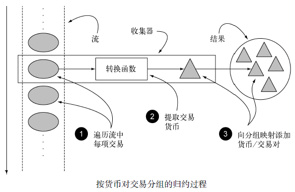
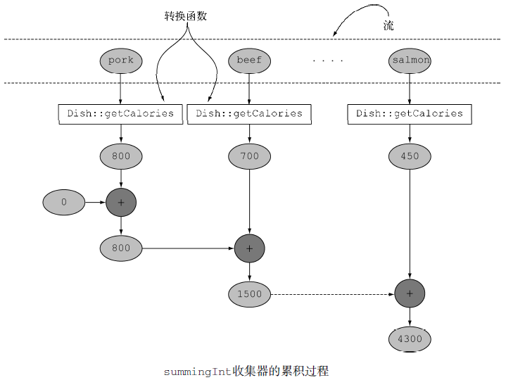
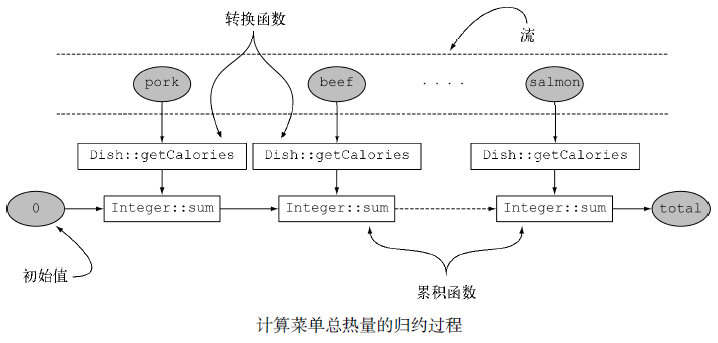
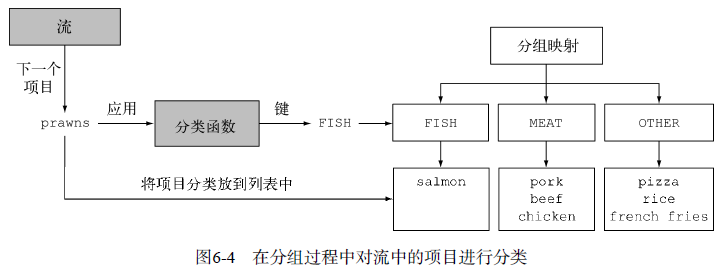
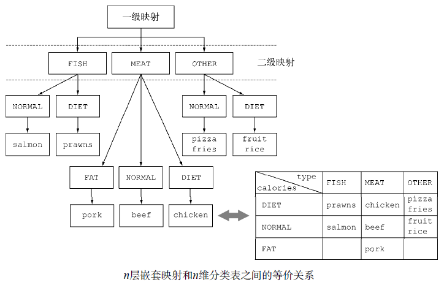
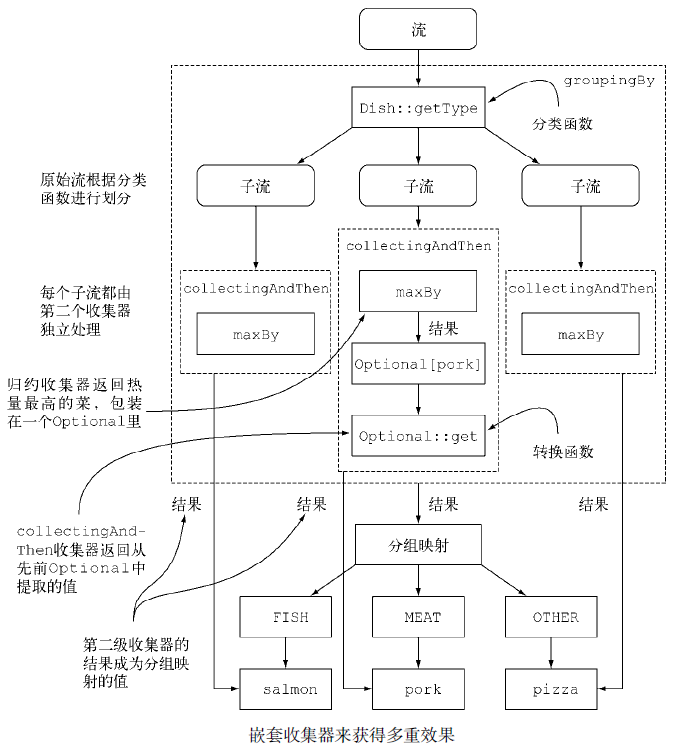
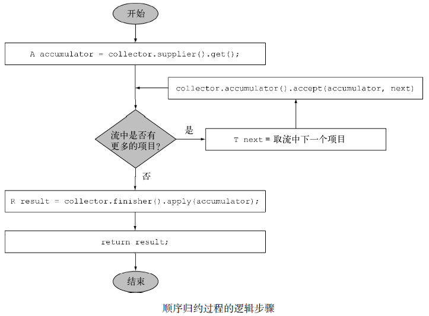
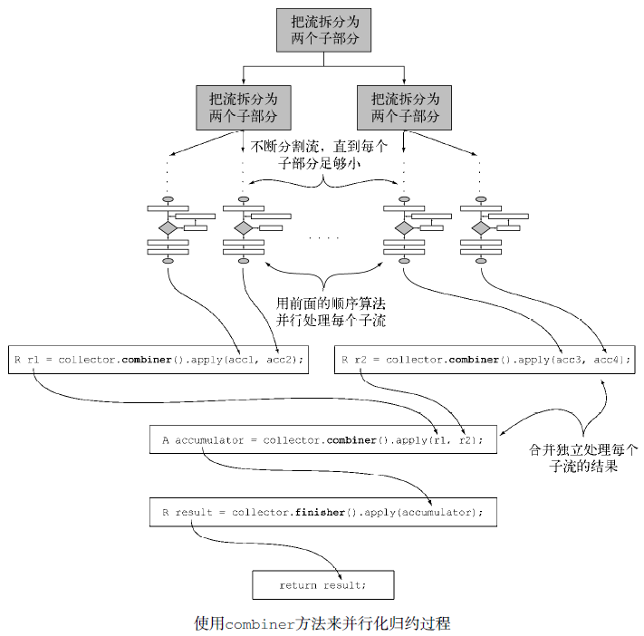

# 用流收集数据 #

[1.收集器简介](#收集器简介)

[1.1.收集器用作高级归约](#收集器用作高级归约)

[1.2.预定义收集器](#预定义收集器)

[2.归约和汇总](#归约和汇总)

[2.1.查找流中的最大值和最小值](#查找流中的最大值和最小值)

[2.2.汇总](#汇总)

[2.3.连接字符串](#连接字符串)

[2.4.广义的归约汇总](#广义的归约汇总)

[2.4.1.Stream接口的collect和reduce有何不同](#stream接口的collect和reduce有何不同)

[2.4.2.收集框架的灵活性：以不同的方法执行同样的操作](#收集框架的灵活性以不同的方法执行同样的操作)

[2.4.3.根据情况选择最佳解决方案](#根据情况选择最佳解决方案)

[2.4.4.用reducing连接字符串](#用reducing连接字符串)

[3.分组](#分组)

[3.1.多级分组](#多级分组)

[3.2.按子组收集数组](#按子组收集数组)

[3.2.1.把收集器的结果转换为另一种类型](#把收集器的结果转换为另一种类型)

[3.2.2.与groupingBy联合使用的其他收集器的例子](#与groupingby联合使用的其他收集器的例子)

[4.分区](#分区)

[4.1.分区的优势](#分区的优势)

[4.2.将数字按质数和非质数分区](#将数字按质数和非质数分区)

[4.3.Collectors类的静态工厂方法](#collectors类的静态工厂方法)

[5.收集器接口](#收集器接口)

[5.1.理解Collector 接口声明的方法](#理解collector接口声明的方法)

[5.1.1.建立新的结果容器：supplier方法](#建立新的结果容器supplier方法)

[5.1.2.将元素添加到结果容器：accumulator方法](#将元素添加到结果容器accumulator方法)

[5.1.3.对结果容器应用最终转换：finisher方法](#对结果容器应用最终转换finisher方法)

[5.1.4.合并两个结果容器：combiner方法](#合并两个结果容器combiner方法)

[5.1.5.characteristics方法](#characteristics方法)

[5.2.全部融合到一起](#全部融合到一起)

[5.2.1.进行自定义收集而不去实现Collector](#进行自定义收集而不去实现collector)

[6.开发你自己的收集器以获得更好的性能](#开发你自己的收集器以获得更好的性能)

[6.1.仅用质数做除数](#仅用质数做除数)

[6.1.1.第一步：定义Collector类的签名](#第一步定义collector类的签名)

[6.1.2.第二步：实现归约过程](#第二步实现归约过程)

[6.1.3.第三步：让收集器并行工作（如果可能）](#第三步让收集器并行工作如果可能)

[6.1.4.第四步：finisher方法和收集器的characteristics方法](#第四步finisher方法和收集器的characteristics方法)

[6.2.比较收集器的性能](#比较收集器的性能)

[7.小结](#小结)

你会发现collect是一个归约操作，就像[reduce](../c06)一样可以接受各种做法作为参数，将流中的元素累积成一个汇总结果。

具体的做法是通过定义新的Collector接口来定义的，因此区分Collection、Collector和collect是很重要的。

下面是一些查询的例子，看看你用collect和收集器能够做什么。

- 对一个交易列表按货币分组，获得该货币的所有交易额总和（返回一个Map<Currency,
Integer&gt;）。
- 将交易列表分成两组：贵的和不贵的（返回一个Map<Boolean, List<Transaction&gt;&gt;）。
- 创建多级分组，比如按城市对交易分组，然后进一步按照贵或不贵分组（返回一个Map<Boolean, List<Transaction&gt;&gt;）。

---

Java8之前：用指令式风格对交易按照货币分组

	Map<Currency, List<Transaction>> transactionsByCurrencies = new HashMap<>();

	for (Transaction transaction : transactions) {
			Currency currency = transaction.getCurrency();
			List<Transaction> transactionsForCurrency = transactionsByCurrencies.get(currency);

			if (transactionsForCurrency == null) {
				transactionsForCurrency = new ArrayList<>();
				transactionsByCurrencies.put(currency, transactionsForCurrency);
			}

			transactionsForCurrency.add(transaction);
	}

Java8之后

	Map<Currency, List<Transaction>> transactionsByCurrencies = transactions.stream().collect(groupingBy(Transaction::getCurrency));

## 收集器简介 ##

**函数式编程**相对于**指令式编程**的一个主要优势：你只需指出希望的结果——“做什么”，而不用操心执行的步骤——“如何做”。

### 收集器用作高级归约 ###

优秀的函数式API设计的另一个好处：**更易复合和重用**。收集器非常有用，因为用它可以简洁而灵活地定义collect用来生成结果集合的标准。更具体地说，对流调用collect方法将对流中的元素触发一个**归约**操作（由Collector来参数化）。

一般来说，Collector会对元素应用一个转换函数（很多时候是不体现任何效果的恒等转换，例如toList），并将结果累积在一个数据结构中，从而产生这一过程的最终输出。例如，在前面所示的交易分组的例子中，转换函数提取了每笔交易的货币，随后使用货币作为键，将交易本身累积在生成的Map中

如货币的例子中所示，Collector接口中方法的实现决定了如何对流执行归约操作。但Collectors实用类提供了很多静态工厂方法，可以方便地创建常见收集器的实例，只要拿来用就可以了。

最直接和最常用的收集器是toList静态方法，它会把流中所有的元素收集到一个List中：

	List<Transaction> transactions = transactionStream.collect(Collectors.toList());

### 预定义收集器 ###

预定义收集器的功能，也就是那些可以从**Collectors类提供的工厂方法**（例如groupingBy）创建的收集器。它们主要提供了三大功能：

- 将流元素归约和汇总为一个值
- 元素分组
- 元素分区

## 归约和汇总 ##

为了说明从**Collectors工厂类中能创建出多少种收集器实例**，我们重用一下前一章的例子：包含一张佳肴列表的菜单！

先来举一个简单的例子，利用counting工厂方法返回的收集器，数一数菜单里有多少种菜：数一数菜单里有多少种菜

	long howManyDishes = menu.stream().collect(Collectors.counting());

or

	long howManyDishes = menu.stream().count();

---

假定你已导入了Collectors类的所有静态工厂方法：

	import static java.util.stream.Collectors.*;

这样你就可以写counting()而用不着写Collectors.counting()之类的了。

### 查找流中的最大值和最小值 ###

假设你想要找出菜单中热量最高的菜。

你可以使用两个收集器，Collectors.maxBy和Collectors.minBy，来计算流中的最大或最小值。

这两个收集器接收一个Comparator参数来比较流中的元素。你可以创建一个Comparator来根据所含热量对菜肴进行比较，并把它传递给Collectors.maxBy：

	Comparator<Dish> dishCaloriesComparator = Comparator.comparingInt(Dish::getCalories);

	Optional<Dish> mostCalorieDish = menu.stream()
					.collect(maxBy(dishCaloriesComparator));

### 汇总 ###

[Summarizing](Summarizing.java)

Collectors.summingInt。它可接受一个把对象映射为求和所需int的函数，并返回一个收集器；该收集器在传递给普通的collect方法后即执行我们需要的汇总操作。

可以这样求出菜单列表的总热量

	int totalCalories = menu.stream().collect(summingInt(Dish::getCalories));

Collectors.summingLong和Collectors.summingDouble方法的作用完全一样，可以用于求和字段为long或double的情况。

---

但汇总不仅仅是求和；还有Collectors.averagingInt，连同对应的averagingLong和averagingDouble可以计算数值的平均数：

	double avgCalories = menu.stream()
				.collect(averagingInt(Dish::getCalories));

不过很多时候，你可能想要得到两个或更多这样的结果，而且你希望只需一次操作就可以完成。

在这种情况下，你可以使用summarizingInt工厂方法返回的收集器。例如，通过一次summarizing操作你可以就数出菜单中元素的个数，并得到菜肴热量总和、平均值、最大值和最小值：

	IntSummaryStatistics menuStatistics =
		menu.stream().collect(summarizingInt(Dish::getCalories));

这个收集器会把所有这些信息收集到一个叫作IntSummaryStatistics的类里，它提供了方便的取值（getter）方法来访问结果。打印menuStatisticobject会得到以下输出：

	IntSummaryStatistics{count=9, sum=4300, min=120, average=477.777778, max=800}

同样，相应的summarizingLong和summarizingDouble工厂方法有相关的LongSummary-Statistics和DoubleSummaryStatistics类型，适用于收集的属性是原始类型long或double的情况。

### 连接字符串 ###

joining工厂方法返回的收集器会把对流中每一个对象应用toString方法得到的所有字符串连接成一个字符串

	String shortMenu = menu.stream().map(Dish::getName).collect(joining());

请注意，joining在内部使用了StringBuilder来把生成的字符串逐个追加起来。此外还要注意，如果Dish类有一个toString方法来返回菜肴的名称，那你无需用提取每一道菜名称的函数来对原流做映射就能够得到相同的结果：

	String shortMenu = menu.stream().collect(joining());

二者均可产生以下字符串：

	porkbeefchickenfrench friesriceseason fruitpizzaprawnssalmon

joining工厂方法有一个重载版本可以接受元素之间的分界符，这样你就可以得到一个逗号分隔的菜肴名称列表：

	String shortMenu = menu.stream().map(Dish::getName).collect(joining(", "));

它会生成：

	pork, beef, chicken, french fries, rice, season fruit, pizza, prawns, salmon

### 广义的归约汇总 ###

[Reducing](Reducing.java)

事实上，我们已经讨论的所有收集器，都是一个可以用**reducing工厂方法**定义的归约过程的特殊情况而已。

Collectors.reducing工厂方法是所有这些特殊情况的一般化。

可以用reducing方法创建的收集器来计算你菜单的总热量

	int totalCalories = menu.stream()
					.collect(reducing(0, Dish::getCalories, (i, j) -> i + j));

同样，你可以使用下面这样单参数形式的reducing来找到热量最高的菜

	Optional<Dish> mostCalorieDish = menu.stream()
					.collect(reducing((d1, d2) -> d1.getCalories() > d2.getCalories() ? d1 : d2));

#### Stream接口的collect和reduce有何不同 ####

你可能想知道，Stream接口的collect收集和reduce归约（上一章）方法有何不同，因为两种方法通常会获得相同的结果。

例如，你可以像下面这样使用reduce方法来实现toListCollector所做的工作：

	Stream<Integer> stream = Arrays.asList(1, 2, 3, 4, 5, 6).stream();
	List<Integer> numbers = stream.reduce(
					new ArrayList<Integer>(),
					(List<Integer> l, Integer e) -> {
						l.add(e);
						return l; 
					},
					(List<Integer> l1, List<Integer> l2) -> {
						l1.addAll(l2);
						return l1; 
					});

这个解决方案有两个问题：一个语义问题和一个实际问题

- **语义问题**在于，reduce方法旨在把两个值结合起来生成一个**新值**，它是一个不可变的归约。与此相反，collect方法的设计就是要**改变容器**，从而累积要输出的结果。这意味着，上面的代码片段是在滥用reduce方法，因为它在原地改变了作为累加器的List。

- 错误的语义使用reduce方法还会造成一个**实际问题**：这个**归约**过程不能并行工作，因为由多个线程并发修改同一个数据结构可能会破坏List本身。在这种情况下，如果你想要线程安全，就需要每次分配一个新的List，而对象分配又会影响性能。这就是collect方法特别适合表达可变容器上的归约的原因，更关键的是它适合并行操作

#### 收集框架的灵活性：以不同的方法执行同样的操作 ####

进一步简化前面使用reducing收集器的求和例子

	int totalCalories = menu.stream().collect(reducing(0,//初始值
					Dish::getCalories,//转换函数
					Integer::sum));//累积函数

之前提到的counting收集器也是类似地利用三参数reducing工厂方法实现的。它把流中的每个元素都转换成一个值为1的Long型对象，然后再把它们相加：

	public static <T> Collector<T, ?, Long> counting() {
		return reducing(0L, e -> 1L, Long::sum);
	}

不使用收集器也能执行相同操作，使用上一章的reduce()

	int totalCalories =
		menu.stream().map(Dish::getCalories).reduce(Integer::sum).get();

最后，更简洁的方法是把流映射到一个IntStream，然后调用sum方法，你也可以得到相同的结果：

	int totalCalories = menu.stream().mapToInt(Dish::getCalories).sum();

#### 根据情况选择最佳解决方案 ####

从上面的例子，函数式编程通常提供了多种方法来执行同一个操作。

这个例子还说明，**收集器**在某种程度上比Stream接口上直接提供的方法用起来更复杂，但好处在于它们能提供**更高水平的抽象和概括**，也更容易重用和自定义。

我们的建议是，尽可能为手头的问题探索不同的解决方案，但在通用的方案里面，始终选择最专门化的一个。无论是从可读性还是性能上看，这一般都是最好的决定。

例如，要计菜单的总热量，我们更倾向于最后一个解决方案（使用IntStream），因为它最简明，也很可能最易读。同时，它也是性能最好的一个，因为IntStream可以让我们避免自动拆箱操作。

#### 用reducing连接字符串 ####

	String shortMenu = menu.stream()
					.map(Dish::getName)
					.collect(joining());

---

	String shortMenu = menu.stream()
					.map(Dish::getName)
					.collect( reducing ( (s1, s2) -> s1 + s2 ) )
					.get();

---

	//这无法编译，因为reducing接受的参数是一个BinaryOperator<t>，也就是一个BiFunction<T,T,T>。
	//这就意味着它需要的函数必须能接受两个参数，
	//然后返回一个相同类型的值，
	//但这里用的Lambda表达式接受的参数是两个菜，
	//返回的却是一个字符串
	
	String shortMenu = menu.stream()
					.collect( reducing( (d1, d2) -> d1.getName() + d2.getName() ) ).get();

---

	String shortMenu = menu.stream()
					.collect( reducing( "",Dish::getName, (s1, s2) -> s1 + s2 ) );

然而就实际应用而言，不管是从可读性还是性能方面考虑，我们始终建议使用joining收集器。

## 分组 ##

[Grouping](Grouping.java)

假设你要把菜单中的菜按照类型进行分类，有肉的放一组，有鱼的放一组，其他的都放另一组。用Collectors.groupingBy工厂方法返回
的收集器就可以轻松地完成这项任务，如下所示：

	Map<Dish.Type, List<Dish>> dishesByType =
					menu.stream().collect(groupingBy(Dish::getType));

其结果是下面的Map：

	{FISH=[prawns, salmon], OTHER=[french fries, rice, season fruit, pizza],MEAT=[pork, beef, chicken]}

你给groupingBy方法传递了一个Function（以方法引用的形式），它提取了流中每一道Dish的Dish.Type。我们把这个Function叫作**分类函数**，因为它用来把流中的元素分成不同的组。

分类函数不一定像方法引用那样可用，因为你想用以分类的条件可能比简单的属性访问器要复杂。例如，你可能想把热量不到400卡路里的菜划分为“低热量”（diet），热量400到700卡路里的菜划为“普通”（normal），高于700卡路里的划为“高热量”（fat）。

	public enum CaloricLevel { DIET, NORMAL, FAT }
	
	Map<CaloricLevel, List<Dish>> dishesByCaloricLevel = menu.stream().collect(
		groupingBy(dish -> {
				if (dish.getCalories() <= 400)
					return CaloricLevel.DIET;
				else if (dish.getCalories() <= 700) 
					return CaloricLevel.NORMAL;
				else 
					return CaloricLevel.FAT;
		}));

### 多级分组 ###

	Map<Dish.Type, Map<CaloricLevel, List<Dish>>> dishesByTypeCaloricLevel = menu.stream().collect(
                groupingBy(Dish::getType,
                        groupingBy((Dish dish) -> {
                            if (dish.getCalories() <= 400) return CaloricLevel.DIET;
                            else if (dish.getCalories() <= 700) return CaloricLevel.NORMAL;
                            else return CaloricLevel.FAT;
                        } )
                )
        );

这个二级分组的结果就是像下面这样的两级Map：

	{MEAT={DIET=[chicken], NORMAL=[beef], FAT=[pork]},
	FISH={DIET=[prawns], NORMAL=[salmon]},
	OTHER={DIET=[rice, seasonal fruit], NORMAL=[french fries, pizza]}}

下图显示了为什么结构相当于n维表格，并强调了分组操作的分类目的。

### 按子组收集数组 ###

例如，要数一数菜单中每类菜有多少个，可以传递counting收集器作为groupingBy收集器的第二个参数：

	Map<Dish.Type, Long> typesCount = menu.stream().collect(
			groupingBy(Dish::getType, counting()));

其结果是下面的Map：

	{MEAT=3, FISH=2, OTHER=4}

---

还要注意，普通的单参数groupingBy(f)（其中f是分类函数）实际上是groupingBy(f,toList())的简便写法。

---

再举一个例子，你可以把前面用于查找菜单中热量最高的菜肴的收集器改一改，按照菜的类型分类：

	Map<Dish.Type, Optional<Dish>> mostCaloricByType = menu.stream()
				.collect(groupingBy(Dish::getType,
					maxBy(comparingInt(Dish::getCalories))));

这个分组的结果显然是一个map，以Dish的类型作为键，以包装了该类型中热量最高的Dish的Optional<Dish>作为值：

	{FISH=Optional[salmon], OTHER=Optional[pizza], MEAT=Optional[pork]}

>这个Map中的值是Optional，因为这是maxBy工厂方法生成的收集器的类型，但实际上，如果菜单中没有某一类型的Dish，这个类型就不会对应一个Optional. empty()值，而且根本不会出现在Map的键中。
>
>groupingBy收集器只有在应用分组条件后，第一次在流中找到某个键对应的元素时才会把键加入分组Map中。这意味着Optional包装器在这里不是很有用，因为它不会仅仅因为它是归约收集器的返回类型而表达一个最终可能不存在却意外存在的值。

#### 把收集器的结果转换为另一种类型 ####

因为分组操作的Map结果中的每个值上包装的Optional没什么用，所以你可能想要把它们去掉。要做到这一点，或者更一般地来说，把收集器返回的结果转换为另一种类型，你可以使用Collectors.collectingAndThen工厂方法返回的收集器

查找每个子组中热量最高的Dish

	Map<Dish.Type, Dish> mostCaloricByType = menu.stream()
		.collect(groupingBy(Dish::getType,//分类函数
			collectingAndThen(
				maxBy(comparingInt(Dish::getCalories)),//包装后的收集器
				Optional::get)));//转换函数

这个工厂方法接受两个参数——要转换的**收集器**以及**转换函数**，并返回另一个收集器。这个收集器相当于旧收集器的一个包装，collect操作的最后一步就是将返回值用转换函数做一个映射。

其结果是下面的Map：

	{FISH=salmon, OTHER=pizza, MEAT=pork}

- 收集器用虚线表示，因此groupingBy是最外层，根据菜肴的类型把菜单流分组，得到三个子流。

- groupingBy收集器包裹着collectingAndThen收集器，因此分组操作得到的每个子流都用这第二个收集器做进一步归约。

- collectingAndThen收集器又包裹着第三个收集器maxBy。

- 随后由归约收集器进行子流的归约操作，然后包含它的collectingAndThen收集器会对其结果应用Optional:get转换函数。

- 对三个子流分别执行这一过程并转换而得到的三个值，也就是各个类型中热量最高的Dish，将成为groupingBy收集器返回的Map中与各个分类键（Dish的类型）相关联的值。

#### 与groupingBy联合使用的其他收集器的例子 ####

你还重用求出所有菜肴热量总和的收集器，不过这次是对每一组Dish求和：

	Map<Dish.Type, Integer> totalCaloriesByType = menu.stream()
			.collect(groupingBy(Dish::getType,
							summingInt(Dish::getCalories)));

比方说你想要知道，对于每种类型的Dish，菜单中都有哪些CaloricLevel。把groupingBy和mapping收集器结合起来。

	Map<Dish.Type, Set<CaloricLevel>> caloricLevelsByType = menu.stream().collect(
                groupingBy(Dish::getType, mapping(dish -> { 
                        	if (dish.getCalories() <= 400) 
                        		return CaloricLevel.DIET;
                        	else if (dish.getCalories() <= 700) 
                        		return CaloricLevel.NORMAL;
                        	else 
                        		return CaloricLevel.FAT; 
                        }, toSet() )));

让你得到这样的Map结果：

	{OTHER=[DIET, NORMAL], MEAT=[DIET, NORMAL, FAT], FISH=[DIET, NORMAL]}

对于返回的Set是什么类型并没有任何保证。但通过使用toCollection，你就可以有更多的控制。例如，你可以给它传递一个构造函数引用来要求HashSet：

	Map<Dish.Type, Set<CaloricLevel>> caloricLevelsByType = menu.stream().collect(
                groupingBy(Dish::getType, mapping(dish -> { 
                        	if (dish.getCalories() <= 400) 
                        		return CaloricLevel.DIET;
                        	else if (dish.getCalories() <= 700) 
                        		return CaloricLevel.NORMAL;
                        	else 
                        		return CaloricLevel.FAT; 
                        }, toCollection(HashSet::new))));

## 分区 ##

[Partitioning](Partitioning.java)

分区是分组的特殊情况：由一个谓词（返回一个布尔值的函数）作为分类函数，它称分区函数。分区函数返回一个布尔值，这意味着得到的分组Map的键类型是Boolean，于是它最多可以分为两组——true是一组，false是一组。

例如，如果你是素食者或是请了一位素食的朋友来共进晚餐，可能会想要把菜单按照素食和非素食分开：

	Map<Boolean, List<Dish>> partitionedMenu =
				menu.stream().collect(partitioningBy(Dish::isVegetarian));

这会返回下面的Map：

	{false=[pork, beef, chicken, prawns, salmon],
	true=[french fries, rice, season fruit, pizza]}

那么通过Map中键为true的值，就可以找出所有的素食菜肴了：

	List<Dish> vegetarianDishes = partitionedMenu.get(true);

请注意，用同样的分区谓词，对菜单List创建的流作筛选，然后把结果收集到另外一个List中也可以获得相同的结果：

	List<Dish> vegetarianDishes =
				menu.stream().filter(Dish::isVegetarian).collect(toList());

### 分区的优势 ###

分区的好处在于保留了分区函数返回true或false的两套流元素列表。

	Map<Boolean, Map<Dish.Type, List<Dish>>> vegetarianDishesByType = menu.stream()
				.collect(
					partitioningBy(Dish::isVegetarian,
						groupingBy(Dish::getType)));

这将产生一个二级Map：

	{false={FISH=[prawns, salmon], MEAT=[pork, beef, chicken]},
	true={OTHER=[french fries, rice, season fruit, pizza]}}

---

你可以重用前面的代码来找到素食和非素食中热量最高的菜：

	Map<Boolean, Dish> mostCaloricPartitionedByVegetarian = menu.stream().collect(
                partitioningBy(Dish::isVegetarian,
                        collectingAndThen(
                                maxBy(comparingInt(Dish::getCalories)),
                                Optional::get)));

这将产生以下结果：

	{false=pork, true=pizza}

---

更多例子

	menu.stream().collect(partitioningBy(Dish::isVegetarian,
			partitioningBy (d -> d.getCalories() > 500)));

这是一个有效的多级分区，产生以下二级Map：

	{ false={false=[chicken, prawns, salmon], true=[pork, beef]},
	true={false=[rice, season fruit], true=[french fries, pizza]}}

---

	menu.stream().collect(partitioningBy(Dish::isVegetarian,
			partitioningBy (Dish::getType)));

不能编译，Dish::getType不能用作谓词

---

	menu.stream().collect(partitioningBy(Dish::isVegetarian,
			counting()));

它会计算每个分区中项目的数目，得到以下Map：

	{false=5, true=4}

### 将数字按质数和非质数分区 ###

假设你要写一个方法，它接受参数int n，并将前n个自然数分为质数和非质数。但首先，找出能够测试某一个待测数字是否是质数的谓词会很有帮助：

	public boolean isPrime(int candidate) {
		return IntStream.range(2, candidate).noneMatch(i -> candidate % i == 0);
	}

一个简单的优化是仅测试小于等于待测数平方根的因子：

	public boolean isPrime(int candidate) {
		int candidateRoot = (int) Math.sqrt((double) candidate);
		return IntStream.rangeClosed(2, candidateRoot).noneMatch(i -> candidate % i == 0);
	}

现在最主要的一部分工作已经做好了。为了把前n个数字分为质数和非质数，只要创建一个包含这n个数的流，用刚刚写的isPrime方法作为谓词，再给partitioningBy收集器归约就好了：

	public Map<Boolean, List<Integer>> partitionPrimes(int n) {
		return IntStream.rangeClosed(2, n).boxed()
				.collect(
					partitioningBy(candidate -> isPrime(candidate)));
	}

### Collectors类的静态工厂方法 ###

工厂方法|返回类型|用于|使用示例
---|---|---|---
toList|List<T&gt;|把流中所有项目收集到一个List|List<Dish&gt; dishes = menuStream.collect(toList());
toSet|Set<T&gt;|把流中所有项目收集到一个Set，删除重复项|Set<Dish&gt; dishes = menuStream.collect(toSet());
toCollection|Collection<T&gt;|把流中所有项目收集到给定的供应源创建的集合|Collection<Dish&gt; dishes = menuStream.collect(toCollection(),ArrayList::new);
counting|Long|计算流中元素的个数|long howManyDishes = menuStream.collect(counting());
summingInt|Integer|对流中项目的一个整数属性求和|int totalCalories = menuStream.collect(summingInt(Dish::getCalories));
averagingInt|Double|计算流中项目Integer属性的平均值|double avgCalories = menuStream.collect(averagingInt(Dish::getCalories));
summarizingInt|IntSummaryStatistics|收集关于流中项目Integer 属性的统计值，例如最大、最小、总和与平均值|IntSummaryStatistics menuStatistics = menuStream.collect(summarizingInt(Dish::getCalories));
joining|String|连接对流中每个项目调用toString方法所生成的字符串|String shortMenu = menuStream.map(Dish::getName).collect(joining(", "));
maxBy|Optional<T&gt;|一个包裹了流中按照给定比较器选出的最大元素的Optional，或如果流为空则为Optional.empty()|Optional<Dish&gt; fattest = menuStream.collect(maxBy(comparingInt(Dish::getCalories)));
minBy|Optional<T&gt;|一个包裹了流中按照给定比较器选出的最小元素的Optional，或如果流为空则为Optional.empty()|Optional<Dish&gt; lightest = menuStream.collect(minBy(comparingInt(Dish::getCalories)));
reducing|归约操作产生的类型|从一个作为累加器的初始值开始，利用BinaryOperator 与流中的元素逐个结合，从而将流归约为单个值|int totalCalories = menuStream.collect(reducing(0, Dish::getCalories, Integer::sum));
collectingAndThen|转换函数返回的类型|包裹另一个收集器，对其结果应用转换函数|int howManyDishes = menuStream.collect(collectingAndThen(toList(), List::size));
groupingBy|Map<K, List<T&gt;&gt;|根据项目的一个属性的值对流中的项目作问组，并将属性值作为结果Map 的键|Map<Dish.Type,List<Dish&gt;&gt; dishesByType = menuStream.collect(groupingBy(Dish::getType));
partitioningBy|Map<Boolean,List<T&gt;&gt;|根据对流中每个项目应用谓词的结果来对项目进行分区|Map<Boolean,List<Dish&gt;&gt; vegetarianDishes = menuStream.collect(partitioningBy(Dish::isVegetarian));

## 收集器接口 ##

	public interface Collector<T, A, R> {
		Supplier<A> supplier();
		BiConsumer<A, T> accumulator();
		Function<A, R> finisher();
		BinaryOperator<A> combiner();
		Set<Characteristics> characteristics();
	}

- T是流中要收集的项目的泛型。
- A是累加器的类型，累加器是在收集过程中用于累积部分结果的对象。
- R是收集操作得到的对象（通常但并不一定是集合）的类型。

例如，你可以实现一个ToListCollector<T>类，将Stream<T>中的所有元素收集到一个List<T>里，它的签名如下：

	public class ToListCollector<T> implements Collector<T, List<T>, List<T>>

### 理解Collector 接口声明的方法 ###

#### 建立新的结果容器：supplier方法 ####

supplier方法必须返回一个结果为空的Supplier，也就是一个无参数函数，在调用时它会创建一个空的累加器实例，供数据收集过程使用。

在我们的ToListCollector中，supplier返回一个空的List，如下所示：

	public Supplier<List<T>> supplier() {
		return () -> new ArrayList<T>();
	}

请注意你也可以只传递一个构造函数引用：

	public Supplier<List<T>> supplier() {
		return ArrayList::new;
	}

#### 将元素添加到结果容器：accumulator方法 ####

accumulator方法会返回执行归约操作的函数。

对于ToListCollector，这个函数仅仅会把当前项目添加至已经遍历过的项目的列表：

	public BiConsumer<List<T>, T> accumulator() {
		return (list, item) -> list.add(item);
	}

你也可以使用方法引用，这会更为简洁：

	public BiConsumer<List<T>, T> accumulator() {
		return List::add;
	}

#### 对结果容器应用最终转换：finisher方法 ####

finisher方法必须返回在累积过程的最后要调用的一个函数，以便将累加器对象转换为整个集合操作的最终结果

	public Function<List<T>, List<T>> finisher() {
		return Function.identity();
	}

这三个方法已经足以对流进行顺序归约，至少从逻辑上看可以按图6-7进行。实践中的实现细节可能还要复杂一点，一方面是因为流的延迟性质，可能在collect操作之前还需要完成其他中间操作的流水线，另一方面则是理论上可能要进行并行归约。

#### 合并两个结果容器：combiner方法 ####

四个方法中的最后一个——combiner方法会返回一个供归约操作使用的函数，它定义了对流的各个子部分进行并行处理时，各个子部分归约所得的累加器要如何合并。

	public BinaryOperator<List<T>> combiner() {
		return (list1, list2) -> {
			list1.addAll(list2);
			return list1; 
		}
	}

有了这第四个方法，就可以对流进行并行归约了。它会用到Java 7中引入的分支/合并框架和Spliterator抽象。

- 原始流会以递归方式拆分为子流，直到定义流是否需要进一步拆分的一个条件为非（如果分布式工作单位太小，并行计算往往比顺序计算要慢，而且要是生成的并行任务比处理器内核数多很多的话就毫无意义了）。
- 现在，所有的子流都可以并行处理，即对每个子流应用图所示（上上图）的顺序归约算法。
- 最后，使用收集器combiner方法返回的函数，将所有的部分结果两两合并。这时会把原始流每次拆分时得到的子流对应的结果合并起来。

#### characteristics方法 ####

最后一个方法——characteristics会返回一个不可变的Characteristics集合，它定义了收集器的行为——尤其是关于流是否可以并行归约，以及可以使用哪些优化的提示。

Characteristics是一个包含三个项目的枚举。

- UNORDERED——归约结果不受流中项目的遍历和累积顺序的影响。

- CONCURRENT——accumulator函数可以从多个线程同时调用，且该收集器可以并行归约流。如果收集器没有标为UNORDERED，那它仅在用于无序数据源时才可以并行归约。

- IDENTITY_FINISH——这表明完成器方法返回的函数是一个恒等函数，可以跳过。这种情况下，累加器对象将会直接用作归约过程的最终结果。这也意味着，将累加器A不加检查地转换为结果R是安全的。

### 全部融合到一起 ###

前一小节中谈到的五个方法足够我们开发自己的ToListCollector了。

[ToListCollector](ToListCollector.java)

[ToListCollectorTest](ToListCollectorTest.java)

	List<Dish> dishes = menuStream.collect(new ToListCollector<Dish>());

	List<Dish> dishes = menuStream.collect(toList());

#### 进行自定义收集而不去实现Collector ####

还有一种方法可以得到同样的结果而无需从头实现新的Collectors接口。

Stream有一个重载的collect方法可以接受另外三个函数——supplier、accumulator和combiner，其语义和Collector接口的相应方法返回的函数完全相同。所以比如说，我们可以像下面这样把菜肴流中的项目收集到一个List中：

	List<Dish> dishes = menuStream.collect(
					ArrayList::new,//供应源
					List::add,//累加器
					List::addAll);//组合器

这第二种形式虽然比前一个写法更为紧凑和简洁，却不那么易读。此外，以恰当的类来实现自己的自定义收集器有助于重用并可避免代码重复。另外值得注意的是，这第二个collect方法不能传递任何Characteristics，所以它永远都是一个IDENTITY_FINISH和CONCURRENT但并非UNORDERED的收集器。

## 开发你自己的收集器以获得更好的性能 ##

[PartitionPrimeNumbers](PartitionPrimeNumbers.java)

用Collectors类提供的一个方便的工厂方法创建了一个收集器，它将前n个自然数划分为质数和非质数。

将前n个自然数按质数和非质数分区

	public Map<Boolean, List<Integer>> partitionPrimes(int n) {
		return IntStream.rangeClosed(2, n).boxed()
					.collect(partitioningBy(candidate -> isPrime(candidate));
	}

当时，通过限制除数不超过被测试数的平方根，我们对最初的isPrime方法做了一些改进：

	public boolean isPrime(int candidate) {
		int candidateRoot = (int) Math.sqrt((double) candidate);
		return IntStream.rangeClosed(2, candidateRoot)
					.noneMatch(i -> candidate % i == 0);
	}

为了获得更好的性能，开发一个自定义收集器。

### 仅用质数做除数 ###

**一个可能的优化是仅仅看看被测试数是不是能够被质数整除**。要是除数本身都不是质数就用不着测了。所以**我们可以仅仅用被测试数之前的质数来测试**。而我们目前所见的预定义收集器的问题，也就是必须自己开发一个收集器的原因在于，在收集过程中是没有办法访问部分结果的。

这意味着，当测试某一个数字是否是质数的时候，你没法访问目前已经找到的其他质数的列表。

	public static boolean isPrime(List<Integer> primes, int candidate) {
		return primes.stream().noneMatch(i -> candidate % i == 0);
	}

而且还应该应用先前的优化，仅仅用小于被测数平方根的质数来测试。因此，你需要想办法在**下一个质数大于被测数平方根时立即停止测试**。不幸的是，Stream API中没有这样一种方法。

你可以使用filter(p -> p <= candidateRoot)来筛选出小于被测数平方根的质数。

但filter要处理整个流才能返回恰当的结果。如果质数和非质数的列表都非常大，这就是个问题了。你用不着这样做；**你只需在质数大于被测数平方根的时候停下来就可以了**。因此，我们会创建一个名为takeWhile的方法，给定一个排序列表和一个谓词，它会**返回元素满足谓词的最长前缀**：

	public static <A> List<A> takeWhile(List<A> list, Predicate<A> p) {
		int i = 0;
		for (A item : list) {

			if (!p.test(item)) {
				return list.subList(0, i);
			}

			i++;
		}

		return list;
	}

利用这个方法，你就可以优化isPrime方法，**只用不大于被测数平方根的质数去测试了**：

	public static boolean isPrime(List<Integer> primes, int candidate){
		int candidateRoot = (int) Math.sqrt((double) candidate);
		return takeWhile(primes, i -> i <= candidateRoot)
				.stream()
				.noneMatch(p -> candidate % p == 0);
	}

请注意，这个takeWhile实现是**即时**的。理想情况下，我们会想要一个延迟求值的takeWhile，这样就可以和noneMatch操作合并。不幸的是，这样的实现超出了本章的范围，你需要了解Stream API的实现才行。

有了这个新的isPrime方法在手，你就可以实现自己的自定义收集器了。首先要声明一个实现Collector接口的新类，然后要开发Collector接口所需的五个方法。

#### 第一步：定义Collector类的签名 ####

Collector接口的定义是：

	public interface Collector<T, A, R>

	public class PrimeNumbersCollector
		implements Collector<Integer,//流中元素的类型
			Map<Boolean, List<Integer>>,//累加器类型
			Map<Boolean, List<Integer>>>//collect操作的 类型结果类型

#### 第二步：实现归约过程 ####

supplier方法会返回一个在调用时创建累加器的函数：

	public Supplier<Map<Boolean, List<Integer>>> supplier() {
		return () -> new HashMap<Boolean, List<Integer>>() {{
			put(true, new ArrayList<Integer>());
			put(false, new ArrayList<Integer>());
		}};
	}

收集器中最重要的方法是accumulator，因为它定义了如何收集流中元素的逻辑。这里它也是实现前面所讲的**优化的关键**。

现在在任何一次迭代中，都可以访问收集过程的部分结果，也就是包含迄今找到的质数的累加器。

	public BiConsumer<Map<Boolean, List<Integer>>, Integer> accumulator() {
		return (Map<Boolean, List<Integer>> acc, Integer candidate) -> {
			acc.get( isPrime(acc.get(true), candidate) )
				.add(candidate);
		};
	}

在这个方法中，你调用了isPrime方法，将待测试是否为质数的数以及迄今找到的质数列表（也就是累积Map中true键对应的值）传递给它。这次调用的结果随后被用作获取质数或非质数列表的键，这样就可以把新的被测数添加到恰当的列表中。

#### 第三步：让收集器并行工作（如果可能） ####

下一个方法要在并行收集时把两个部分累加器合并起来，这里，它只需要合并两个Map，即将第二个Map中质数和非质数列表中的所有数字合并到第一个Map的对应列表中就行了：

	public BinaryOperator<Map<Boolean, List<Integer>>> combiner() {
		return (Map<Boolean, List<Integer>> map1,
			Map<Boolean, List<Integer>> map2) -> {
				map1.get(true).addAll(map2.get(true));
				map1.get(false).addAll(map2.get(false));
				return map1;
			};
	}

请注意，实际上这个收集器是**不能并行使用**的，因为**该算法本身是顺序的**。这意味着永远都不会调用combiner方法，你可以把它的实现留空（更好的做法是抛出一个UnsupportedOperationException异常）。为了让这个例子完整，我们还是决定实现它。

#### 第四步：finisher方法和收集器的characteristics方法 ####

前面说过，accumulator正好就是收集器的结果，用不着进一步转换，那么finisher方法就返回identity函数：

	public Function<Map<Boolean, List<Integer>>,Map<Boolean, List<Integer>>> finisher() {
		return Function.identity();
	}

就characteristics方法而言，我们已经说过，它既不是CONCURRENT也不是UNORDERED，但却是IDENTITY_FINISH的：

	public Set<Characteristics> characteristics() {
		return Collections.unmodifiableSet(EnumSet.of(IDENTITY_FINISH));
	}

最后实现的[PrimeNumbersCollector](PartitionPrimeNumbers.java)。

### 比较收集器的性能 ###

用partitioningBy工厂方法创建的收集器和你刚刚开发的自定义收集器在功能上是一样的，但是我们有没有实现用自定义收集器超越partitioningBy收集器性能的目标呢？现在让我们写个小测试框架来跑一下吧：

[CollectorHarness](CollectorHarness.java)

请注意，更为科学的测试方法是用一个诸如JMH的框架，但我们不想在这里把问题搞得更复杂。对这个例子而言，这个小小的测试类提供的结果足够准确了。这个类会先把前一百万个自然数分为质数和非质数，利用partitioningBy工厂方法创建的收集器调用方法10次，记下最快的
一次运行。

运行结果：

	done in 1430
	done in 1382
	done in 1306
	done in 1061
	done in 1132
	done in 1049
	done in 1027
	done in 1033
	done in 1274
	done in 1901
	1.Partitioning done in: 1027 msecs

	done in 1020
	done in 860
	done in 983
	done in 977
	done in 967
	done in 957
	done in 877
	done in 900
	done in 801
	done in 850
	2.Partitioning done in: 801 msecs

还不错！这意味着开发自定义收集器并不是白费工夫，原因有二：第一，你学会了如何在需要的时候实现自己的收集器；第二，你获得了大约32%的性能提升。

可以通过把实现PrimeNumbersCollector核心逻辑的三个函数传给collect方法的重载版本来获得同样的结果：

    public Map<Boolean, List<Integer>> partitionPrimesWithInlineCollector(int n) {
        return Stream.iterate(2, i -> i + 1).limit(n)//IntStream.rangeClosed(2, n).boxed()
                .collect(
                        () -> new HashMap<Boolean, List<Integer>>() {{
                            put(true, new ArrayList<Integer>());
                            put(false, new ArrayList<Integer>());
                        }},
                        (acc, candidate) -> {
                            acc.get( isPrime(acc.get(true), candidate) )
                                    .add(candidate);
                        },
                        (map1, map2) -> {
                            map1.get(true).addAll(map2.get(true));
                            map1.get(false).addAll(map2.get(false));
                        });
    }

这样就可以避免为实现Collector接口创建一个全新的类；得到的代码更紧凑，虽然可能可读性会差一点，可重用性会差一点。

## 小结 ##

- collect是一个终端操作，它接受的参数是将流中元素累积到汇总结果的各种方式（称为收集器）。
- 预定义收集器包括将流元素归约和汇总到一个值，例如计算最小值、最大值或平均值。[收集器总结](#collectors类的静态工厂方法)。
- 预定义收集器可以用groupingBy对流中元素进行分组，或用partitioningBy进行分区。
- 收集器可以高效地复合起来，进行多级分组、分区和归约。
- 你可以实现Collector接口中定义的方法来开发你自己的收集器。
