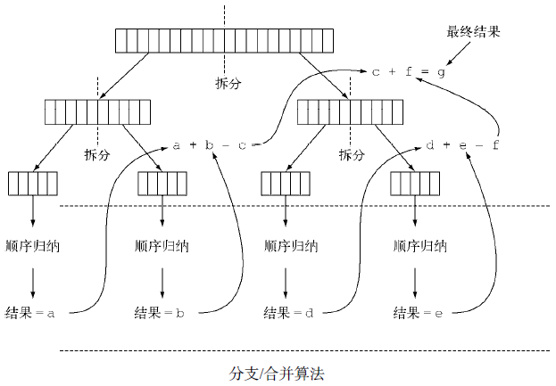

# 并行数据处理与性能 #

[1.并行流](#并行流)

[1.1.将顺序流转换为并行流](#将顺序流转换为并行流)

[1.2.测量流性能](#测量流性能)

[1.2.1.使用更有针对性的方法](#使用更有针对性的方法)

[1.3.正确使用并行流](#正确使用并行流)

[1.4.高效使用并行流建议](#高效使用并行流建议)

[2.分支/合并框架](#分支合并框架)

[2.1.使用RecursiveTask](#使用recursivetask)

[2.1.1.运行ForkJoinSumCalculator](#运行forkjoinsumcalculator)

[2.2.使用分支/合并框架的最佳做法](#使用分支合并框架的最佳做法)

[2.3.工作窃取](#工作窃取)

[3.Spliterator](#spliterator)

[3.1.拆分过程](#拆分过程)

[3.1.1.Spliterator的特性](#spliterator的特性)

[3.2.实现你自己的Spliterator](#实现你自己的spliterator)

[3.2.1.以函数式风格重写单词计数器](#以函数式风格重写单词计数器)

[3.2.2.让WordCounter并行工作](#让wordcounter并行工作)

[4.小结](#小结)

在Java 7之前，并行处理数据集合非常麻烦。

- 第一，你得明确地把包含数据的数据结构分成若干子部分。
- 第二，你要给每个子部分分配一个独立的线程。
- 第三，你需要在恰当的时候对它们进行同步来避免不希望出现的竞争条件，等待所有线程完成，最后把这些部分结果合并起来。

Java 7引入了一个叫作分支/合并的框架，让这些操作更稳定、更不易出错。

## 并行流 ##

[ParallelStreams](ParallelStreams.java)

可以通过对收集源调用Stream接口parallelStream方法来把集合转换为并行流。并行流就是一个把内容分成多个数据块，并用不同的线程分别处理每个数据块的流。

假设你需要写一个方法，接受数字n作为参数，并返回从1到给定参数的所有数字的和。

	public static long sequentialSum(long n) {
		return Stream.iterate(1L, i -> i + 1)
				.limit(n)
				.reduce(0L, Long::sum);
	}

用更为传统的Java术语来说，这段代码与下面的迭代等价：

	public static long iterativeSum(long n) {
		long result = 0;
		for (long i = 1L; i <= n; i++) {
			result += i;
		}
		return result;
	}

这似乎是利用并行处理的好机会，特别是n很大的时候。那怎么入手呢？

你要对结果变量进行同步吗？

用多少个线程呢？

谁负责生成数呢？

谁来做加法呢？

用并行流的话，这问题就简单多了！

### 将顺序流转换为并行流 ###

	public static long parallelSum(long n) {
		return Stream.iterate(1L, i -> i + 1)
			.limit(n)
			.parallel()
			.reduce(0L, Long::sum);
	}

Stream在内部分成了几块。因此可以对不同的块独立并行进行归纳操作。最后，同一个归纳操作会将各个子流的部分归纳结果合并起来，得到整个原始流的归纳结果。

---

类似地，你只需要对并行流调用sequential方法就可以把它变成顺序流。请注意，你可能以为把这两个方法结合起来，就可以更细化地控制在遍历流时哪些操作要并行执行，哪些要顺序执行。

例如

	stream.parallel()
		.filter(...)
		.sequential()
		.map(...)
		.parallel()
		.reduce();

**但最后一次parallel或sequential调用会影响整个流水线**。在本例中，流水线会并行执行，因为最后调用的是它。

---

并行流内部使用了默认的ForkJoinPool，它默认的
线程数量就是你的处理器数量， 这个值是由Runtime.getRuntime().availableProcessors()得到的。

但是你可以通过系统属性java.util.concurrent.ForkJoinPool.common.parallelism来改变线程池大小，如下所示：

	System.setProperty("java.util.concurrent.ForkJoinPool.common.parallelism","12");

一般而言，让ForkJoinPool的大小等于处理器数量是个不错的默认值，除非你有很好的理由，否则我们强烈建议不要修改它。

### 测量流性能 ###

[ParallelStreamsHarness](ParallelStreamsHarness.java)

测量对前n个自然数求和的函数的性能

	public long measureSumPerf(Function<Long, Long> adder, long n) {
		long fastest = Long.MAX_VALUE;
		
		for (int i = 0; i < 10; i++) {
			long start = System.nanoTime();
			long sum = adder.apply(n);
			long duration = (System.nanoTime() - start) / 1_000_000;
			System.out.println("Result: " + sum);
			if (duration < fastest) fastest = duration;
		}
		return fastest;
	}

测试代码：

	System.out.println("Sequential sum done in:" + measureSumPerf(ParallelStreams::sequentialSum, 10_000_000) + " msecs");

	System.out.println("Iterative Sum done in: " + measurePerf(ParallelStreams::iterativeSum, 10_000_000L) + " msecs\\n");

	System.out.println("Parallel Sum done in: " + measurePerf(ParallelStreams::parallelSum, 10_000_000L) + " msecs\\n" );

运行结果：

	Sequential Sum done in: 311 msecs\n

	Iterative Sum done in: 17 msecs\n

	Parallel Sum done in: 11641 msecs\n

Parallel Sum的运行结果相当令人失望，求和方法的并行版本比顺序版本要慢很多。

你如何解释这个意外的结果呢？这里实际上有两个问题：

- iterate生成的是**装箱**的对象，必须拆箱成数字才能求和；
- 我们很难把iterate分成多个独立块来并行执行。

具体来说，iterate很难分割成能够独立执行的小块，因为每次应用这个函数都要依赖前一次应用的结果

#### 使用更有针对性的方法 ####

一个叫LongStream.rangeClosed的方法。这个方法与iterate相比有两个优点。

- LongStream.rangeClosed直接产生原始类型的long数字，没有装箱拆箱的开销。
- LongStream.rangeClosed会生成数字范围，很容易拆分为独立的小块。例如，范围1~20可分为1~5、6~10、11~15和16~20。

	public static long rangedSum(long n) {
		return LongStream.rangeClosed(1, n)
			.reduce(0L, Long::sum);
	}

	public static long parallelRangedSum(long n) {
		return LongStream.rangeClosed(1, n)
			.parallel()
			.reduce(0L, Long::sum);
	}

测试代码：

	System.out.println("Range Sum done in: " + measurePerf(ParallelStreams::rangedSum, 10_000_000L) + " msecs\\n");
	System.out.println("Parallel range Sum done in: " + measurePerf(ParallelStreams::parallelRangedSum, 10_000_000L) + " msecs\\n" );

运行结果：

	Range Sum done in: 38 msecs\n
	
	Parallel range Sum done in: 20 msecs\n

使用正确的数据结构然后使其并行工作能够保证最佳的性能。

**请记住，并行化并不是没有代价的**。并行化过程本身需要对流做递归划分，把每个子流的归纳操作分配到不同的线程，然后把这些操作的结果合并成一个值。

但在多个内核之间移动数据的代价也可能比你想的要大，所以很重要的一点是要保证在内核中并行执行工作的时间比在内核之间传输数据的时间长。

总而言之，很多情况下不可能或不方便并行化。然而，在使用并行Stream加速代码之前，你必须确保用得对；如果结果错了，算得快就毫无意义了。

### 正确使用并行流 ###

错用并行流而产生错误的首要原因，就是使用的**算法改变了某些共享状态**。

下面是另一种实现对前n个自然数求和的方法，但这会改变一个共享累加器：

    public static long sideEffectSum(long n) {
        Accumulator accumulator = new Accumulator();
        LongStream.rangeClosed(1, n).forEach(accumulator::add);
        return accumulator.total;
    }

    public static class Accumulator {
        private long total = 0;

        public void add(long value) {
            total += value;
        }
    }

测试代码：

	System.out.println("SideEffect Sequential sum done in: " + measurePerf(ParallelStreams::sideEffectSum, 10_000_000L) + " msecs\\n" );

运行结果：

	SideEffect Sequential sum done in: 15 msecs\n

---

改用同步：

    public static long sideEffectParallelSum(long n) {
        Accumulator accumulator = new Accumulator();
        LongStream.rangeClosed(1, n).parallel().forEach(accumulator::add);
        return accumulator.total;
    }

测试代码：

	System.out.println("SideEffect prallel sum done in: " + measurePerf(ParallelStreams::sideEffectParallelSum, 10_000_000L) + " msecs\\n" );

运行结果：

	Result: 40982006038773
	Result: 31276474800658
	Result: 24968119902981
	Result: 33235695815058
	Result: 38464302195225
	Result: 34974467550362
	Result: 35961255749290
	Result: 50000005000000
	Result: 50000005000000
	Result: 50000005000000
	SideEffect prallel sum done in: 8 msecs\n

部分结果离正确值50000005000000差很远。

这是由于多个线程在同时访问累加器，执行total += value，而这
一句虽然看似简单，**却不是一个原子操作**。问题的根源在于，forEach中调用的方法有副作用，它会改变多个线程共享的对象的可变状态。

共享可变状态会影响并行流以及并行计算

现在，记住要避免共享可变状态，确保并行Stream得到正确的结果

### 高效使用并行流建议 ###

一般而言，想给出任何关于什么时候该用并行流的定量建议都是不可能也毫无意义的，因为任何类似于“仅当至少有一千个（或一百万个或随便什么数字）元素的时候才用并行流）”的建议对于某台特定机器上的某个特定操作可能是对的，但在略有差异的另一种情况下可能就是大错特错。尽管如此，我们至少可以提出一些定性意见，帮你决定某个特定情况下是否有必要使用并行流。

- **如果有疑问，测量**。把顺序流转成并行流轻而易举，但却不一定是好事。**并行流并不总是比顺序流快**。此外，并行流有时候会和你的直觉不一致，所以在考虑选择顺序流还是并行流时，第一个也是最重要的建议就是用适当的基准来检查其性能。

- **留意装箱**。自动装箱和拆箱操作会大大降低性能。Java 8中有原始类型流（IntStream、LongStream、DoubleStream）来避免这种操作，但凡有可能都应该用这些流。

- 有些操作本身在并行流上的性能就比顺序流差。特别是limit和findFirst等依赖于元素**顺序**的操作，它们在并行流上执行的代价非常大。例如findAny会比findFirst性能好，因为它不一定要按顺序来执行。你总是可以调用unordered方法来把有序流变成无序流。那么，如果你需要流中的n个元素而不是专门要前n个的话，对无序并行流调用limit可能会比单个有序流（比如数据源是一个List）更高效。

- **还要考虑流的操作流水线的总计算成本**。设N是要处理的元素的总数，Q是一个元素通过流水线的大致处理成本，则N*Q就是这个对成本的一个粗略的定性估计。Q值较高就意味着使用并行流时性能好的可能性比较大。

- **对于较小的数据量**，选择并行流几乎从来都不是一个好的决定。并行处理少数几个元素的好处还抵不上并行化造成的额外开销。

- 要考虑流背后的数据结构是否易于分解。例如，ArrayList的拆分效率比LinkedList高得多，因为前者用不着遍历就可以平均拆分，而后者则必须遍历。另外，用range工厂方法创建的原始类型流也可以快速分解。

流的数据源和可分解性

源|可分解性
---|---
ArrayList|极佳
LinkedList|差
IntStream.range|极佳
Stream.iterate|差
HashSet|好
TreeSet|好

- 流自身的特点，以及流水线中的中间操作修改流的方式，都可能会改变分解过程的性能。例如，一个SIZED流可以分成大小相等的两部分，这样每个部分都可以比较高效地并行处理，但筛选操作可能丢弃的元素个数却无法预测，导致流本身的大小未知。

- 还要考虑终端操作中合并步骤的代价是大是小（例如Collector中的combiner方法）。如果这一步代价很大，那么组合每个子流产生的部分结果所付出的代价就可能会超出通过并行流得到的性能提升。

并行流背后使用的基础架构是Java 7中引入的分支/合并框架。

## 分支/合并框架 ##

**分支/合并框架的目的是以递归方式将可以并行的任务拆分成更小的任务，然后将每个子任务的结果合并起来生成整体结果**。它是ExecutorService接口的一个实现，它把子任务分配给线程池（称为ForkJoinPool）中的工作线程。首先来看看如何定义任务和子任务。

### 使用RecursiveTask ###

要把任务提交到这个池，必须创建RecursiveTask<R>的一个子类，其中R是并行化任务（以及所有子任务）产生的结果类型，或者如果任务不返回结果，则是RecursiveAction类型（当然它可能会更新其他非局部机构）。

要定义RecursiveTask，只需实现它唯一的抽象方法compute：

	protected abstract R compute();

这个方法同时定义了将任务拆分成子任务的逻辑，以及无法再拆分或不方便再拆分时，生成单个子任务结果的逻辑。正由于此，这个方法的实现类似于下面的伪代码：

	if (任务足够小或不可分) {
		顺序计算该任务
	} else {
		将任务分成两个子任务
		递归调用本方法，拆分每个子任务，等待所有子任务完成
		合并每个子任务的结果
	}

[ForkJoinSumCalculator](ForkJoinSumCalculator.java)

**请注意在实际应用时，使用多个ForkJoinPool是没有什么意义的**。正是出于这个原因，一般来说把它实例化一次，然后把实例保存在静态字段中，使之成为单例，这样就可以在软件中任何部分方便地重用了。这里创建时用了其默认的无参数构造函数，这意味着想让线程池使用JVM能够使用的所有处理器。

更确切地说，该构造函数将使用Runtime.availableProcessors的返回值来决定线程池使用的线程数。请注意availableProcessors方法虽然看起来是处理器，但它实际上返回的是可用内核的数量，包括超线程生成的虚拟内核。

#### 运行ForkJoinSumCalculator ####

当把ForkJoinSumCalculator任务传给ForkJoinPool时，这个任务就由池中的一个线程执行，这个线程会调用任务的compute方法。该方法会检查任务是否小到足以顺序执行，如果不够小则会把要求和的数组分成两半，分给两个新的ForkJoinSumCalculator，而它们也由ForkJoinPool安排执行。

因此，这一过程可以递归重复，把原任务分为更小的任务，直到满足不方便或不可能再进一步拆分的条件（本例中是求和的项目数小于等于10 000）。这时会顺序计算每个任务的结果，然后由分支过程创建的（隐含的）任务二叉树遍历回到它的根。接下来会合并每个子任务的部分结果，从而得到总任务的结果。

调用ForkJoin

	public static long forkJoinSum(long n) {
		long[] numbers = LongStream.rangeClosed(1, n).toArray();
		ForkJoinTask<Long> task = new ForkJoinSumCalculator(numbers);
		return new ForkJoinPool().invoke(task);
	}

测试代码：

	System.out.println("ForkJoin sum done in: " + measurePerf(ForkJoinSumCalculator::forkJoinSum, 10_000_000L) + " msecs\\n" );

运行结果：

	ForkJoin sum done in: 142 msecs\n

这个性能看起来比用并行流的版本要差，但这只是因为必须先要把整个数字流都放进一个long[]，之后才能在ForkJoinSumCalculator任务中使用它。

### 使用分支/合并框架的最佳做法 ###

虽然分支/合并框架还算简单易用，不幸的是它也很容易被误用。以下是几个有效使用它的最佳做法。

- 对一个任务调用join方法会阻塞调用方，直到该任务做出结果。因此，有必要在两个子任务的计算都开始之后再调用它。否则，你得到的版本会比原始的顺序算法更慢更复杂，因为每个子任务都必须等待另一个子任务完成才能启动。

- 不应该在RecursiveTask内部使用ForkJoinPool的invoke方法。相反，你应该始终直接调用compute或fork方法，只有顺序代码才应该用invoke来启动并行计算。

- 对子任务调用fork方法可以把它排进ForkJoinPool。同时对左边和右边的子任务调用它似乎很自然，但这样做的效率要比直接对其中一个调用compute低。这样做你可以为其中一个子任务重用同一线程，从而避免在线程池中多分配一个任务造成的开销。

- 调试使用分支/合并框架的并行计算可能有点棘手。特别是你平常都在你喜欢的IDE里面看栈跟踪（stack trace）来找问题，但放在分支合并计算上就不行了，因为调用compute的线程并不是概念上的调用方，后者是调用fork的那个。

- 和并行流一样，你不应理所当然地认为在多核处理器上使用分支/合并框架就比顺序计算快。我们已经说过，一个任务可以分解成多个独立的子任务，才能让性能在并行化时有所提升。所有这些子任务的运行时间都应该比分出新任务所花的时间长；一个惯用方法是把输入/输出放在一个子任务里，计算放在另一个里，这样计算就可以和输入/输出同时进行。此外，在比较同一算法的顺序和并行版本的性能时还有别的因素要考虑。就像任何其他Java代码一样，分支/合并框架需要“预热”或者说要执行几遍才会被JIT编译器优化。这就是为什么在测量性能之前跑几遍程序很重要，我们的测试框架就是这么做的。同时还要知道，编译器内置的优化可能会为顺序版本带来一些优势（例如执行死码分析——删去从未被使用的计算）。

对于分支/合并拆分策略还有最后一点补充：你必须选择一个标准，来决定任务是要进一步拆分还是已小到可以顺序求值。

### 工作窃取 ###

在[ForkJoinSumCalculator](ForkJoinSumCalculator.java)的例子中，我们决定在要求和的数组中最多包含10 000个项目时就不再创建子任务了。这个选择是很随意的，但大多数情况下也很难找到一个好的启发式方法来确定它，只能试几个不同的值来尝试优化它。

在我们的测试案例中，我们先用了一个有1000万项目的数组，意味着ForkJoinSumCalculator至少会分出1000个子任务来。这似乎有点浪费资源，因为我们用来运行它的机器上只有四个内核。在这个特定例子中可能确实是这样，因为所有的任务都受CPU约束，预计所花的时间也差不多。

但分出大量的小任务一般来说都是一个好的选择。这是因为，理想情况下，划分并行任务时，应该让每个任务都用完全相同的时间完成，让所有的CPU内核都同样繁忙。不幸的是，实际中，每个子任务所花的时间可能天差地别，要么是因为划分策略效率低，要么是有不可预知的原因，比如磁盘访问慢，或是需要和外部服务协调执行。

分支/合并框架工程用一种称为**工作窃取**（work stealing）的技术来解决这个问题。在实际应用中，这意味着这些任务差不多被平均分配到ForkJoinPool中的所有线程上。每个线程都为分配给它的任务保存一个双向链式队列，每完成一个任务，就会从队列头上取出下一个任务开始执
行。

基于前面所述的原因，某个线程可能早早完成了分配给它的所有任务，也就是它的队列已经空了，而其他的线程还很忙。这时，这个线程并没有闲下来，而是随机选了一个别的线程，从队列的尾巴上“偷走”一个任务。这个过程一直继续下去，直到所有的任务都执行完毕，所有的队列都清空。这就是为什么要划成许多小任务而不是少数几个大任务，这有助于更好地在工作线程
之间平衡负载。

一般来说，这种工作窃取算法用于在池中的工作线程之间重新分配和平衡任务。下图展示了这个过程。当工作线程队列中有一个任务被分成两个子任务时，一个子任务就被闲置的工作线程“偷走”了。如前所述，这个过程可以不断递归，直到规定子任务应顺序执行的条件为真。

## Spliterator ##

Spliterator是Java 8中加入的另一个新接口；这个名字代表“**可分迭代器**”（splitable iterator）。和Iterator一样，Spliterator也用于遍历数据源中的元素，但它是为了并行执行而设计的。虽然在实践中可能用不着自己开发Spliterator，但了解一下它的实现方式会让你对并行流的工作原理有更深入的了解。Java 8已经为集合框架中包含的所有数据结构提供了一个默认的Spliterator实现

	public interface Spliterator<T> {
		boolean tryAdvance(Consumer<? super T> action);
		Spliterator<T> trySplit();
		long estimateSize();
		int characteristics();
	}

- T是Spliterator遍历的元素的类型。tryAdvance方法的行为类似于普通的Iterator，因为它会按顺序一个一个使用Spliterator中的元素，并且如果还有其他元素要遍
历就返回true。

- trySplit是专为Spliterator接口设计的，因为它可以把一些元素划出去分给第二个Spliterator（由该方法返回），让它们两个并行处理。

- Spliterator还可通过estimateSize方法估计还剩下多少元素要遍历，因为即使不那么确切，能快速算出来是一个值
也有助于让拆分均匀一点。

### 拆分过程 ###

将Stream拆分成多个部分的算法是一个递归过程，如下图：

#### Spliterator的特性 ####

Spliterator接口声明的最后一个抽象方法是characteristics，它将返回一个int，代表Spliterator本身特性集的编码。使用Spliterator的客户可以用这些特性来更好地控制和优化它的使用。（不幸的是，虽然它们在概念上与收集器的特性有重叠，
编码却不一样。）

特性|含义
---|---
ORDERED|元素有既定的顺序（例如List），因此Spliterator在遍历和划分时也会遵循这一顺序
DISTINCT|对于任意一对遍历过的元素x和y，x.equals(y)返回false
SORTED|遍历的元素按照一个预定义的顺序排序
SIZED|该Spliterator由一个已知大小的源建立（例如Set），因此estimatedSize()返回的是准确值
NONNULL|保证遍历的元素不会为null
IMMUTABLE|Spliterator的数据源不能修改。这意味着在遍历时不能添加、删除或修改任何元素
CONCURRENT|该Spliterator的数据源可以被其他线程同时修改而无需同步
SUBSIZED|该Spliterator和所有从它拆分出来的Spliterator都是SIZED

### 实现你自己的Spliterator ###

[WordCount](WordCount.java)

开发一个简单的方法来数数一个String中的单词数。

	public int countWordsIteratively(String s) {
		int counter = 0;
		boolean lastSpace = true;
		for (char c : s.toCharArray()) {
			if (Character.isWhitespace(c)) {
				lastSpace = true;
			} else {
				if (lastSpace) counter++;
				lastSpace = false;
			}
		}
		return counter;
	}

	final String SENTENCE =
	" Nel mezzo del cammin di nostra vita " +
	"mi ritrovai in una selva oscura" +
	" ché la dritta via era smarrita ";
	
	System.out.println("Found " + countWordsIteratively(SENTENCE) + " words");

运行结果

	Found 19 words

#### 以函数式风格重写单词计数器 ####

首先你需要把String转换成一个流。不幸的是，原始类型的流仅限于int、long和double，所以你只能用Stream<Character>：

	Stream<Character> stream = IntStream.range(0, SENTENCE.length())
						.mapToObj(SENTENCE::charAt);

你可以对这个流做归约来计算字数。在归约流时，你得保留由两个变量组成的状态：一个int用来计算到目前为止数过的字数，还有一个boolean用来记得上一个遇到的Character是不是空格。所以你必须创建一个新类WordCounter来把这个状态封装起来

[WordCount#WordCounter](WordCount.java)

	private int countWords(Stream<Character> stream) {
		WordCounter wordCounter = stream.reduce(new WordCounter(0, true),
						WordCounter::accumulate,
						WordCounter::combine);
						return wordCounter.getCounter();
	}

	Stream<Character> stream = IntStream.range(0, SENTENCE.length())
					.mapToObj(SENTENCE::charAt);

	System.out.println("Found " + countWords(stream) + " words");

运行结果：

	Found 19 words

#### 让WordCounter并行工作 ####

尝试用并行流来加快字数统计，如下所示：

	System.out.println("Found " + countWords(stream.parallel()) + " words");

不幸的是，这次的输出是：

	Found 25 words

问题的根源在于原始的String在任意位置拆分，所以有时一个词会被分为两个词，然后数了两次。

这就说明，拆分流会影响结果，而把顺序流换成并行流就可能使结果出错。

如何解决这个问题呢？解决方案就是要确保String不是在随机位置拆开的，而只能在词尾拆开。要做到这一点，你必须为Character实现一个Spliterator，它只能在两个词之间拆开String，然后由此创建并行流。

---

[WordCount#WordCounterSpliterator](WordCount.java)

快速回顾一下实现了Spliterator 接口的WordCounterSpliterator中的各个函数。

- tryAdvance方法把String中当前位置的Character传给了Consumer，并让位置加一。作为参数传递的Consumer是一个Java内部类，在遍历流时将要处理的Character传给了一系列要对其执行的函数。这里只有一个归约函数，即WordCounter类的accumulate方法。如果新的指针位置小于String的总长，且还有要遍历的Character，则tryAdvance返回true。

- trySplit方法是Spliterator中最重要的一个方法，因为它定义了拆分要遍历的数据结构的逻辑。就像在[ForkJoinSumCalculator](ForkJoinSumCalculator.java)中实现的RecursiveTask的compute方法一样（分支/合并框架的使用方式），首先要设定不再进一步拆分的下限。这里用了一个非常低的下限——10个Character，仅仅是为了保证程序会对那个比较短的String做几次拆分。在实际应用中，就像分支/合并的例子那样，你肯定要用更高的下限来避免生成太多的任务。如果剩余的Character数量低于下限，你就返回null表示无需进一步拆分。相反，如果你需要执行拆分，就把试探的拆分位置设在要解析的String块的中间。但我们没有直接使用这个拆分位置，因为要避免把词在中间断开，于是就往前找，直到找到一个空格。一旦找到了适当的拆分位置，就可以创建一个新的Spliterator来遍历从当前位置到拆分位置的子串；把当前位置this设为拆分位置，因为之前的部分将由新Spliterator来处理，最后返回。

- 还需要遍历的元素的estimatedSize就是这个Spliterator解析的String的总长度和当前遍历的位置的差。

- 最后，characteristic方法告诉框架这个Spliterator是ORDERED（顺序就是String中各个Character的次序）、SIZED（estimatedSize方法的返回值是精确的）、SUBSIZED（trySplit方法创建的其他Spliterator也有确切大小）、NONNULL（String中不能有为null的Character）和IMMUTABLE（在解析String时不能再添加Character，因为String本身是一个不可变类）的。

---

调用方法

	Spliterator<Character> spliterator = new WordCounterSpliterator(SENTENCE);
	Stream<Character> stream = StreamSupport.stream(spliterator, true);

	System.out.println("Found " + countWords(stream) + " words");

运行结果

	Found 19 words

Spliterator还有最后一个值得注意的功能，就是可以在第一次遍历、第一次拆分或第一次查询估计大小时绑定元素的数据源，而不是在创建时就绑定。这种情况下，它称为延迟绑定（late-binding）的Spliterator。

## 小结 ##

- 内部迭代让你可以并行处理一个流，而无需在代码中显式使用和协调不同的线程。

- 虽然并行处理一个流很容易，却不能保证程序在所有情况下都运行得更快。并行软件的行为和性能有时是违反直觉的，因此一定要测量，确保你并没有把程序拖得更慢。

- 像并行流那样对一个数据集并行执行操作可以提升性能，特别是要处理的元素数量庞大，或处理单个元素特别耗时的时候。

- 从性能角度来看，使用正确的数据结构，如尽可能利用原始流而不是一般化的流，几乎总是比尝试并行化某些操作更为重要。

- 分支/合并框架让你得以用递归方式将可以并行的任务拆分成更小的任务，在不同的线程上执行，然后将各个子任务的结果合并起来生成整体结果。

- Spliterator定义了并行流如何拆分它要遍历的数据。
