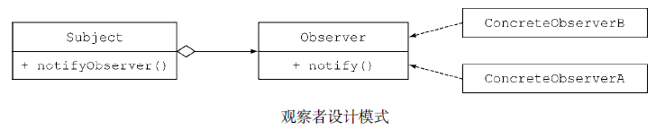
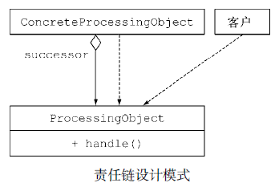
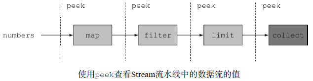

# 重构、测试和调试 #

[1.为改善可读性和灵活性重构代码](#为改善可读性和灵活性重构代码)

[1.1.改善代码的可读性](#改善代码的可读性)

[1.2.从匿名类到Lambda表达式的转换](#从匿名类到lambda表达式的转换)

[1.3.从Lambda表达式到方法引用的转换](#从lambda表达式到方法引用的转换)

[1.4.从命令式的数据处理切换到Stream](#从命令式的数据处理切换到stream)

[1.5.增加代码的灵活性](#增加代码的灵活性)

[1.5.1.采用函数接口](#采用函数接口)

[1.5.2.有条件的延迟执行](#有条件的延迟执行)

[1.5.3.环绕执行](#环绕执行)

[2.使用Lambda重构面向对象的设计模式](#使用lambda重构面向对象的设计模式)

[2.1.策略模式](#策略模式)

[2.1.1.使用Lambda表达式](#使用lambda表达式)

[2.2.模板方法](#模板方法)

[2.2.1.使用Lambda表达式2](#使用lambda表达式2)

[2.3.观察者模式](#观察者模式)

[2.3.1.使用Lambda表达式3](#使用lambda表达式3)

[2.4.责任链模式](#责任链模式)

[2.4.1.使用Lambda表达式4](#使用lambda表达式4)

[2.5.工厂模式](#工厂模式)

[2.5.1.使用Lambda表达式5](#使用lambda表达式5)

[3.测试Lambda表达式](#测试lambda表达式)

[3.1.测试可见Lambda 函数的行为](#测试可见lambda函数的行为)

[3.2.测试使用Lambda 的方法的行为](#测试使用lambda的方法的行为)

[3.3.将复杂的Lambda 表达式分到不同的方法](#将复杂的lambda表达式分到不同的方法)

[4.调试](#调试)

[4.1.查看栈跟踪](#查看栈跟踪)

[4.2.使用日志调试](#使用日志调试)

[5.小结](#小结)

## 为改善可读性和灵活性重构代码 ##

利用Lambda表达式，你可以写出更简洁、更灵活的代码。用“更简洁”来描述Lambda表达式是因为相较于匿名类，Lambda表达式可以帮助我们用更紧凑的方式描述程序的行为。

### 改善代码的可读性 ###

改善代码的可读性到底意味着什么？

通常的理解是，“别人理解这段代码的难易程度”。

改善可读性意味着你要确保你的代码能非常容易地被包括自己在内的所有人理解和维护。

为了确保你的代码能被其他人理解，有几个步骤可以尝试，比如确保你的代码附有良好的文档，并严格遵守编程规范。

跟之前的版本相比较，Java 8的新特性也可以帮助提升代码的可读性：
- 使用Java 8，你可以减少冗长的代码，让代码更易于理解
- 通过方法引用和Stream API，你的代码会变得更直观

这里会介绍三种简单的**重构**，利用Lambda表达式、方法引用以及Stream改善程序代码的可读性:

- 重构代码，用Lambda表达式取代匿名类
- 用方法引用重构Lambda表达式
- 用Stream API重构命令式的数据处理

### 从匿名类到Lambda表达式的转换 ###

	//传统的方式，使用匿名类
	Runnable r1 = new Runnable(){
		public void run(){
			System.out.println("Hello");
		}
	};

	//新的方式，使用Lambda表达式
	Runnable r2 = () -> System.out.println("Hello");

但是某些情况下，将匿名类转换为Lambda表达式可能是一个比较复杂的过程。 首先，**匿名类**和**Lambda**表达式中的this和super的含义是不同的。

在匿名类中，this代表的是类自身，但是在Lambda中，它代表的是包含类。其次，匿名类可以屏蔽包含类的变量，而Lambda表达式不能（它们会导致编译错误），譬如

	int a = 10;
	Runnable r1 = () -> {
		int a = 2;//编译错误
		System.out.println(a);
	};
	
	Runnable r2 = new Runnable(){
		public void run(){
			int a = 2;//一切正常
			System.out.println(a);
		}
	};

---

在涉及重载的上下文里，将匿名类转换为Lambda表达式可能导致最终的代码更加晦涩。实际上，匿名类的类型是在初始化时确定的，而Lambda的类型取决于它的上下文。

假设用与Runnable同样的签名声明了一个函数接口，称之为Task

	interface Task{
		public void execute();
	}

	public static void doSomething(Runnable r){ r.run(); }
	public static void doSomething(Task a){ a.execute(); }

再传递一个匿名类实现的Task，不会碰到任何问题：

	doSomething(new Task() {
		public void execute() {
		System.out.println("Danger danger!!");
		}
	});

但是将这种匿名类转换为Lambda表达式时，就导致了一种晦涩的方法调用，因为Runnable和Task都是合法的目标类型：

	//麻烦来了： doSomething(Runnable) 和doSomething(Task)都匹配该类型
	doSomething(() -> System.out.println("Danger danger!!"));

可以对Task尝试使用显式的类型转换来解决这种模棱两可的情况：

	doSomething((Task)() -> System.out.println("Danger danger!!"));

### 从Lambda表达式到方法引用的转换 ###

Lambda表达式非常适用于需要传递代码片段的场景。不过，为了改善代码的可读性，也请尽量使用方法引用。因为方法名往往能更直观地表达代码的意图。

	Map<CaloricLevel, List<Dish>> dishesByCaloricLevel =
	menu.stream()
		.collect(groupingBy(dish -> {
			if (dish.getCalories() <= 400) 
				returnCaloricLevel.DIET;
			else if (dish.getCalories() <= 700) 
				return CaloricLevel.NORMAL;
			else 
				return CaloricLevel.FAT;
		}));

Lambda表达式的内容抽取到一个单独的方法中，将其作为参数传递给groupingBy方法。变换之后，代码变得更加简洁，程序的意图也更加清晰了

	Map<CaloricLevel, List<Dish>> dishesByCaloricLevel = menu.stream()
					.collect(groupingBy(Dish::getCaloricLevel));

为了实现这个方案，你还需要在Dish类中添加getCaloricLevel方法：

	public class Dish{
	…
		public CaloricLevel getCaloricLevel(){
			if (this.getCalories() <= 400) 
				return CaloricLevel.DIET;
			else if (this.getCalories() <= 700) 
				return CaloricLevel.NORMAL;
			else 
				return CaloricLevel.FAT;
		}
	}

---

除此之外，我们还应该尽量考虑使用静态辅助方法，比如comparing、maxBy。这些方法设计之初就考虑了会结合方法引用一起使用

	inventory.sort((Apple a1, Apple a2) -> a1.getWeight().compareTo(a2.getWeight()));

	inventory.sort(comparing(Apple::getWeight));

很多通用的归约操作，比如sum、maximum，都有内建的辅助方法可以和方法引用结合使用。

比如，使用Collectors接口可以轻松得到和或者最大值，与采用Lambada表达式和底层的归约操作比起来，这种方式要直观得多。

	int totalCalories = menu.stream()
					.map(Dish::getCalories)
					.reduce(0, (c1, c2) -> c1 + c2);

	int totalCalories = menu.stream().collect(summingInt(Dish::getCalories));

### 从命令式的数据处理切换到Stream ###

Stream API能更清晰地表达数据处理管道的意图。除此之外，通过短路和延迟载入以及利用介绍的现代计算机的多核架构。

	List<String> dishNames = new ArrayList<>();
		for(Dish dish: menu){
		if(dish.getCalories() > 300){
			dishNames.add(dish.getName());
		}
	}

替代方案使用Stream API，采用这种方式编写的代码读起来更像是问题陈述，并行化也非常容易

	menu.parallelStream()
		.filter(d -> d.getCalories() > 300)
		.map(Dish::getName)
		.collect(toList());

不幸的是，将命令式的代码结构转换为Stream API的形式是个困难的任务，因为你需要考虑控制流语句，比如break、continue、return，并选择使用恰当的流操作。

### 增加代码的灵活性 ###

Lambda表达式有利于行为参数化。

你可以使用不同的Lambda表示不同的行为，并将它们作为参数传递给函数去处理执行。

比如，我们可以用多种方式为Predicate创建筛选条件，或者使用Comparator对多种对象进行比较。

#### 采用函数接口 ####

首先，你必须意识到，没有函数接口，你就无法使用Lambda表达式。因此，你需要在代码中引入函数接口。

听起来很合理，但**是在什么情况下使用它们呢**？这里我们介绍两种通用的模式，你可以依照这两种模式重构代码，利用Lambda表达式带来的灵活性，它们分别是：

- 有条件的延迟执行
- 环绕执行。

#### 有条件的延迟执行 ####

控制语句被混杂在业务逻辑代码之中。典型的情况包括进行安全
性检查以及日志输出。比如，

	if (logger.isLoggable(Log.FINER)){
		logger.finer("Problem: " + generateDiagnostic());
	}

这段代码的问题：

- 日志器的状态（它支持哪些日志等级）通过isLoggable方法暴露给了客户端代码。
- 为什么要在每次输出一条日志之前都去查询日志器对象的状态？这只能搞砸你的代码。

更好的方案是使用log方法，该方法在输出日志消息之前，会在内部检查日志对象是否已经设置为恰当的日志等级：

	logger.log(Level.FINER, "Problem: " + generateDiagnostic());

这种方式**更好的**原因是你不再需要在代码中插入那些条件判断，与此同时日志器的状态也不再被暴露出去。不过，这段代码依旧存在一个问题。日志消息的输出与否每次都需要判断，即使你已经传递了参数，不开启日志。

---

这就是Lambda表达式可以施展拳脚的地方。你需要做的仅仅是延迟消息构造，如此一来，日志就只会在某些特定的情况下才开启（以此为例，当日志器的级别设置为FINER时）。

你可以通过下面的方式对它进行调用：

	logger.log(Level.FINER, () -> "Problem: " + generateDiagnostic());

如果日志器的级别设置恰当，log方法会在内部执行作为参数传递进来的Lambda表达式。这里介绍的Log方法的内部实现如下：

	public void log(Level level, Supplier<String> msgSupplier){
		if(logger.isLoggable(level)){
			log(level, msgSupplier.get());
		}
	}

**从这个故事里我们学到了什么呢**？如果你发现你需要频繁地从客户端代码去查询一个对象的状态（比如前文例子中的日志器的状态），只是为了传递参数、调用该对象的一个方法（比如输出一条日志），那么可以考虑实现一个新的方法，以Lambda或者方法表达式作为参数，新方法在检查完该对象的状态之后才调用原来的方法。你的代码会因此而变得更易读（结构更清晰），封装性更好（对象的状态也不会暴露给客户端代码了）。

>PS.与JS回调函数类似

#### 环绕执行 ####

如果你发现虽然你的业务代码千差万别，但是它们**拥有同样的准备和清理阶段**，这时，你完全可以将这部分代码用Lambda实现。这种方式的好处是可以重用准备和清理阶段的逻辑，减少重复冗余的代码。

	//传入一个Lambda表达式
	String oneLine = processFile((BufferedReader b) -> b.readLine());
	String twoLines = processFile((BufferedReader b) -> b.readLine() + b.readLine());

	public static String processFile(BufferedReaderProcessor p) throws IOException {
		try(BufferedReader br = new BufferedReader(new FileReader("java8inaction/chap8/data.txt"))){
			return p.process(br);
		}
	}

	@FunctionalInterface
	public interface BufferedReaderProcessor{
		String process(BufferedReader b) throws IOException;
	}

## 使用Lambda重构面向对象的设计模式 ##

对设计经验的归纳总结被称为设计模式。

设计软件时，如果你愿意，可以复用这些方式方法来解决一些常见问题。这看起来像传统建筑工程师的工作方式，对典型的场景（比如悬挂桥、拱桥等）都定义有可重用的解决方案。例如，

- 访问者模式常用于分离程序的算法和它的操作对象。
- 单例模式一般用于限制类的实例化，仅生成一份对象。

### 策略模式 ###

[StrategyMain](StrategyMain.java)

策略模式代表了解决一类算法的通用解决方案，你可以在运行时选择使用哪种方案

- 一个代表某个算法的接口（它是策略模式的接口）。
- 一个或多个该接口的具体实现，它们代表了算法的多种实现（比如，实体类Concrete-
StrategyA或者ConcreteStrategyB）。
- 一个或多个使用策略对象的客户。

假设你希望验证输入的内容是否根据标准进行了恰当的格式化（比如只包含小写字母或数字）。你可以从定义一个验证文本（以String的形式表示）的接口入手：

	public interface ValidationStrategy {
		boolean execute(String s);
	}

其次，你定义了该接口的一个或多个具体实现：
	public class IsAllLowerCase implements ValidationStrategy {
		public boolean execute(String s){
			return s.matches("[a-z]+");
		}
	}

	public class IsNumeric implements ValidationStrategy {
		public boolean execute(String s){
			return s.matches("\\d+");
		}
	}

	public class Validator{
		private final ValidationStrategy strategy;
		
		public Validator(ValidationStrategy v){
			this.strategy = v;
		}

		public boolean validate(String s){
			return strategy.execute(s);
		}
	}

#### 使用Lambda表达式 ####

到现在为止，你应该已经意识到ValidationStrategy是一个函数接口了（除此之外，它还与Predicate<String>具有同样的函数描述）。这意味着我们不需要声明新的类来实现不同的策略，通过直接传递Lambda表达式就能达到同样的目的，并且还更简洁：

	Validator numericValidator = new Validator((String s) -> s.matches("[a-z]+"));
	boolean b1 = numericValidator.validate("aaaa");

	Validator lowerCaseValidator = new Validator((String s) -> s.matches("\\d+"));
	boolean b2 = lowerCaseValidator.validate("bbbb");

Lambda表达式避免了采用策略设计模式时僵化的模板代码。

### 模板方法 ###

[OnlineBanking](OnlineBanking.java)

[OnlineBankingLambda](OnlineBankingLambda.java)

如果你需要采用某个算法的框架，同时又希望有一定的灵活度，能对它的某些部分进行改进，那么采用模板方法设计模式是比较通用的方案。换句话说，模板方法模式在你“希望使用这个算法，但是需要对其中的某些行进行改进，才能达到希望的效果”时是非常有用的。

假设你需要编写一个简单的在线银行应用。通常，用户需要输入一个用户账户，之后应用才能从银行的数据库中得到用户的详细信息，最终完成一些让用户满意的操作。

不同分行的在线银行应用让客户满意的方式可能还略有不同，比如给客户的账户发放红利，或者仅仅是少发送一些推广文件。你可能通过下面的抽象类方式来实现在线银行应用：

	abstract class OnlineBanking {
		public void processCustomer(int id){
			Customer c = Database.getCustomerWithId(id);
			makeCustomerHappy(c);
		}

		abstract void makeCustomerHappy(Customer c);
	}

#### 使用Lambda表达式2 ####

	public void processCustomer(int id, Consumer<Customer> makeCustomerHappy){
		Customer c = Database.getCustomerWithId(id);
		makeCustomerHappy.accept(c);
	}

	new OnlineBankingLambda()
		.processCustomer(1337, (Customer c) -> System.out.println("Hello " + c.getName());

Lamba表达式能帮助你解决设计模式与生俱来的设计僵化问题

### 观察者模式 ###

观察者模式是一种比较常见的方案，某些事件发生时（比如状态转变），如果一个对象（通常我们称之为主题）需要自动地通知其他多个对象（称为观察者），就会采用该方案。

创建图形用户界面（GUI）程序时，你经常会使用该设计模式。这种情况下，你会在图形用户界面组件（比如按钮）上注册一系列的观察者。如果点击按钮，观察者就会收到通知，并随即执行某个特定的行为。

但是观察者模式并不局限于图形用户界面。比如，观察者设计模式也适用于股票交易的情形，多个券商可能都希望对某一支股票价格（主题）的变动做出响应。

---

你需要为Twitter这样的应用设计并实现一个定制化的通知系统。想法很简单：好几家报纸机构，比如《纽约时报》《卫报》以及《世界报》都订阅了新闻，他们希望当接收的新闻中包含他们感兴趣的关键字时，能得到特别通知。

观察者

	interface Observer {
		void notify(String tweet);
	}

	class NYTimes implements Observer{
		public void notify(String tweet) {
			if(tweet != null && tweet.contains("money")){
				System.out.println("Breaking news in NY! " + tweet);
			}
		}
	}
	class Guardian implements Observer{
		public void notify(String tweet) {
			if(tweet != null && tweet.contains("queen")){
				System.out.println("Yet another news in London... " + tweet);
			}
		}
	}
	class LeMonde implements Observer{
		public void notify(String tweet) {
			if(tweet != null && tweet.contains("wine")){
				System.out.println("Today cheese, wine and news! " + tweet);
			}
		}
	}

---

主题

	interface Subject{
		void registerObserver(Observer o);
		void notifyObservers(String tweet);
	}

	class Feed implements Subject{
		private final List<Observer> observers = new ArrayList<>();

		public void registerObserver(Observer o) {
			this.observers.add(o);
		}

		public void notifyObservers(String tweet) {
			observers.forEach(o -> o.notify(tweet));
		}
	}

	Feed f = new Feed();
	f.registerObserver(new NYTimes());
	f.registerObserver(new Guardian());
	f.registerObserver(new LeMonde());
	f.notifyObservers("The queen said her favourite book is Java 8 in Action!");

#### 使用Lambda表达式3 ####

	f.registerObserver((String tweet) -> {
		if(tweet != null && tweet.contains("money")){
			System.out.println("Breaking news in NY! " + tweet);
		}
	});

	f.registerObserver((String tweet) -> {
		if(tweet != null && tweet.contains("queen")){
			System.out.println("Yet another news in London... " + tweet);
		}
	});

是否我们随时随地都可以使用Lambda表达式呢？答案是否定的！

Lambda适配得很好，那是因为需要执行的动作都很简单，因此才能很方便地消除僵化代码。但是，观察者的逻辑有可能十分复杂，它们可能还持有状态，抑或定义了多个方法，诸如此类。在这些情形下，你还是应该继续使用类的方式。

### 责任链模式 ###

[ChainOfResponsibilityMain](ChainOfResponsibilityMain.java)

责任链模式是一种创建处理对象序列（比如操作序列）的通用方案。一个处理对象可能需要在完成一些工作之后，将结果传递给另一个对象，这个对象接着做一些工作，再转交给下一个处理对象，以此类推。

通常，这种模式是通过定义一个代表处理对象的抽象类来实现的，在抽象类中会定义一个字段来记录后续对象。一旦对象完成它的工作，处理对象就会将它的工作转交给它的后继。

	public abstract class ProcessingObject<T> {

		protected ProcessingObject<T> successor;
		public void setSuccessor(ProcessingObject<T> successor){
			this.successor = successor;

		public T handle(T input){
			T r = handleWork(input);
			if(successor != null){
				return successor.handle(r);
			}
			return r;
		}

		abstract protected T handleWork(T input);
		}
	}

可以创建两个处理对象，它们的功能是进行一些文
本处理工作。

	public class HeaderTextProcessing extends ProcessingObject<String> {
		public String handleWork(String text){
			return "From Raoul, Mario and Alan: " + text;
		}
	}
	public class SpellCheckerProcessing extends ProcessingObject<String> {
		public String handleWork(String text){
			return text.replaceAll("labda", "lambda");
		}
	}

现在你就可以将这两个处理对象结合起来，构造一个操作序列！

	ProcessingObject<String> p1 = new HeaderTextProcessing();
	ProcessingObject<String> p2 = new SpellCheckerProcessing();
	p1.setSuccessor(p2);
	String result = p1.handle("Aren't labdas really sexy?!!");
	System.out.println(result);

#### 使用Lambda表达式4 ####

这个模式看起来像是在链接（也即是构造）函数，你需要使用andThen方法对其进行构造。[link](../c03)

	UnaryOperator<String> headerProcessing = (String text) -> "From Raoul, Mario and Alan: " + text;
	UnaryOperator<String> spellCheckerProcessing = (String text) -> text.replaceAll("labda", "lambda");

	Function<String, String> pipeline = headerProcessing.andThen(spellCheckerProcessing);
	String result2 = pipeline.apply("Aren't labdas really sexy?!!");

### 工厂模式 ###

[FactoryMain](FactoryMain.java)

使用工厂模式，你无需向客户暴露实例化的逻辑就能完成对象的创建。比如，我们假定你为一家银行工作，他们需要一种方式创建不同的金融产品：贷款、期权、股票，等等。

	public class ProductFactory {

		public static Product createProduct(String name){
			switch(name){
				case "loan": return new Loan();
				case "stock": return new Stock();
				case "bond": return new Bond();
				default: throw new RuntimeException("No such product " + name);
			}
		}

	}

这里贷款（Loan）、股票（Stock）和债券（Bond）都是产品（Product）的子类。createProduct方法可以通过附加的逻辑来设置每个创建的产品。但是带来的好处也显而易见，你在创建对象时不用再担心会将构造函数或者配置暴露给客户，这使得客户创建产品时更加简单：

	Product p = ProductFactory.createProduct("loan");

#### 使用Lambda表达式5 ####

	Supplier<Product> loanSupplier = Loan::new;
	Loan loan = loanSupplier.get();

	final static Map<String, Supplier<Product>> map = new HashMap<>();

	static {
		map.put("loan", Loan::new);
		map.put("stock", Stock::new);
		map.put("bond", Bond::new);
	}

现在，你可以像之前使用工厂设计模式那样，利用这个Map来实例化不同的产品。
	public static Product createProduct(String name){

		Supplier<Product> p = map.get(name);
		if(p != null) 
			return p.get();
		throw new IllegalArgumentException("No such product " + name);
	}

这是个全新的尝试，它使用Java 8中的新特性达到了传统工厂模式同样的效果。但是，如果工厂方法createProduct需要接收多个传递给产品构造方法的参数，这种方式的扩展性不是很好。你不得不提供不同的函数接口，无法采用之前统一使用一个简单接口的方式。

比如，我们假设你希望保存具有**三个参数**（两个参数为Integer类型，一个参数为String类型）的**构造函数**；为了完成这个任务，你需要创建一个特殊的函数接口TriFunction。最终的结果是Map变得更加复杂。

	public interface TriFunction<T, U, V, R>{
		R apply(T t, U u, V v);
	}

	Map<String, TriFunction<Integer, Integer, String, Product>> map = new HashMap<>();

## 测试Lambda表达式 ##

### 测试可见Lambda 函数的行为 ###

由于moveRightBy方法声明为**public**，测试工作变得相对容易。你可以在用例内部完成测试。但是Lambda并无函数名（毕竟它们都是匿名函数），因此要对你代码中的Lambda函数进行测试实际上比较困难，因为你无法通过函数名的方式调用它们。

有些时候，你可以借助某个字段访问Lambda函数，这种情况，你可以利用这些字段，通过它们对封装在Lambda函数内的逻辑进行测试。比如，我们假设你在Point类中添加了静态字段compareByXAndThenY，通过该字段，使用方法引用你可以访问Comparator对象：

	public class Point{
		public final static Comparator<Point> compareByXAndThenY = comparing(Point::getX)
			.thenComparing(Point::getY);
	…
	}

Lambda表达式会生成函数接口的一个实例。由此，你可以测试该实例的行为。这个例子中，我们可以使用不同的参数，对Comparator对象类型实例compareByXAndThenY的compare方法进行调用，验证它们的行为是否符合预期：

	@Test
	public void testComparingTwoPoints() throws Exception {
		Point p1 = new Point(10, 15);
		Point p2 = new Point(10, 20);
		int result = Point.compareByXAndThenY.compare(p1 , p2);
		assertEquals(-1, result);
	}

### 测试使用Lambda 的方法的行为 ###

我们需要对使用Lambda表达式的方法进行测试。比如下面这个方法moveAllPointsRightBy：

	public static List<Point> moveAllPointsRightBy(List<Point> points, int x){
		return points.stream()
			.map(p -> new Point(p.getX() + x, p.getY()))
			.collect(toList());
	}

没必要对Lambda表达式p -> new Point(p.getX() + x,p.getY())进行测试，它只是moveAllPointsRightBy内部的实现细节。**我们更应该关注的是方法moveAllPointsRightBy的行为**：

	@Test
	public void testMoveAllPointsRightBy() throws Exception{
		List<Point> points =
		Arrays.asList(new Point(5, 5), new Point(10, 5));
		List<Point> expectedPoints =
		Arrays.asList(new Point(15, 5), new Point(20, 5));
		List<Point> newPoints = Point.moveAllPointsRightBy(points, 10);
		assertEquals(expectedPoints, newPoints);
	}

### 将复杂的Lambda 表达式分到不同的方法 ###

可能你会碰到非常复杂的Lambda表达式，包含大量的业务逻辑，比如需要处理复杂情况的定价算法。你无法在测试程序中引用Lambda表达式如果一个方法接受Lambda表达式作为参数，你可以采用的一个方案是使用不同的Lambda表达式对它进行测试。

## 调试 ##

调试有问题的代码时，程序员的兵器库里有两大老式武器，分别是：

- 查看栈跟踪
- 输出日志

### 查看栈跟踪 ###

[Debugging](Debugging.java)

你的程序突然停止运行（比如突然抛出一个异常），这时你首先要调查程序在什么地方发生了异常以及为什么会发生该异常。这时栈帧就非常有用。程序的每次方法调用都会产生相应的调用信息，包括程序中方法调用的位置、该方法调用使用的参数、被调用方法的本地变量。这些信息被保存在栈帧上。

程序失败时，你会得到它的**栈跟踪**，通过一个又一个栈帧，你可以了解程序失败时的概略信息。换句话说，通过这些你能得到程序失败时的方法调用列表。这些方法调用列表最终会帮助你发现问题出现的原因。

---

不幸的是，由于Lambda表达式没有名字，它的栈跟踪可能很难分析。在下面这段简单的代码中，我们刻意地引入了一些错误：

	import java.util.*;
	public class Debugging{
		public static void main(String[] args) {
			List<Point> points = Arrays.asList(new Point(12, 2), null);
			points.stream().map(p -> p.getX()).forEach(System.out::println);
		}
	}

运行这段代码会产生下面的栈跟踪：

	Exception in thread "main" java.lang.NullPointerException
		at Debugging.lambda$main$0(Debugging.java:6)
		at Debugging$$Lambda$5/284720968.apply(Unknown Source)
		at java.util.stream.ReferencePipeline$3$1.accept(ReferencePipeline
		.java:193)
		at java.util.Spliterators$ArraySpliterator.forEachRemaining(Spliterators
		.java:948)
	…

这段程序当然会失败，因为Points列表的第二个元素是空（null）。这时你的程序实际是在试图处理一个空引用。由于Stream流水线发生了错误，构成Stream流水线的整个方法调用序列都暴露在你面前了。

不过，你留意到了吗？栈跟踪中还包含下面这样类似加密的内容：

	at Debugging.lambda$main$0(Debugging.java:6)
	at Debugging$$Lambda$5/284720968.apply(Unknown Source)

这些表示错误发生在Lambda表达式内部。由于Lambda表达式没有名字，所以编译器只能为它们指定一个名字。这个例子中，它的名字是lambda$main$0，看起来非常不直观。如果你使用了大量的类，其中又包含多个Lambda表达式，这就成了一个非常头痛的问题。

---

即使你使用了方法引用，还是有可能出现栈无法显示你使用的方法名的情况。将之前的Lambda表达式p-> p.getX()替换为方法引用reference Point::getX也会产生难于分析的栈跟踪：

	points.stream().map(Point::getX).forEach(System.out::println);

	Exception in thread "main" java.lang.NullPointerException
		at Debugging$$Lambda$5/284720968.apply(Unknown Source)
		at java.util.stream.ReferencePipeline$3$1.accept(ReferencePipeline
		.java:193)
		…

注意，如果方法引用指向的是同一个类中声明的方法，那么它的名称是可以在栈跟踪中显示的。比如，下面这个例子：

	import java.util.*;
	public class Debugging{
		public static void main(String[] args) {
			List<Integer> numbers = Arrays.asList(1, 2, 3);
			numbers.stream().map(Debugging::divideByZero).forEach(System.out::println);
		}

		public static int divideByZero(int n){
			return n / 0;
		}
	}

方法divideByZero在栈跟踪中就正确地显示了：

	Exception in thread "main" java.lang.ArithmeticException: / by zero
		at Debugging.divideByZero(Debugging.java:10)
		at Debugging$$Lambda$1/999966131.apply(Unknown Source)
		at java.util.stream.ReferencePipeline$3$1.accept(ReferencePipeline
		.java:193)
	…

总的来说，我们需要特别注意，**涉及Lambda表达式的栈跟踪可能非常难理解**。这是Java编译器未来版本可以改进的一个方面。

### 使用日志调试 ###

[Peek](Peek.java)

使用forEach将流操作的结果日志输出到屏幕上或者记录到日志文件中：

	List<Integer> numbers = Arrays.asList(2, 3, 4, 5);
	numbers.stream()
	.map(x -> x + 17)
	.filter(x -> x % 2 == 0)
	.limit(3)
	.forEach(System.out::println);

这段代码的输出如下：

	20
	22

不幸的是，一旦调用forEach，整个流就会恢复运行。到底哪种方式能更有效地帮助我们理解Stream流水线中的每个操作（比如map、filter、limit）产生的输出？

peek的设计初衷就是在流的每个元素恢复运行之前，插入执行一个动作。但是它不像forEach那样恢复整个流的运行，而是在一个元素上完成操作之后，它只会将操作顺承到流水线中的下一个操作。

	List<Integer> result =
	numbers.stream()
			.peek(x -> System.out.println("from stream: " + x))
			.map(x -> x + 17)
			.peek(x -> System.out.println("after map: " + x))
			.filter(x -> x % 2 == 0)
			.peek(x -> System.out.println("after filter: " + x))
			.limit(3)
			.peek(x -> System.out.println("after limit: " + x))
			.collect(toList());

通过peek操作我们能清楚地了解流水线操作中每一步的输出结果：

	taking from stream: 2
	after map: 19
	taking from stream: 3
	after map: 20
	after filter: 20
	after limit: 20
	taking from stream: 4
	after map: 21
	taking from stream: 5
	after map: 22
	after filter: 22
	after limit: 22

## 小结 ##

- Lambda表达式能提升代码的可读性和灵活性。
- 如果你的代码中使用了匿名类，尽量用Lambda表达式替换它们，但是要注意二者间语义的微妙差别，比如关键字this，以及变量隐藏。
- 跟Lambda表达式比起来，方法引用的可读性更好 。
- 尽量使用Stream API替换迭代式的集合处理。
- Lambda表达式有助于避免使用面向对象设计模式时容易出现的僵化的模板代码，典型的比如策略模式、模板方法、观察者模式、责任链模式，以及工厂模式。
- 即使采用了Lambda表达式，也同样可以进行单元测试，但是通常你应该关注使用了Lambda表达式的方法的行为。
- 尽量将复杂的Lambda表达式抽象到普通方法中。
- Lambda表达式会让栈跟踪的分析变得更为复杂。
- 流提供的peek方法在分析Stream流水线时，能将中间变量的值输出到日志中，是非常有用的工具。

