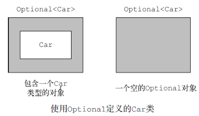
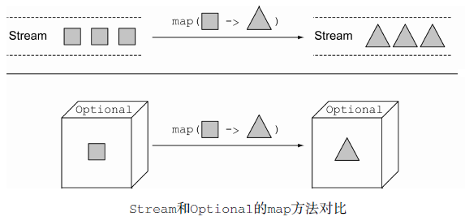
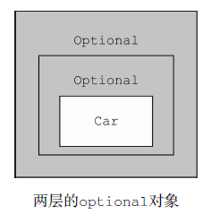
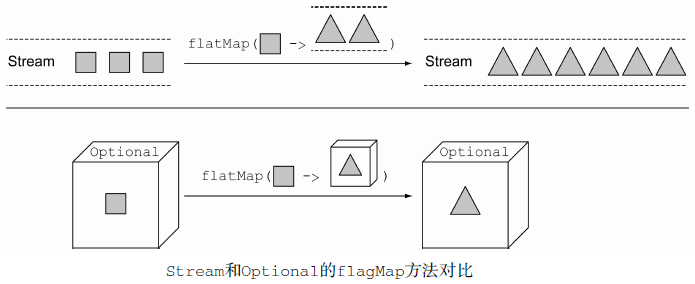
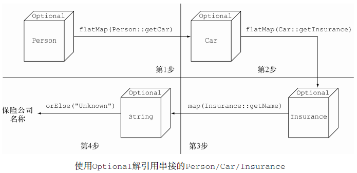

# 用Optional取代null #

[1.如何为缺失的值建模](#如何为缺失的值建模)

[1.1.采用防御式检查减少NullPointerException](#采用防御式检查减少nullpointerexception)

[1.1.1.深层质疑](#深层质疑)

[1.1.2.过多的退出语句](#过多的退出语句)

[1.2.null带来的种种问题](#null带来的种种问题)

[1.3.其他语言中null的替代品](#其他语言中null的替代品)

[2.Optional类入门](#optional类入门)

[3.应用Optional的几种模式](#应用optional的几种模式)

[3.1.创建Optional对象](#创建optional对象)

[3.1.1.声明一个空的Optional](#声明一个空的optional)

[3.1.2.依据一个非空值创建Optional](#依据一个非空值创建optional)

[3.1.3.可接受null的Optional](#可接受null的optional)

[3.2.使用map从Optional对象中提取和转换值](#使用map从optional对象中提取和转换值)

[3.3.使用flatMap链接Optional对象](#使用flatmap链接optional对象)

[3.3.1.使用Optional获取car的保险公司名称](#使用optional获取car的保险公司名称)

[3.3.2.使用Optional解引用串接的Person/Car/Insurance对象](#使用optional解引用串接的personcarinsurance对象)

[3.3.3.在域模型中使用Optional，以及为什么它们无法序列化](#在域模型中使用optional以及为什么它们无法序列化)

[3.4.默认行为及解引用Optional对象](#默认行为及解引用optional对象)

[3.5.两个Optional对象的组合](#两个optional对象的组合)

[3.6.以不解包的方式组合两个Optional对象](#以不解包的方式组合两个optional对象)

[3.7.使用filter剔除特定的值](#使用filter剔除特定的值)

[3.8.对Optional对象进行过滤](#对optional对象进行过滤)

[3.9.Optional类的方法](#optional类的方法)

[4.使用Optional的实战示例](#使用optional的实战示例)

[4.1.用Optional封装可能为null的值](#用optional封装可能为null的值)

[4.2.异常与Optional的对比](#异常与optional的对比)

[4.3.基础类型的Optional对象，以及为什么应该避免使用它们](#基础类型的optional对象以及为什么应该避免使用它们)

[4.4.把之前所有内容整合起来](#把之前所有内容整合起来)

[5.小结](#小结)

毫无疑问，我承认，对任何一位Java程序员来说，无论是初出茅庐的新人，还是久经江湖的专家，NullPointerException都是他心中的痛，可是我们又无能为力，因为这就是我们为了使用方便甚至不可避免的像null引用这样的构造所付出的代价。这就是程序设计世界里大家都持有的观点，然而，这可能并非事实的全部真相，只是我们根深蒂固的一种偏见。

1965年，英国一位名为Tony Hoare的计算机科学家在设计ALGOL W语言时提出了null引用的想法。

## 如何为缺失的值建模 ##

假设你需要处理下面这样的嵌套对象，这是一个拥有汽车及汽车保险的客户。

	public class Person {
		private Car car;
	
		public Car getCar() {
			return car;
		}
	}
	
	public class Car {
		private Insurance insurance;
	
		public Insurance getInsurance() {
			return insurance;
		}
	}
	
	public class Insurance {
		private String name;
	
		public String getName() {
			return name;
		}
	}

---

	public String getCarInsuranceName(Person person) {
		return person.getCar().getInsurance().getName();
	}

这段代码看起来相当正常，但是现实生活中很多人没有车。所以调用getCar方法的结果会怎样呢？在实践中，一种比较常见的做法是返回一个null引用，表示该值的缺失，即用户没有车。

而接下来，对getInsurance的调用会返回null引用的insurance，这会导致运行时出现一个**NullPointerException**，终止程序的运行。但这还不是全部。如果返回的person值为null会怎样？如果getInsurance的返回值也是null，结果又会怎样？

### 采用防御式检查减少NullPointerException ###

怎样做才能避免这种不期而至的NullPointerException呢？通常，你可以在需要的地方添加null的检查（过于激进的防御式检查甚至会在不太需要的地方添加检测代码），并且添加的方式往往各有不同。

#### 深层质疑 ####

	public String getCarInsuranceName(Person person) {
		if (person != null) {
			Car car = person.getCar();
			if (car != null) {
				Insurance insurance = car.getInsurance();
				if (insurance != null) {
					return insurance.getName();
				}
			}
		}
		return "Unknown";
	}

标记为“深层质疑”，原因是它不断重复着一种模式：每次你不确定一个变量是否为null时，都需要添加一个进一步嵌套的if块，也增加了代码缩进的层数。**很明显，这种方式不具备扩展性，同时还牺牲了代码的可读性**。

#### 过多的退出语句 ####

	public String getCarInsuranceName(Person person) {
		if (person == null) {
			return "Unknown";
		}
		Car car = person.getCar();
		if (car == null) {
			return "Unknown";
		}
		Insurance insurance = car.getInsurance();
		if (insurance == null) {
			return "Unknown";
		}
		return insurance.getName();
	}

你试图避免深层递归的if语句块，采用了一种不同的策略：每次你遭遇null变量，都返回一个字符串常量“Unknown”。然而，这种方案远非理想，**现在这个方法有了四个截然不同的退出点，使得代码的维护异常艰难**。更糟的是，发生null时返回的默认值，即字符串“Unknown”在三个不同的地方重复出现——出现拼写错误的概率不小！当然，你可能会说，我们可以用把它们抽取到一个常量中的方式避免这种问题。

进一步而言，这种流程是极易出错的；如果你忘记检查了那个可能为null的属性会怎样？你会了解使用null来表示变量值的缺失是大错特错的。

### null带来的种种问题 ###

在Java程序开发中使用null会带来理论和实际操作上的种种问题

- **它是错误之源。** NullPointerException是目前Java程序开发中最典型的异常。
- **它会使你的代码膨胀。**它让你的代码充斥着深度嵌套的null检查，代码的可读性糟糕透顶。
- **它自身是毫无意义的。**null自身没有任何的语义，尤其是，它代表的是在静态类型语言中以一种错误的方式对
缺失变量值的建模。
- **它破坏了Java的哲学。**Java一直试图避免让程序员意识到指针的存在，唯一的例外是：null指针。
- **它在Java的类型系统上开了个口子。**null并不属于任何类型，这意味着它可以被赋值给任意引用类型的变量。这会导致问题，原因是当这个变量被传递到系统中的另一个部分后，你将无法获知这个null变量最初的赋值到底是什么类型。

### 其他语言中null的替代品 ###

比如Groovy，通过引入安全导航操作符（Safe Navigation Operator，标记为?）可以安全访问可能为null的变量。

	def carInsuranceName = person?.car?.insurance?.name

几乎所有的Java程序员碰到NullPointerException时的第一冲动就是添加一个if语句，在调用方法使用该变量之前检查它的值是否为null，快速地搞定问题。如果你按照这种方式解决问题，**丝毫不考虑你的算法或者你的数据模型在这种状况下是否应该返回一个nul**l，那么你其实并没有真正解决这个问题，只是暂时地掩盖了问题，使得下次该问题的调查和修复更加困难，而你很可能就是下个星期或下个月要面对这个问题的人。刚才的那种方式实际上是**掩耳盗铃**，只是在清扫地毯下的灰尘。

而Groovy的null安全解引用操作符也只是一个更强大的扫把，让我们可以毫无顾忌地犯错。你不会忘记做这样的检查，因为类型系统会强制你进行这样的操作。

---

另一些函数式语言，比如Haskell、Scala，试图从另一个角度处理这个问题。Haskell中包含了一个Maybe类型，它本质上是对optional值的封装。Maybe类型的变量可以是指定类型的值，也可以什么都不是。

但是它并没有null引用的概念。Scala有类似的数据结构，名字叫Option[T]，它既可以包含类型为T的变量，也可以不包含该变量要使用这种类型，你必须显式地调用Option类型的available操作，检查该变量是否有值，而这其实也是一种变相的“null检查”。

## Optional类入门 ##

汲取Haskell和Scala的灵感，Java 8中引入了一个新的类java.util.Optional<T&gt;。这是一个封装Optional值的类。举例来说，使用新的类意味着，如果你知道一个人可能有也可能没有车，那么Person类内部的car变量就不应该声明为Car，遭遇某人没有车时把null引用赋值给它，而是应该直接将其声明为Optional<Car>类型。

变量存在时，Optional类只是对类简单封装。变量不存在时，缺失的值会被建模成一个“空”的Optional对象，由方法Optional.empty()返回。Optional.empty()方法是一个静态工厂方法，它返回Optional类的特定单一实例。

你可能还有疑惑，null引用和Optional.empty()有什么本质的区别吗？从语义上，你可以把它们当作一回事儿，但是实际中它们之间的差别非常大： 如果你尝试解引用一个null ， 一定会触发NullPointerException ， 不过使用Optional.empty()就完全没事儿，它是Optional类的一个有效对象，多种场景都能调用，

使用Optional而不是null的一个非常重要而又实际的语义区别是，第一个例子中，我们在声明变量时使用的是Optional<Car>类型，而不是Car类型，这句声明非常清楚地表明了这里发生变量缺失是允许的。与此相反，使用Car这样的类型，可能将变量赋值为null，这意味着你需要独立面对这些，你只能依赖你对业务模型的理解，判断一个null是否属于该变量的有
效范畴。

---

使用Optional类对最初的代码进行重构

	public class Person {
		private Optional<Car> car;
	
		public Optional<Car> getCar() {
			return car;
		}
	}
	
	public class Car {
		private Optional<Insurance> insurance;
	
		public Optional<Insurance> getInsurance() {
			return insurance;
		}
	}
	
	public class Insurance {
		private String name;
	
		public String getName() {
			return name;
		}
	}

在你的代码中始终如一地使用Optional，能非常清晰地界定出变量值的缺失是结构上的问题，还是你算法上的缺陷，抑或是你数据中的问题。另外，我们还想特别强调，引入Optional类的意图并非要消除每一个null引用。与此相反，它的目标是帮助你更好地设计出普适的API，让程序员看到方法签名，就能了解它是否接受一个Optional的值。这种强制会让你更积极地将变量从Optional中解包出来，直面缺失的变量值。

## 应用Optional的几种模式 ##

### 创建Optional对象 ###

#### 声明一个空的Optional ####

	Optional<Car> optCar = Optional.empty();

#### 依据一个非空值创建Optional ####

	Optional<Car> optCar = Optional.of(car);

如果car是一个null，这段代码会立即抛出一个NullPointerException，而不是等到你试图访问car的属性值时才返回一个错误。

#### 可接受null的Optional ####

	Optional<Car> optCar = Optional.ofNullable(car);

### 使用map从Optional对象中提取和转换值 ###

从对象中提取信息是一种比较常见的模式。比如，你可能想要从insurance公司对象中提取公司的名称。提取名称之前，你需要检查insurance对象是否为null

	String name = null;
	if(insurance != null){
		name = insurance.getName();
	}

为了支持这种模式，Optional提供了一个map方法

	Optional<Insurance> optInsurance = Optional.ofNullable(insurance);
	Optional<String> name = optInsurance.map(Insurance::getName);

### 使用flatMap链接Optional对象 ###

	public String getCarInsuranceName(Person person) {
		return person.getCar().getInsurance().getName();
	}

你的第一反应可能是我们可以利用map重写之前的代码，

	Optional<Person> optPerson = Optional.of(person);
	Optional<String> name = optPerson.map(Person::getCar)
					.map(Car::getInsurance)
					.map(Insurance::getName);

不幸的是，这段代码无法通过编译。

optPerson是Optional<Person&gt;类型的变量， 调用map方法应该没有问题。但getCar返回的是一个Optional<Car&gt;类型的对象，这意味着map操作的结果是一个Optional<Optional<Car&gt;&gt;类型的对象。

因此，它对getInsurance的调用是非法的，因为最外层的optional对象包含了另一个optional对象的值，而它当然不会支持getInsurance方法。

flatMap方法解决这个问题。

使用流时，flatMap方法接受一个函数作为参数，这个函数的返回值是另一个流。这个方法会应用到流中的每一个元素，最终形成一个新的流的流。但是flagMap会用流的内容替换每个新生成的流。

换句话说，由方法生成的各个流会被合并或者扁平化为一个单一的流。这里你希望的结果其实也是类似的，但是你想要的是将两层的optional合并为一个。

这个例子中，传递给流的flatMap方法会将每个正方形转换为另一个流中的两个三角形。那么，map操作的结果就包含有三个新的流，每一个流包含两个三角形，但flatMap方法会将这种两层的流合并为一个包含六个三角形的单一流。

类似地，传递给optional的flatMap方法的函数会将原始包含正方形的optional对象转换为包含三角形的optional对象。如果将该方法传递给map方法，结果会是一个Optional对象，而这个Optional对象中包含了三角形；但flatMap方法会将这种两层的Optional对象转换为包含三角形的单一Optional对象

#### 使用Optional获取car的保险公司名称 ####

	public String getCarInsuranceName(Optional<Person> person) {
		return person.flatMap(Person::getCar)
			.flatMap(Car::getInsurance)
			.map(Insurance::getName)
			.orElse("Unknown");
	}

通过比较之前的两个代码清单，我们可以看到，处理潜在可能缺失的值时，使用Optional具有明显的优势。这一次，你可以用非常容易却又普适的方法实现之前你期望的效果——不再需要使用那么多的条件分支，也不会增加代码的复杂性。

再一次看到这种方式的优点，它通过类型系统让你的域模型中隐藏的知识显式地体现在你的代码中，**换句话说**，你永远都不应该忘记语言的首要功能就是沟通，即使对程序设计语言而言也没有什么不同。声明方法接受一个Optional参数，或者将结果作为Optional类型返回，让你的同事或者未来你方法的使用者，很清楚地知道它可以接受空值，或者它可能返回一个空值。

#### 使用Optional解引用串接的Person/Car/Insurance对象 ####

由Optional<Person&gt;对象，我们可以结合使用之前介绍的map和flatMap方法，从Person中解引用出Car，从Car中解引用出Insurance，从Insurance对象中解引用出包含insurance公司名称的字符串。

#### 在域模型中使用Optional，以及为什么它们无法序列化 ####

上面展示了如何在你的域模型中使用Optional，将允许缺失或者暂
无定义的变量值用特殊的形式标记出来。然而，Optional类设计者的初衷并非如此，他们构思时怀揣的是另一个用例。这一点，Java语言的架构师Brian Goetz曾经非常明确地陈述过，Optional的设计初衷仅仅是要支持能返回Optional对象的语法。

由于Optional类设计时就没特别考虑将其作为类的字段使用，所以它也并未实现Serializable接口。由于这个原因，**如果你的应用使用了某些要求序列化的库或者框架，在域模型中使用Optional，有可能引发应用程序故障**。

然而，通过前面的介绍，你已经看到用Optional声明域模型中的某些类型是个不错的主意，尤其是你需要遍历有可能全部或部分为空，或者可能不存在的对象时。如果你一定要实现序列化的域模型，作为替代方案，我们建议你像下面这个例子那样，提供一个能访问声明为Optional、变量值可能缺失的接口，代码清单如下：

	public class Person {
		private Car car;
		public Optional<Car> getCarAsOptional() {
			return Optional.ofNullable(car);
		}
	}

### 默认行为及解引用Optional对象 ###

Optional类提供了多种方法读取Optional实例中的变量值。

- get()是这些方法中最简单但又最不安全的方法。如果变量存在，它直接返回封装的变量值，否则就抛出一个NoSuchElementException异常。所以，除非你非常确定Optional变量一定包含值，否则使用这个方法是个相当糟糕的主意。此外，这种方式即便相对于嵌套式的null检查，也并未体现出多大的改进。

- orElse(T other)是我们在代码清单10-5中使用的方法，正如之前提到的，它允许你在Optional对象不包含值时提供一个默认值。

- orElseGet(Supplier<? extends T&gt; other)是orElse方法的延迟调用版，Supplier方法只有在Optional对象不含值时才执行调用。如果创建默认值是件耗时费力的工作，你应该考虑采用这种方式（借此提升程序的性能），或者你需要非常确定某个方法仅在Optional为空时才进行调用，也可以考虑该方式（这种情况有严格的限制条件）。

- orElseThrow(Supplier<? extends X&gt; exceptionSupplier)和get方法非常类似，它们遭遇Optional对象为空时都会抛出一个异常，但是使用orElseThrow你可以定制希望抛出的异常类型。

- ifPresent(Consumer<? super T&gt;)让你能在变量值存在时执行一个作为参数传入的方法，否则就不进行任何操作。

### 两个Optional对象的组合 ###

假设你有这样一个方法，它接受一个Person和一个Car对象，并以此为条件对外部提供的服务进行查询，通过一些复杂的业务逻辑，试图找到满足该组合的最便宜的保险公司：

	public Insurance findCheapestInsurance(Person person, Car car) {
		// 不同的保险公司提供的查询服务
		// 对比所有数据
		return cheapestCompany;
	}

假设你想要该方法的一个null-安全的版本，它接受两个Optional对象作为参数，返回值是一个Optional<Insurance>对象，如果传入的任何一个参数值为空，它的返回值亦为空

	public Optional<Insurance> nullSafeFindCheapestInsurance(Optional<Person> person, Optional<Car> car) {
		if (person.isPresent() && car.isPresent()) {
			return Optional.of(findCheapestInsurance(person.get(), car.get()));
		} else {
			return Optional.empty();
		}
	}

### 以不解包的方式组合两个Optional对象 ###

	public Optional<Insurance> nullSafeFindCheapestInsurance(Optional<Person> person, Optional<Car> car) {
		return person.flatMap(p -> car.map(c -> findCheapestInsurance(p, c)));
	}

### 使用filter剔除特定的值 ###

经常需要调用某个对象的方法，查看它的某些属性。比如，你可能需要检查保险公司的名称是否为“Cambridge-Insurance”。为了以一种安全的方式进行这些操作，你首先需要确定引用指向的Insurance对象是否为null，之后再调用它的getName方法，

	Insurance insurance = ...;

	if(insurance != null && "CambridgeInsurance".equals(insurance.getName())){
		System.out.println("ok");
	}

使用Optional对象的filter方法，这段代码可以重构如下:

	Optional<Insurance> optInsurance = ...;
	optInsurance.filter(insurance -> "CambridgeInsurance".equals(insurance.getName()))
		.ifPresent(x -> System.out.println("ok"));

### 对Optional对象进行过滤 ###

找出年龄大于或者等于minAge参数的Person所对应的保险公司列表。

	public String getCarInsuranceName(Optional<Person> person, int minAge) {
		return person.filter(p -> p.getAge() >= minAge)
					.flatMap(Person::getCar)
					.flatMap(Car::getInsurance)
					.map(Insurance::getName)
					.orElse("Unknown");
	}

### Optional类的方法 ###

方法|描述
---|---
empty|返回一个空的Optional实例
filter|如果值存在并且满足提供的谓词，就返回包含该值的Optional对象；否则返回一个空的Optional对象
flatMap|如果值存在，就对该值执行提供的mapping函数调用，返回一个Optional类型的值，否则就返回一个空的Optional对象
get|如果该值存在，将该值用Optional封装返回，否则抛出一个NoSuchElementException异常
ifPresent|如果值存在，就执行使用该值的方法调用，否则什么也不做
isPresent|如果值存在就返回true，否则返回false
map|如果值存在，就对该值执行提供的mapping函数调用
of|将指定值用Optional封装之后返回，如果该值为null，则抛出一个NullPointerException异常
ofNullable|将指定值用Optional封装之后返回，如果该值为null，则返回一个空的Optional对象
orElse|如果有值则将其返回，否则返回一个默认值
orElseGet|如果有值则将其返回，否则返回一个由指定的Supplier接口生成的值
orElseThrow|如果有值则将其返回，否则抛出一个由指定的Supplier接口生成的异常

## 使用Optional的实战示例 ##

有效地使用Optional类意味着你需要对如何处理潜在缺失值进行全面的反思。这种反思不仅仅限于你曾经写过的代码，**更重要的可能是，你如何与原生Java API实现共存共赢。**

### 用Optional封装可能为null的值 ###

假设你有一个Map<String, Object>方法，访问由key索引的值时，如果map中没有与key关联的值，该次调用就会返回一个null

	Object value = map.get("key");

使用Optional封装map的返回值，你可以对这段代码进行优化。要达到这个目的有两种方式：你可以使用笨拙的if-then-else判断语句，毫无疑问这种方式会增加代码的复杂度；或者你可以采用我们前文介绍的Optional.ofNullable方法：

	Optional<Object> value = Optional.ofNullable(map.get("key"));

### 异常与Optional的对比 ###

由于某种原因，函数无法返回某个值，这时除了返回null，Java API比较常见的替代做法是抛出一个异常。

这种情况比较典型的例子是使用静态方法Integer.parseInt(String)，将
String转换为int。在这个例子中，如果String无法解析到对应的整型，该方法就抛出一个NumberFormatException。最后的效果是，发生String无法转换为int时，代码发出一个遭遇非法参数的信号，唯一的不同是，这次你需要使用try/catch 语句，而不是使用if条件判断来控制一个变量的值是否非空。

你也可以用空的Optional对象，对遭遇无法转换的String时返回的非法值进行建模，这时你期望parseInt的返回值是一个optional。我们无法修改最初的Java方法，但是这无碍我们进行需要的改进，你可以实现一个工具方法，将这部分逻辑封装于其中，最终返回一个我们希望的Optional对象

	public static Optional<Integer> stringToInt(String s) {
		try {
			return Optional.of(Integer.parseInt(s));
		} catch (NumberFormatException e) {
			return Optional.empty();
		}
	}

**强烈建议是**，你可以将多个类似的方法封装到一个工具类中，让我们称之为OptionalUtility。通过这种方式，你以后就能直接调用OptionalUtility.stringToInt方法，将String转换为一个Optional<Integer&gt;对象，而不再需要记得你在其中封装了笨拙的try/catch的逻辑了。

### 基础类型的Optional对象，以及为什么应该避免使用它们 ###

不知道你注意到了没有， 与Stream 对象一样， Optional 也提供了类似的基础类型——OptionalInt、OptionalLong以及OptionalDouble——所以代码可以不返回Optional<Integer&gt;，而是直接返回一个OptionalInt类型的对象。

前面讨论过使用基础类型Stream的场景，尤其是如果Stream对象包含了大量元素，出于性能的考量，使用基础类型是不错的选择，但对Optional对象而言，这个理由就不成立了，因为Optional对象最多只包含一个值。

**不推荐大家使用基础类型的Optional**，因为基础类型的Optional不支持map、flatMap以及filter方法，而这些却是Optional类最有用的方法。

此外，与Stream一样，Optional对象无法由基础类型的Optional组合构成

### 把之前所有内容整合起来 ###

假设你需要向你的程序传递一些属性。为了举例以及测试你开发的代码，你创建了一些示例属性，如下所示：

	Properties props = new Properties();
	props.setProperty("a", "5");
	props.setProperty("b", "true");
	props.setProperty("c", "-3");

假设你的程序需要从这些属性中读取一个值，该值是以秒为单位计量的一段时间。由于一段时间必须是正数，你想要该方法符合下面的签名：

	public int readDuration(Properties props, String name)

即，如果给定属性对应的值是一个代表正整数的字符串，就返回该整数值，任何其他的情况都返回0。

	public static int readDurationImperative(Properties props, String name) {
		String value = props.getProperty(name);
		if (value != null) {
			try {
				int i = Integer.parseInt(value);
				if (i > 0) {
					return i;
				}
			} catch (NumberFormatException nfe) {
			}
		}
		return 0;
	}

使用Optional从属性中读取duration

	public int readDuration(Properties props, String name) {
		return Optional.ofNullable(props.getProperty(name))
				.flatMap(OptionalUtility::stringToInt)
				.filter(i -> i > 0)
				.orElse(0);
	}

## 小结 ##

- null引用在历史上被引入到程序设计语言中，目的是为了表示变量值的缺失。
- Java 8中引入了一个新的类java.util.Optional<T&gt;，对存在或缺失的变量值进行建模。
- 你可以使用静态工厂方法Optional.empty、Optional.of以及Optional.ofNullable创建Optional对象。
- Optional类支持多种方法，比如map、flatMap、filter，它们在概念上与Stream类中对应的方法十分相似。
- 使用Optional会迫使你更积极地解引用Optional对象，以应对变量值缺失的问题，最终，你能更有效地防止代码中出现不期而至的空指针异常。
- 使用Optional能帮助你设计更好的API，用户只需要阅读方法签名，就能了解该方法是否接受一个Optional类型的值。

