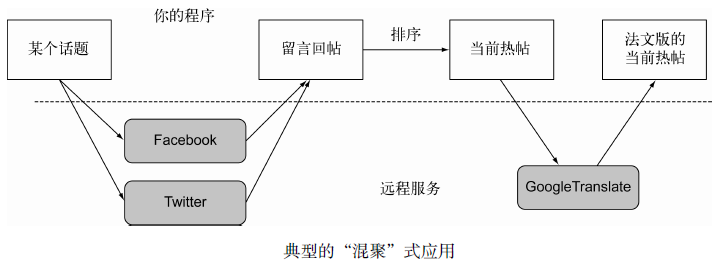
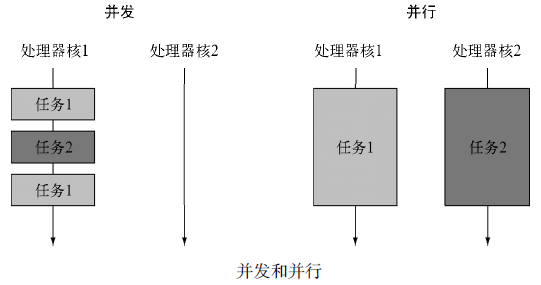
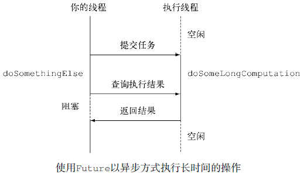
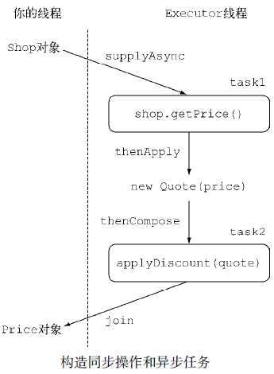
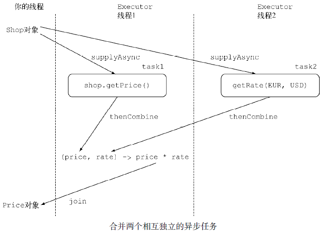

# CompletableFuture：组合式异步编程 #

[1.Future接口](#future接口)

[1.1.Future接口的局限性](#future接口的局限性)

[1.2.使用CompletableFuture构建异步应用](#使用completablefuture构建异步应用)

[1.3.同步API与异步API](#同步api与异步api)

[2.实现异步API](#实现异步api)

[2.1.将同步方法转换为异步方法](#将同步方法转换为异步方法)

[2.2.错误处理](#错误处理)

[2.2.1.使用工厂方法supplyAsync创建CompletableFuture](#使用工厂方法supplyasync创建completablefuture)

[3.让你的代码免受阻塞之苦——将无法改变的同步适配成异步](#让你的代码免受阻塞之苦将无法改变的同步适配成异步)

[3.1.使用并行流对请求进行并行操作](#使用并行流对请求进行并行操作)

[3.2.使用CompletableFuture发起异步请求](#使用completablefuture发起异步请求)

[3.3.寻找更好的方案](#寻找更好的方案)

[3.4.使用定制的执行器](#使用定制的执行器)

[3.4.1.调整线程池的大小](#调整线程池的大小)

[3.4.2.并行——使用Stream还是CompletableFutures？](#并行使用stream还是completablefutures)

[4.对多个异步任务进行流水线操作](#对多个异步任务进行流水线操作)

[4.1.实现折扣服务](#实现折扣服务)

[4.2.使用Discount服务](#使用discount服务)

[4.3.构造同步和异步操作](#构造同步和异步操作)

[4.4.将两个CompletableFuture对象整合起来，无论它们是否存在依赖](#将两个completablefuture对象整合起来无论它们是否存在依赖)

[4.5.对Future和CompletableFuture的回顾](#对future和completablefuture的回顾)

[5.即时响应——CompletableFuture的completion事件](#即时响应completablefuture的completion事件)

[5.1.对最佳价格查询器应用的优化](#对最佳价格查询器应用的优化)

[5.2.付诸实践](#付诸实践)

[6.小结](#小结)

最近这些年，两种趋势不断地推动我们反思我们设计软件的方式。

1. 第一种趋势和应用运行的硬件平台相关，
2. 第二种趋势与应用程序的架构相关，尤其是它们之间如何交互。

我们注意到随着多核处理器的出现，提升应用程序处理速度最有效的方式是编写能充分发挥多核能力的软件。

你已经看到通过切分大型的任务，让每个子任务并行运行，这一目标是能够实现的；你也已经了解相对直接使用线程的方式，使用**分支/合并框架**（在Java 7中引入）和**并行流**（在Java 8中新引入）能以更简单、更有效的方式实现这一目标。

---

第二种趋势反映在公共API日益增长的互联网服务应用。

著名的互联网大鳄们纷纷提供了自己的公共API服务，比如

1. 谷歌提供了地理信息服务，
2. Facebook提供了社交信息服务，
3. Twitter提供了新闻服务。
 
现在，很少有网站或者网络应用会以完全隔离的方式工作。更多的时候，我们看到的下一代网络应用都采用“混聚”（mash-up）的方式：它会使用来自多个来源的内容，将这些内容聚合在一起，方便用户的生活。

---

比如，你可能希望为你的法国客户提供指定主题的热点报道。为实现这一功能，你需要向谷歌或者Twitter的API请求所有语言中针对该主题最热门的评论，可能还需要依据你的内部算法对它们的相关性进行排序。之后，你可能还需要使用谷歌的翻译服务把它们翻译成法语，甚至利用谷歌地图服务定位出评论作者的位置信息，最终将所有这些信息聚集起来，呈现在你的网站上。

当然，如果某些外部网络服务发生响应慢的情况，你希望依旧能为用户提供部分信息，比如提供带问号标记的通用地图，以文本的方式显示信息，而不是呆呆地显示一片空白屏幕，直到地图服务器返回结果或者超时退出。

要实现类似的服务，你需要与互联网上的多个Web服务通信。可是，你并不希望因为等待某些服务的响应，阻塞应用程序的运行，浪费数十亿宝贵的CPU时钟周期。比如，不要因为等待Facebook的数据，暂停对来自Twitter的数据处理。

---

这些场景体现了多任务程序设计的另一面。**分支/合并框架**以及**并行**流是实现并行处理的宝贵工具；它们将一个操作切分为多个子操作，在多个不同的核、CPU甚至是机器上并行地执行这些子操作。

与此相反，如果你的意图是实现**并发**，而非**并行**，或者你的主要目标是在同一个CPU上执行几个松耦合的任务，充分利用CPU的核，让其足够忙碌，从而最大化程序的吞吐量，那么你其实真正想做的是避免因为等待远程服务的返回，或者对数据库的查询，而阻塞线程的执行，浪费宝贵的计算资源，因为这种等待的时间很可能相当长。**Future接口，尤其是它的新版实现CompletableFuture，是处理这种情况的利器**。

## Future接口 ##

Future接口在Java 5中被引入，设计初衷是对将来某个时刻会发生的结果进行建模。它建模了**一种异步计算**，返回一个执行运算结果的引用，当运算结束后，这个引用被返回给调用方。在Future中触发那些潜在耗时的操作把调用线程解放出来，让它能继续执行其他有价值的工作，不再需要呆呆等待耗时的操作完成。

打个比方，你可以把它想象成这样的场景：你拿了一袋子衣服到你中意的干洗店去洗。干洗店的员工会给你张发票，告诉你什么时候你的衣服会洗好（这就是一个Future事件）。衣服干洗的同时，你可以去做其他的事情。

Future的另一个优点是它比更底层的Thread更易用。要使用Future，通常你只需要将耗时的操作封装在一个Callable对象中，再将它提交给ExecutorService，就万事大吉了。

	ExecutorService executor = Executors.newCachedThreadPool();
	Future<Double> future = executor.submit(new Callable<Double>() {
		public Double call() {
			//以异步方式在新的线程中执行耗时的操作
			return doSomeLongComputation();
		}
	});

	//异步操作进行的同时，你可以做其他的事情
	doSomethingElse();

	try {
		//获取异步操作的结果，如果最终被阻塞，无法得到结果，那么在最多等待1秒钟之后退出
		Double result = future.get(1, TimeUnit.SECONDS);
	} catch (ExecutionException ee) {
		// 计算抛出一个异常
	} catch (InterruptedException ie) {
		// 当前线程在等待过程中被中断
	} catch (TimeoutException te) {
		// 在Future对象完成之前超过已过期
	}

**如果该长时间运行的操作永远不返回了会怎样？**

为了处理这种可能性，虽然Future提供了一个无需任何参数的get方法，还是**推荐**大家使用重载版本的get方法，它接受一个超时的参数，通过它，你可以定义你的线程等待Future结果的最长时间

### Future接口的局限性 ###

**比如，很难表述Future结果之间的依赖性**；

从文字描述上这很简单，“当长时间计算任务完成时，请将该计算的结果通知到另一个长时间运行的计算任务，这两个计算任务都完成后，将计算的结果与另一个查询操作结果合并”。

但是，使用Future中提供的方法完成这样的操作又是另外一回事。这也是我们需要更具描述能力的特性的原因，比如:

- 将两个异步计算合并为一个——这两个异步计算之间相互独立，同时第二个又依赖于第一个的结果。

- 等待Future集合中的所有任务都完成。

- 仅等待Future集合中最快结束的任务完成（有可能因为它们试图通过不同的方式计算同一个值），并返回它的结果。

- 通过编程方式完成一个Future任务的执行（即以手工设定异步操作结果的方式）。

- 应对Future的完成事件（即当Future的完成事件发生时会收到通知，并能使用Future计算的结果进行下一步的操作，不只是简单地阻塞等待操作的结果）。

新的**CompletableFuture**类（它实现了Future接口）如何利用Java 8的新特性以更直观的方式将上述需求都变为可能。Stream和CompletableFuture的设计都遵循了类似的模式：它们都使用了Lambda表达式以及流水线的思想。

### 使用CompletableFuture构建异步应用 ###

为了展示CompletableFuture的强大特性，我们会创建一个名为“最佳价格查询器”（best-price-finder）的应用，它会查询多个在线商店，依据给定的产品或服务找出最低的价格。这个过程中，你会学到几个重要的技能。

- 首先，你会学到如何为你的客户**提供异步API**。

- 其次，你会掌握如何让你**使用了同步API的代码变为非阻塞代码**。你会了解如何使用流水线将两个接续的异步操作合并为一个异步计算操作。比如，在线商店返回了你想要购买商品的原始价格，并附带着一个折扣代码——最终，要计算出该商品的实际价格，你不得不访问第二个远程折扣服务，查询该折扣代码对应的折扣比率。

- 你还会学到如何**以响应式的方式处理异步操作的完成事件**，以及随着各个商店返回它的商品价格，最佳价格查询器如何持续地更新每种商品的最佳推荐，而不是等待所有的商店都返回他们各自的价格（这种方式存在着一定的风险，一旦某家商店的服务中断，用户可能遭遇白屏）。

### 同步API与异步API ###

**同步API**其实只是对传统方法调用的另一种称呼：你调用了某个方法，调用方在被调用方运行的过程中会等待，被调用方运行结束返回，调用方取得被调用方的返回值并继续运行。即使调用方和被调用方在不同的线程中运行，调用方还是需要等待被调用方结束运行，这就是**阻塞式调用**这个名词的由来。

与此相反，**异步API**会直接返回，或者至少在被调用方计算完成之前，将它剩余的计算任务交给另一个线程去做，该线程和调用方是异步的——这就是**非阻塞式调用**的由来。执行剩余计算任务的线程会将它的计算结果返回给调用方。返回的方式要么是通过回调函数，要么是由调用方再次执行一个“等待，直到计算完成”的方法调用。这种方式的计算在I/O系统程序设计中非常常见：**你发起了一次磁盘访问**，这次访问和你的其他计算操作是异步的，你完成其他的任务时，磁盘块的数据可能还没载入到内存，你只需要等待数据的载入完成。

## 实现异步API ##

[Shop](Shop.java)

首先，商店应该声明依据指定产品名称返回价格的方法：

	public class Shop {
		public double getPrice(String product) {
			// 待实现
		}
	}

模拟1秒钟延迟的方法

	public static void delay() {
		try {
			Thread.sleep(1000L);
		} catch (InterruptedException e) {
			throw new RuntimeException(e);
		}
	}

在getPrice方法中引入一个模拟的延迟

	public double getPrice(String product) {
		return calculatePrice(product);
	}

	private double calculatePrice(String product) {
		delay();
		return random.nextDouble() * product.charAt(0) + product.charAt(1);
	}

### 将同步方法转换为异步方法 ###

将getPrice转换为getPriceAsync方法，并修改它的返回值：

	public Future<Double> getPriceAsync(String product) {
		CompletableFuture<Double> futurePrice = new CompletableFuture<>();
		new Thread( () -> {
			double price = calculatePrice(product);
			futurePrice.complete(price);
		}).start();

		//无需等待还没结束的计算，直接返回Future对象
		return futurePrice;
	}

使用异步API

[ShopMain](ShopMain.java)

运行结果

	Invocation returned after 43 msecs
	Price is 123.26
	Price returned after 1045 msecs

### 错误处理 ###

**如果价格计算过程中产生了错误会怎样呢**？非常不幸，这种情况下你会得到一个相当糟糕的结果：用于提示错误的异常会被限制在试图计算商品价格的当前线程的范围内，最终会杀死该线程，而这会导致等待get方法返回结果的客户端永久地被阻塞。

客户端可以使用重载版本的get方法，它使用一个超时参数来避免发生这样的情况。使用这种方法至少能防止程序永久地等待下去，超时发生时，程序会得到通知发生了TimeoutException。

为了让客户端能了解商店无法提供请求商品价格的原因，你需要使用CompletableFuture的completeExceptionally方法将导致CompletableFuture内发生问题的异常抛出。

	public Future<Double> getPriceAsync(String product) {
		CompletableFuture<Double> futurePrice = new CompletableFuture<>();

		new Thread( () -> {
			try {
				double price = calculatePrice(product);
				futurePrice.complete(price);
			} catch (Exception ex) {
				futurePrice.completeExceptionally(ex);
			}
		}).start();
		return futurePrice;
	}

#### 使用工厂方法supplyAsync创建CompletableFuture ####

CompletableFuture类自身提供了大量精巧的工厂方法，使用这些方法能更容易地完成整个流程，还不用担心实现的细节。

	public Future<Double> getPriceAsync(String product) {
		return CompletableFuture.supplyAsync(() -> calculatePrice(product));
	}

## 让你的代码免受阻塞之苦——将无法改变的同步适配成异步 ##

[BestPriceFinder](BestPriceFinder.java)

[BestPriceFinderMain](BestPriceFinderMain.java)

你已经被要求进行“最佳价格查询器”应用的开发了，不过你需要查询的所有商店只提供了同步API。

换句话说，你有一个商家的列表，如下所示：

	List<Shop> shops = Arrays.asList(new Shop("BestPrice"),
					new Shop("LetsSaveBig"),
					new Shop("MyFavoriteShop"),
					new Shop("BuyItAll"));

采用**顺序查询**所有商店的方式实现的findPrices方法

	public List<String> findPrices(String product) {
		return shops.stream()
			.map(shop -> String.format("%s price is %.2f",
				shop.getName(), shop.getPrice(product)))
			.collect(toList());
	}

验证findPrices的正确性和执行性能

	long start = System.nanoTime();
	System.out.println(findPrices("myPhone27S"));
	long duration = (System.nanoTime() - start) / 1_000_000;
	System.out.println("Done in " + duration + " msecs");

运行结果：

	[BestPrice price is 123.26, LetsSaveBig price is 169.47, MyFavoriteShop price
	is 214.13, BuyItAll price is 184.74]
	Done in 4032 msecs

### 使用并行流对请求进行并行操作 ###

	public List<String> findPrices(String product) {
		return shops.parallelStream()
			.map(shop -> String.format("%s price is %.2f",
				shop.getName(), shop.getPrice(product)))
			.collect(toList());
	}

### 使用CompletableFuture发起异步请求 ###

	public List<String> findPrices(String product) {
		List<CompletableFuture<String>> priceFutures = shops.stream()
			.map(shop -> CompletableFuture.supplyAsync(
						() -> shop.getName() + " price is " + shop.getPrice(product)))
			.collect(Collectors.toList());
	
		return priceFutures.stream()
				.map(CompletableFuture::join)
				.collect(toList());
	}

### 寻找更好的方案 ###

	execute("sequential", () -> bestPriceFinder.findPricesSequential("myPhone27S"));
	execute("parallel", () -> bestPriceFinder.findPricesParallel("myPhone27S"));
	execute("composed CompletableFuture", () -> bestPriceFinder.findPricesFuture("myPhone27S"));
	execute("composed CompletableFuture2", () -> bestPriceFinder.findPricesFuture2("myPhone27S"));

运行结果

	[BestPrice price is 123.25651664705744, LetsSaveBig price is 169.4653393606115, MyFavoriteShop price is 214.12914480588853, BuyItAll price is 184.74384995303313]
	sequential done in 4076 msecs

	[BestPrice price is 197.15388829450728, LetsSaveBig price is 167.59404755738808, MyFavoriteShop price is 192.48730292081552, BuyItAll price is 199.67823140124116]
	parallel done in 2013 msecs

	[BestPrice price is 171.10524235618578, LetsSaveBig price is 168.59369176671822, MyFavoriteShop price is 174.79155890558252, BuyItAll price is 154.82955565763797]
	composed CompletableFuture done in 1011 msecs

	[BestPrice price is 227.53480147033423, LetsSaveBig price is 200.89398407500244, MyFavoriteShop price is 161.14747297059597, BuyItAll price is 155.9041805933185]
	composed CompletableFuture2 done in 1005 msecs

它们看起来不相伯仲，究其原因都一样：它们内部采用的是同样的通用线程池，默认都使用固定数目的线程，具体线程数取决于Runtime.getRuntime().availableProcessors()的返回值。然而，CompletableFuture具有一定的优势，因为**它允许你对执行器（Executor）进行配置**，尤其是线程池的大小，让它以更适合应用需求的方式进行配置，满足程序的要求，而**这是并行流API无法提供的**。

### 使用定制的执行器 ###

创建一个配有线程池的执行器，线程池中线程的数目取决于你预计你的应用需要处理的负荷，**但是你该如何选择合适的线程数目呢**？

---

#### 调整线程池的大小 ####

[《Java并发编程实战》](http://mng.bz/979c)一书中，Brian Goetz和合著者们为线程池大小的优化提供了不少中肯的建议。这非常重要，如果线程池中线程的数量过多，最终它们会竞争稀缺的处理器和内存资源，浪费大量的时间在上下文切换上。反之，如果线程的数目过少，正如你的应用所面临的情况，处理器的一些核可能就无法充分利用。Brian Goetz建议，线程池大小与处理器的利用率之比可以使用下面的公式进行估算：

	N-threads = N-CPU * U-CPU * (1 + W/C)

其中：

- N-CPU是处理器的核的数目，可以通过Runtime.getRuntime().availableProcessors()得到
- U-CPU是期望的CPU利用率（该值应该介于0和1之间）
- W/C是等待时间与计算时间的比率

---

你的应用99%的时间都在等待商店的响应，所以估算出的W/C比率为1/100。这意味着如果你期望的CPU利用率是100%，你需要创建一个拥有400个线程的线程池。

实际操作中，如果你创建的线程数比商店的数目更多，**反而是一种浪费**，因为这样做之后，你线程池中的有些线程根本没有机会被使用。出于这种考虑，我们建议你将执行器使用的线程数，与你需要查询的商店数目设定为同一个值，这样每个商店都应该对应一个服务线程。

不过，为了避免发生由于商店的数目过多导致服务器超负荷而崩溃，你还是需要设置一个上限，比如100个线程.

	private final Executor executor = Executors.newFixedThreadPool(Math.min(shops.size(), 100),new ThreadFactory() {
			public Thread newThread(Runnable r) {
				Thread t = new Thread(r);
				t.setDaemon(true);
				return t;
			}
		});

注意，你现在正创建的是一个由**守护线程**构成的线程池。Java程序无法终止或者退出一个正在运行中的线程，所以最后剩下的那个线程会由于一直等待无法发生的事件而引发问题。

与此相反，如果将线程标记为守护进程，意味着程序退出时它也会被回收。这二者之间没有性能上的差异。现在，你可以将执行器作为第二个参数传递给supplyAsync工厂方法了。

	CompletableFuture.supplyAsync(() -> shop.getName() + " price is " + shop.getPrice(product), executor);

处理需大量使用异步操作的情况时，利用CompletableFutures向其提交任务执行几乎是最有效的策略。

#### 并行——使用Stream还是CompletableFutures？ ####

目前为止，你已经知道对集合进行并行计算有两种方式：

1. 要么将其转化为并行流，利用map这样的操作开展工作，
2. 要么枚举出集合中的每一个元素，创建新的线程，在CompletableFuture内对其进行操作。

后者提供了更多的灵活性，你可以调整线程池的大小，而这能帮助你确保整体的计算不会因为线程都在等待I/O而发生阻塞。

我们对使用这些API的建议如下。

- 如果你进行的是计算密集型的操作，并且**没有I/O**，那么推荐使用**Stream**接口，因为实现简单，同时效率也可能是最高的（如果所有的线程都是计算密集型的，那就没有必要创建比处理器核数更多的线程）。

- 反之，如果你并行的工作单元还涉及**等待I/O**的操作（包括网络连接等待），那么使用**CompletableFuture**灵活性更好，你可以像前文讨论的那样，依据等待/计算，或者W/C的比率设定需要使用的线程数。这种情况不使用并行流的另一个原因是，处理流的流水线中如果发生I/O等待，流的延迟特性会让我们很难判断到底什么时候触发了等待。

## 对多个异步任务进行流水线操作 ##

[BestPriceFinder2](BestPriceFinder2.java)

[BestPriceFinderMain2](BestPriceFinderMain2.java)

让我们假设所有的商店都同意使用一个集中式的折扣服务。

[Discount](Discount.java)

### 实现折扣服务 ###

[Quote](Quote.java)

### 使用Discount服务 ###

由于Discount服务是一种远程服务，你还需要增加1秒钟的模拟延迟。

以最简单的、顺序的而且同步执行的实现。

    public List<String> findPricesSequential(String product) {
        return shops.stream()
                .map(shop -> shop.getPrice2(product))
                .map(Quote::parse)
                .map(Discount::applyDiscount)
                .collect(Collectors.toList());
    }

- 第一个操作将每个shop对象转换成了一个字符串，该字符串包含了该 shop中指定商品的价格和折扣代码。
- 第二个操作对这些字符串进行了解析，在Quote对象中对它们进行转换。
- 最终，第三个map会操作联系远程的Discount服务，计算出最终的折扣价格，并返回该价格及提供该价格商品的shop。

	[BestPrice price is 110.93, LetsSaveBig price is 135.58, MyFavoriteShop price is 192.72, BuyItAll price is 184.74, ShopEasy price is 167.28]
	sequential done in 10238 msecs

这种实现方式的性能远非最优，只是运行基准测试。

把流转换为并行流的方式，非常容易提升该程序的性能。

Stream底层依赖的是线程数量固定的通用线程池，扩展性差。相反，你也知道，如果自定义CompletableFutures调度任务执行的执行器能够更充分地利用CPU资源

### 构造同步和异步操作 ###

	List<String> findPrices(String product) {
		List<CompletableFuture<String>> priceFutures = shops.stream()
			.map(shop -> CompletableFuture.supplyAsync(() -> shop.getPrice(product), executor))
			.map(future -> future.thenApply(Quote::parse))
			.map(future -> future.thenCompose(quote -> CompletableFuture.supplyAsync(() -> Discount.applyDiscount(quote), executor)))
			.collect(toList());

		return priceFutures.stream()
					.map(CompletableFuture::join)
					.collect(toList());
	}

三次转换流程图

运行结果

	[BestPrice price is 204.78, LetsSaveBig price is 190.85, MyFavoriteShop price is 128.92, BuyItAll price is 140.31, ShopEasy price is 166.1]
	composed CompletableFuture done in 2025 msecs

### 将两个CompletableFuture对象整合起来，无论它们是否存在依赖 ###

    CompletableFuture<Double> futurePriceInUSD = 
        CompletableFuture.supplyAsync(() -> shop.getPrice(product))
        .thenCombine(
            CompletableFuture.supplyAsync(
                () ->  ExchangeService.getRate(Money.EUR, Money.USD)),
            (price, rate) -> price * rate
        );

### 对Future和CompletableFuture的回顾 ###

前两节非常清晰地呈现了相对于采用Java 8 之前提供的Future 实现， **CompletableFuture 版本实现所具备的巨大优势**。

CompletableFuture利用Lambda表达式以声明式的API提供了一种机制，能够用最有效的方式，非常容易地将多个以同步或异步方式执行复杂操作的任务结合到一起。

为了更直观地感受一下使用CompletableFuture在代码可读性上带来的巨大提升，尝试仅使用Java 7中提供的特性。

利用Java 7的方法合并两个Future对象，实现上一节例子。

    ExecutorService executor = Executors.newCachedThreadPool();
    List<Future<Double>> priceFutures = new ArrayList<>();
    for (Shop shop : shops) {
        final Future<Double> futureRate = executor.submit(new Callable<Double>() { 
            public Double call() {
                return ExchangeService.getRate(Money.EUR, Money.USD);
            }
        });
        Future<Double> futurePriceInUSD = executor.submit(new Callable<Double>() { 
            public Double call() {
                try {
                    double priceInEUR = shop.getPrice(product);
                    return priceInEUR * futureRate.get();
                } catch (InterruptedException | ExecutionException e) {
                    throw new RuntimeException(e.getMessage(), e);
                }
            }
        });
        priceFutures.add(futurePriceInUSD);
    }

## 即时响应——CompletableFuture的completion事件 ##

希望尽快将不同商店中的商品价格呈现给你的用户（这是车辆保险或者机票比价网站的典型需求），而不是像之前那样，等所有的数据都完备之后再呈现

你希望的效果是，**只要有商店返回商品价格就在第一时间显示返回值**，不再等待那些还未返回的商店（有些甚至会发生超时）

一个模拟生成0.5秒至2.5秒随机延迟的方法

	private static final Random random = new Random();

	public static void randomDelay() {
		int delay = 500 + random.nextInt(2000);
		try {
			Thread.sleep(delay);
		} catch (InterruptedException e) {
			throw new RuntimeException(e);
		}
	}

### 对最佳价格查询器应用的优化 ###

重构findPrices方法返回一个由Future构成的流

    public Stream<CompletableFuture<String>> findPricesStream(String product) {
        return shops.stream()
                .map(shop -> CompletableFuture.supplyAsync(() -> shop.getPrice2(product), executor))
                .map(future -> future.thenApply(Quote::parse))
                .map(future -> future.thenCompose(quote -> CompletableFuture.supplyAsync(() -> Discount.applyDiscount(quote), executor)));
    }

Java 8 的CompletableFuture 的thenAccept 方法用来接收CompletableFuture执行完毕后的返回值做参数。

	findPricesStream("myPhone").map(f -> f.thenAccept(System.out::println));

thenCompose和thenCombine方法一样，thenAccept方法也提供了一个异步版本，名为thenAcceptAsync。异步版本的方法会对处理结果的消费者进行调度，从线程池中**选择一个新的线程**继续执行，不再由同一个线程完成CompletableFuture的所有任务。

因为你想要避免不必要的上下文切换，更重要的是你希望避免在等待线程上浪费时间，尽快响应CompletableFuture的completion事件，所以这里没有采用异步版本。
 
由于thenAccept 方法已经定义了如何处理CompletableFuture 返回的结果，一旦CompletableFuture计算得到结果，它就返回一个CompletableFuture<Void>。所以，map操作返回的是一个Stream<CompletableFuture<Void>>。

对这个<CompletableFuture<Void>>对象，你能做的事非常有限，只能等待其运行结束，不过这也是你所期望的。你还希望能给最慢的商店一些机会，让它有机会打印输出返回的价格。为了实现这一目的，你可以把构成Stream的所有CompletableFuture<Void>对象放到一个数组中，等待所有的任务执行完成，

响应CompletableFuture的completion事件

	CompletableFuture[] futures = findPricesStream("myPhone")
		.map(f -> f.thenAccept(System.out::println))
		.toArray(size -> new CompletableFuture[size]);
	CompletableFuture.allOf(futures).join();

allOf工厂方法接收一个由CompletableFuture构成的数组，数组中的所有CompletableFuture对象执行完成之后，它返回一个CompletableFuture<Void>对象。这意味着，如果你需要等待最初Stream 中的所有CompletableFuture 对象执行完毕， 对allOf 方法返回的CompletableFuture执行join操作是个不错的主意。

这个方法对“最佳价格查询器”应用也是有用的，因为你的用户可能会困惑是否后面还有一些价格没有返回，使用这个方法，你可以在执行完毕之后打印输出一条消息“All shops returned results or timed out”。

然而在另一些场景中，你可能希望只要CompletableFuture对象数组中有任何一个执行完毕就不再等待，比如，你正在查询两个汇率服务器，任何一个返回了结果都能满足你的需求。在这种情况下，你可以使用一个类似的工厂方法**anyOf**。该方法接收一个CompletableFuture对象构成的数组，返回由第一个执行完毕的CompletableFuture对象的返回值构成的CompletableFuture<Object>。

### 付诸实践 ###

执行这段代码你会看到不同商店的价格不再像之前那样总是在一个时刻返回，而是随着商店折扣价格返回的顺序逐一地打印输出

    public void printPricesStream(String product) {
        long start = System.nanoTime();
        CompletableFuture[] futures = findPricesStream(product)
                .map(f -> f.thenAccept(s -> System.out.println(s + " (done in " + ((System.nanoTime() - start) / 1_000_000) + " msecs)")))
                .toArray(size -> new CompletableFuture[size]);
        CompletableFuture.allOf(futures).join();
        System.out.println("All shops have now responded in " + ((System.nanoTime() - start) / 1_000_000) + " msecs");
    }

运行结果

	BestPrice price is 127.88 (done in 2022 msecs)
	LetsSaveBig price is 147.21 (done in 2024 msecs)
	ShopEasy price is 224.23 (done in 2025 msecs)
	MyFavoriteShop price is 119.11 (done in 2025 msecs)
	BuyItAll price is 111.53 (done in 2025 msecs)
	All shops have now responded in 2026 msecs

## 小结 ##

- 执行比较耗时的操作时，尤其是那些依赖一个或多个远程服务的操作，使用异步任务可以改善程序的性能，加快程序的响应速度。

- 你应该尽可能地为客户提供异步API。使用CompletableFuture类提供的特性，你能够轻松地实现这一目标。

- CompletableFuture类还提供了异常管理的机制，让你有机会抛出/管理异步任务执行中发生的异常。

- 将同步API的调用封装到一个CompletableFuture中，你能够以异步的方式使用其结果。

- 如果异步任务之间相互独立，或者它们之间某一些的结果是另一些的输入，你可以将这些异步任务构造或者合并成一个。

- 你可以为CompletableFuture注册一个回调函数，在Future执行完毕或者它们计算的结果可用时，针对性地执行一些程序。

- 你可以决定在什么时候结束程序的运行，是等待由CompletableFuture对象构成的列

