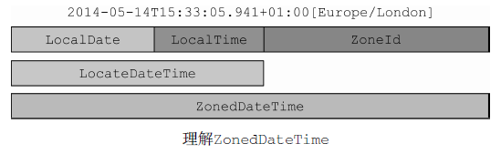

# 新的日期和时间API #

[1.LocalDate、LocalTime、Instant、Duration 以及Period](#localdatelocaltimeinstantduration以及period)

[1.1.使用LocalDate 和LocalTime](#使用localdate和localtime)

[1.2.合并日期和时间](#合并日期和时间)

[1.3.机器的日期和时间格式](#机器的日期和时间格式)

[1.4.定义Duration或Period](#定义duration或period)

[2.操纵、解析和格式化日期](#操纵解析和格式化日期)

[2.1.使用TemporalAdjuster](#使用temporaladjuster)

[2.1.1.自定义TemporalAdjuster](#自定义temporaladjuster)

[2.2.打印输出及解析日期-时间对象](#打印输出及解析日期时间对象)

[3.处理不同的时区和历法](#处理不同的时区和历法)

[3.1.利用和UTC/格林尼治时间的固定偏差计算时区](#利用和utc格林尼治时间的固定偏差计算时区)

[3.2.使用别的日历系统](#使用别的日历系统)

[4.小结](#小结)

相信大多数有经验的程序员都会赞同Java 8之前的库对日期和时间的支持就非常不理想。值得高兴的是 Java 8中引入全新的日期和时间API就是要解决这一问题。

**Java 8之前的日期和时间API**

在Java 1.0中，对日期和时间的支持只能依赖java.util.Date类。正如类名所表达的，这个类无法表示日期，**只能以毫秒的精度表示时间**。

**更糟糕的是它的易用性**，由于某些原因未知的设计决策，这个类的易用性被深深地损害了，比如：年份的起始选择是1900年，月份的起始从0开始。这意味着，如果你想要用Date表示Java 8的发布日期，即2014年3月18日，需要创建下面这样的Date实例：

	Date date = new Date(114, 2, 18);

它的打印输出效果为：

	Tue Mar 18 00:00:00 CET 2014

Date类的toString方法返回的字符串也容易误导人。以我们的例子而言，它的返回值中甚至还包含了JVM的默认时区CET，即中欧时间（Central Europe Time）。但这**并不表示Date类在任何方面支持时区**。

随着Java 1.0退出历史舞台，Date类的种种问题和限制几乎一扫而光，但很明显，这些历史旧账如果不牺牲前向兼容性是无法解决的。

所以，在Java 1.1中，Date类中的很多方法被废弃了，取而代之的是java.util.Calendar类。很不幸，Calendar类也有类似的问题和设计缺陷，导致使用这些方法写出的代码非常容易出错。

**比如**，月份依旧是从0开始计算（不过，至少Calendar类拿掉了由1900年开始计算年份这一设计）。更糟的是，同时存在Date和Calendar这两个类，

也增加了程序员的困惑。到底该使用哪一个类呢？此外，有的特性只在某一个类有提供，比如用于以语言无关方式格式化和解析日期或时间的DateFormat方法就只在Date类里有。

DateFormat方法也有它自己的问题。比如，**它不是线程安全的。**这意味着两个线程如果尝试使用同一个formatter解析日期，你可能会得到无法预期的结果。

最后，Date和Calendar类都是**可以变的**。能把2014年3月18日修改成4月18日意味着什么呢？这种设计会将你拖入维护的噩梦。

所有这些缺陷和不一致导致用户们转投第三方的日期和时间库，比如**Joda-Time**。为了解决这些问题，Oracle决定在原生的Java API中提供高质量的日期和时间支持。所以，你会看到Java 8在java.time包中整合了很多Joda-Time的特性。

[DateTimeExamples](DateTimeExamples.java)

## LocalDate、LocalTime、Instant、Duration 以及Period ##

### 使用LocalDate 和LocalTime ###

LocalDate类实例是一个不可变对象，它只提供了简单的日期，并不含当天的时间信息。另外，它也不附带任何与时区相关的信息。

创建一个LocalDate对象并读取其值

	LocalDate date = LocalDate.of(2014, 3, 18);
	int year = date.getYear();//2014
	Month month = date.getMonth();//MARCH
	int day = date.getDayOfMonth();//18
	DayOfWeek dow = date.getDayOfWeek();//TUESDAY
	int len = date.lengthOfMonth();//31
	boolean leap = date.isLeapYear();//false

可以使用工厂方法从系统时钟中获取当前的日期：

	LocalDate today = LocalDate.now();

使用TemporalField读取LocalDate的值

	int year = date.get(ChronoField.YEAR);
	int month = date.get(ChronoField.MONTH_OF_YEAR);
	int day = date.get(ChronoField.DAY_OF_MONTH);

---

一天中的时间，比如13:45:20，可以使用LocalTime类表示

创建LocalTime并读取其值

	LocalTime time = LocalTime.of(13, 45, 20);
	int hour = time.getHour();//13
	int minute = time.getMinute();//45
	int second = time.getSecond();//20

LocalDate和LocalTime都可以通过解析代表它们的字符串创建。使用静态方法parse，你可以实现这一目的：

	LocalDate date = LocalDate.parse("2014-03-18");
	LocalTime time = LocalTime.parse("13:45:20");

### 合并日期和时间 ###

这个复合类名叫LocalDateTime，是LocalDate和LocalTime的合体。它同时表示了日期和时间，但**不带有时区信息**，你可以直接创建，也可以通过合并日期和时间对象构造

直接创建LocalDateTime对象，或者通过合并日期和时间的方式创建

	// 2014-03-18T13:45:20
	LocalDateTime dt1 = LocalDateTime.of(2014, Month.MARCH, 18, 13, 45, 20);
	LocalDateTime dt2 = LocalDateTime.of(date, time);
	LocalDateTime dt3 = date.atTime(13, 45, 20);
	LocalDateTime dt4 = date.atTime(time);
	LocalDateTime dt5 = time.atDate(date);

也可以使用toLocalDate或者toLocalTime方法，从LocalDateTime中提取LocalDate或者LocalTime组件

    LocalDate date1 = dt1.toLocalDate();
    LocalTime time1 = dt1.toLocalTime();

### 机器的日期和时间格式 ###

**作为人**，我们习惯于以星期几、几号、几点、几分这样的方式理解日期和时间。毫无疑问，这种方式对于计算机而言并不容易理解。

**从计算机的角度来看**，建模时间最自然的格式是表示一个持续时间段上某个点的单一大整型数。这也是新的java.time.Instant类对时间建模的方式，基本上它是以Unix元年时间（传统的设定为UTC时区1970年1月1日午夜时分）开始所经历的秒数进行计算。

你可以通过向静态工厂方法ofEpochSecond传递一个代表秒数的值创建一个该类的实例。静态工厂方法ofEpochSecond还有一个增强的重载版本，它接收第二个以纳秒为单位的参数值，对传入作为秒数的参数进行调整。重载的版本会调整纳秒参数，确保保存的纳秒分片在0到999 999 999之间。

	Instant.ofEpochSecond(3);
	Instant.ofEpochSecond(3, 0);
	Instant.ofEpochSecond(2, 1_000_000_000);
	Instant.ofEpochSecond(4, -1_000_000_000);

Instant类也支持静态工厂方法now，它能够帮你获取当前时刻的时间戳。我们想要特别强调一点，Instant的设计初衷是为了便于机器使用。它包含的是由秒及纳秒所构成的数字。所以，它无法处理那些我们非常容易理解的时间单位。

	int day = Instant.now().get(ChronoField.DAY_OF_MONTH);

它会抛出下面这样的异常：

	java.time.temporal.UnsupportedTemporalTypeException: Unsupported field:
		DayOfMonth

### 定义Duration或Period ###

目前为止，你看到的所有类都实现了Temporal接口，Temporal接口定义了如何读取和操纵为时间建模的对象的值。

创建两个Temporal对象之间的duration。Duration类的静态工厂方法between就是为这个目的而设计的。你可以创建两个LocalTimes对象、两个LocalDateTimes对象，或者两个Instant对象之间的duration，

	Duration d1 = Duration.between(time1, time2);
	Duration d1 = Duration.between(dateTime1, dateTime2);
	Duration d2 = Duration.between(instant1, instant2);

由于LocalDateTime和Instant是为不同的目的而设计的，一个是为了便于人阅读使用，另一个是为了便于机器处理，所以你不能将二者混用。如果你试图在这两类对象之间创建duration，会触发一个DateTimeException异常。此外，由于Duration类主要用于以秒和纳秒衡量时间的长短，你不能仅向between方法传递一个LocalDate对象做参数。

**如果你需要以年、月或者日的方式对多个时间单位建模，可以使用Period类**。使用该类的工厂方法between，你可以使用得到两个LocalDate之间的时长，如下所示：

	Period tenDays = Period.between(LocalDate.of(2014, 3, 8), LocalDate.of(2014, 3, 18));

创建Duration和Period对象

	Duration threeMinutes = Duration.ofMinutes(3);
	Duration threeMinutes = Duration.of(3, ChronoUnit.MINUTES);
	
	Period tenDays = Period.ofDays(10);
	Period threeWeeks = Period.ofWeeks(3);
	Period twoYearsSixMonthsOneDay = Period.of(2, 6, 1);

Duration类和Period类共享了很多相似的方法

日期-时间类中表示时间间隔的通用方法

方法名|是否是静态方法|方法描述
---|---|---
between|是|创建两个时间点之间的interval
from|是|由一个临时时间点创建interval
of|是|由它的组成部分创建interval的实例
parse|是|由字符串创建interval的实例
addTo|否|创建该interval的副本，并将其叠加到某个指定的temporal对象
get|否|读取该interval的状态
isNegative|否|检查该interval是否为负值，不包含零
isZero|否|检查该interval的时长是否为零
minus|否|通过减去一定的时间创建该interval的副本
multipliedBy|否|将interval的值乘以某个标量创建该interval的副本
negated|否|以忽略某个时长的方式创建该interval的副本
plus|否|以增加某个指定的时长的方式创建该interval的副本
subtractFrom|否|从指定的temporal对象中减去该interval

截至目前，我们介绍的这些日期-时间对象都是**不可修改的**，这是**为了更好地支持函数式编程，确保线程安全，保持领域模式一致性而做出的重大设计决定**。

当然，新的日期和时间API也提供了一些便利的方法来创建这些对象的可变版本。比如，你可能希望在已有的LocalDate实例上增加3天。

## 操纵、解析和格式化日期 ##

如果你已经有一个LocalDate对象，想要创建它的一个修改版，最直接也最简单的方法是使用withAttribute方法。

withAttribute方法会创建对象的一个副本，并按照需要修改它的属性。注意，下面的这段代码中所有的方法都返回一个修改了属性的对象。**它们都不会修改原来的对象！**

	LocalDate date1 = LocalDate.of(2014, 3, 18);
	LocalDate date2 = date1.withYear(2011);
	LocalDate date3 = date2.withDayOfMonth(25);
	LocalDate date4 = date3.with(ChronoField.MONTH_OF_YEAR, 9);

它们都声明于Temporal接口，所有的日期和时间API类都实现这两个方法，它们定义了单点的时间，比如LocalDate、LocalTime、LocalDateTime以及Instant。

更确切地说，使用get和with方法，我们可以将Temporal对象值的读取和修改区分开。如果Temporal对象不支持请求访问的字段，它会抛出一个UnsupportedTemporalTypeException异常，比如试图访问Instant对象的ChronoField.MONTH_OF_YEAR字段，或者LocalDate对象的ChronoField.NANO_OF_SECOND字段时都会抛出这样的异常。

---

以相对方式修改LocalDate对象的属性

	LocalDate date1 = LocalDate.of(2014, 3, 18);
	LocalDate date2 = date1.plusWeeks(1);
	LocalDate date3 = date2.minusYears(3);
	LocalDate date4 = date3.plus(6, ChronoUnit.MONTHS);

像LocalDate、LocalTime、LocalDateTime以及Instant这样表示时间点的日期-时间类提供了大量通用的方法

表示时间点的日期-时间类的通用方法

方法名|是否是静态方法|描述
---|---|---
from|是|依据传入的Temporal对象创建对象实例
now|是|依据系统时钟创建Temporal对象
of|是|由Temporal对象的某个部分创建该对象的实例
parse|是|由字符串创建Temporal对象的实例
atOffset|否|将Temporal对象和某个时区偏移相结合
atZone|否|将Temporal对象和某个时区相结合
format|否|使用某个指定的格式器将Temporal对象转换为字符串（Instant类不提供该方法）
get|否|读取Temporal对象的某一部分的值
minus|否|创建Temporal对象的一个副本，通过将当前Temporal对象的值减去一定的时长创建该副本
plus|否|创建Temporal对象的一个副本，通过将当前Temporal对象的值加上一定的时长创建该副本
with|否|以该Temporal对象为模板，对某些状态进行修改创建该对象的副本

### 使用TemporalAdjuster ###

截至目前，你所看到的所有日期操作都是相对比较直接的。有的时候，你需要进行一些更加复杂的操作，比如，将日期调整到下个周日、下个工作日，或者是本月的最后一天。

这时，你可以使用重载版本的with方法，向其传递一个提供了更多定制化选择的TemporalAdjuster对象，更加灵活地处理日期。对于最常见的用例， 日期和时间API已经提供了大量预定义的TemporalAdjuster。你可以通过TemporalAdjuster类的静态工厂方法访问它们，

	import static java.time.temporal.TemporalAdjusters.*;
	LocalDate date1 = LocalDate.of(2014, 3, 18);
	LocalDate date2 = date1.with(nextOrSame(DayOfWeek.SUNDAY));//2014-03-23
	LocalDate date3 = date2.with(lastDayOfMonth());//2014-03-31

TemporalAdjuster中包含的工厂方法列表

方法名|描述
---|---
dayOfWeekInMonth|创建一个新的日期，它的值为同一个月中每一周的第几天
firstDayOfMonth|创建一个新的日期，它的值为当月的第一天
firstDayOfNextMonth|创建一个新的日期，它的值为下月的第一天
firstDayOfNextYear|创建一个新的日期，它的值为明年的第一天
firstDayOfYear|创建一个新的日期，它的值为当年的第一天
firstInMonth|创建一个新的日期，它的值为同一个月中，第一个符合星期几要求的值
lastDayOfMonth|创建一个新的日期，它的值为当月的最后一天
lastDayOfNextMonth|创建一个新的日期，它的值为下月的最后一天
lastDayOfNextYear|创建一个新的日期，它的值为明年的最后一天
lastDayOfYear|创建一个新的日期，它的值为今年的最后一天
lastInMonth|创建一个新的日期，它的值为同一个月中，最后一个符合星期几要求的值
next/previous|创建一个新的日期，并将其值设定为日期调整后或者调整前，第一个符合指定星期几要求的日期
nextOrSame/previousOrSame|创建一个新的日期，并将其值设定为日期调整后或者调整前，第一个符合指定星期几要求的日期，如果该日期已经符合要求，直接返回该对象

#### 自定义TemporalAdjuster ####

使用TemporalAdjuster我们可以进行更加复杂的日期操作，而且这些方法的名称也非常直观，方法名基本就是问题陈述。此外，即使你没有找到符合你要求的预定义的TemporalAdjuster，**创建你自己的TemporalAdjuster也并非难事**。实际上，TemporalAdjuster接口只声明了单一的一个方法（这使得它成为了一个函数式接口）。

	@FunctionalInterface
	public interface TemporalAdjuster {
		Temporal adjustInto(Temporal temporal);
	}

这意味着TemporalAdjuster接口的实现需要定义如何将一个Temporal对象转换为另一个Temporal对象。你可以把它看成一个UnaryOperator<Temporal&gt;。

---

**实现一个定制的TemporalAdjuster**

请设计一个NextWorkingDay类，该类实现了TemporalAdjuster接口，能够计算明天的日期，同时过滤掉周六和周日这些节假日。格式如下所示：

	date = date.with(new NextWorkingDay());

如果当天的星期介于周一至周五之间，日期向后移动一天；如果当天是周六或者周日，则返回下一个周一。

	public class NextWorkingDay implements TemporalAdjuster {
		@Override
		public Temporal adjustInto(Temporal temporal) {
			DayOfWeek dow = DayOfWeek.of(temporal.get(ChronoField.DAY_OF_WEEK));
			int dayToAdd = 1;
			if (dow == DayOfWeek.FRIDAY) 
				dayToAdd = 3;
			else if (dow == DayOfWeek.SATURDAY) 
				dayToAdd = 2;
			return 
				temporal.plus(dayToAdd, ChronoUnit.DAYS);
		}
	}

该TemporalAdjuster通常情况下将日期往后顺延一天，如果当天是周六或者周日，则依据情况分别将日期顺延3天或者2天。

注意，由于TemporalAdjuster是一个函数式接口，你只能以Lambda表达式的方式向该adjuster接口传递行为：

	date = date.with(temporal -> {
		DayOfWeek dow = DayOfWeek.of(temporal.get(ChronoField.DAY_OF_WEEK));
		//...
	});

你大概会希望在你代码的多个地方使用同样的方式去操作日期，为了达到这一目的，我们建议你像我们的示例那样将它的逻辑封装到一个类中。对于你经常使用的操作，都应该采用类似的方式，进行封装。最终，你会创建自己的类库，让你和你的团队能轻松地实现代码复用。

如果你想要使用Lambda表达式定义TemporalAdjuster对象，推荐使用TemporalAdjusters类的静态工厂方法ofDateAdjuster，它接受一个UnaryOperator<LocalDate&gt;类型的参数，代码如下：

	TemporalAdjuster nextWorkingDay = TemporalAdjusters.ofDateAdjuster(
		temporal -> {
			DayOfWeek dow = DayOfWeek.of(temporal.get(ChronoField.DAY_OF_WEEK));
		//...
	});
	date = date.with(nextWorkingDay);

### 打印输出及解析日期-时间对象 ###

格式化以及解析日期时间对象是另一个非常重要的功能。新的java.time.format包就是特别为这个目的而设计的。这个包中，最重要的类是DateTimeFormatter。创建格式器最简单的方法是通过它的静态工厂方法以及常量。

	LocalDate date = LocalDate.of(2014, 3, 18);
	String s1 = date.format(DateTimeFormatter.BASIC_ISO_DATE);
	String s2 = date.format(DateTimeFormatter.ISO_LOCAL_DATE);

也可以通过解析代表日期或时间的字符串重新创建该日期对象。

	LocalDate date1 = LocalDate.parse("20140318",
		DateTimeFormatter.BASIC_ISO_DATE);
	LocalDate date2 = LocalDate.parse("2014-03-18",
		DateTimeFormatter.ISO_LOCAL_DATE);

和老的java.util.DateFormat相比较，所有的DateTimeFormatter实例都是**线程安全的**。所以，你能够以单例模式创建格式器实例，就像DateTimeFormatter所定义的那些常量，并能在多个线程间共享这些实例。

按照某个模式创建DateTimeFormatter

	DateTimeFormatter formatter = DateTimeFormatter.ofPattern("dd/MM/yyyy");
	LocalDate date1 = LocalDate.of(2014, 3, 18);
	String formattedDate = date1.format(formatter);
	LocalDate date2 = LocalDate.parse(formattedDate, formatter);

创建一个本地化的DateTimeFormatter

	DateTimeFormatter italianFormatter =
	DateTimeFormatter.ofPattern("d. MMMM yyyy", Locale.ITALIAN);
	LocalDate date1 = LocalDate.of(2014, 3, 18);
	String formattedDate = date.format(italianFormatter); // 18. marzo 2014
	LocalDate date2 = LocalDate.parse(formattedDate, italianFormatter);

你还需要更加细粒度的控制，DateTimeFormatterBuilder类还提供了更复杂的格式器，你可以选择恰当的方法，一步一步地构造自己的格式器。另外，它还提供了非常强大的解析功能，比如区分大小写的解析、柔性解析（允许解析器使用启发式的机制去解析输入，不精确地匹配指定的模式）、填充， 以及在格式器中指定可选节。比如，

你可以通过DateTimeFormatterBuilder自己编程实现上面代码中使用的italianFormatter

	DateTimeFormatter italianFormatter = new DateTimeFormatterBuilder()
					.appendText(ChronoField.DAY_OF_MONTH)
					.appendLiteral(". ")
					.appendText(ChronoField.MONTH_OF_YEAR)
					.appendLiteral(" ")
					.appendText(ChronoField.YEAR)
					.parseCaseInsensitive()
					.toFormatter(Locale.ITALIAN);

## 处理不同的时区和历法 ##

之前你看到的日期和时间的种类都不包含时区信息。时区的处理是新版日期和时间API新增加的重要功能，使用新版日期和时间API时区的处理被极大地简化了。新的java.time.ZoneId类是老版java.util.TimeZone的替代品。它的设计目标就是要让你无需为时区处理的复杂和繁琐而操心，比如处理日光时（Daylight Saving Time，DST）这种问题。跟其他日期和时间类一样，ZoneId类也是无法修改的。

**时区是按照一定的规则将区域划分成的标准时间相同的区间**。在ZoneRules这个类中包含了40个这样的实例。你可以简单地通过调用ZoneId的getRules()得到指定时区的规则。每个特定的ZoneId对象都由一个地区ID标识，比如：

	ZoneId romeZone = ZoneId.of("Europe/Rome");

地区ID都为“{区域}/{城市}”的格式，这些地区集合的设定都由英特网编号分配机构（IANA）的时区数据库提供。你可以通过Java 8的新方法toZoneId将一个老的时区对象转换为ZoneId：

	ZoneId zoneId = TimeZone.getDefault().toZoneId();

一旦得到一个ZoneId对象，你就可以将它与LocalDate、LocalDateTime或者是Instant对象整合起来，构造为一个ZonedDateTime实例，它代表了相对于指定时区的时间点，

	LocalDate date = LocalDate.of(2014, Month.MARCH, 18);
	ZonedDateTime zdt1 = date.atStartOfDay(romeZone);
	LocalDateTime dateTime = LocalDateTime.of(2014, Month.MARCH, 18, 13, 45);
	ZonedDateTime zdt2 = dateTime.atZone(romeZone);
	Instant instant = Instant.now();
	ZonedDateTime zdt3 = instant.atZone(romeZone);

下图对ZonedDateTime的组成部分进行了说明，相信能够帮助你理解LocaleDate、LocalTime、LocalDateTime以及ZoneId之间的差异。

通过ZoneId，你还可以将LocalDateTime转换为Instant：

	LocalDateTime dateTime = LocalDateTime.of(2014, Month.MARCH, 18, 13, 45);
	Instant instantFromDateTime = dateTime.toInstant(romeZone);

你也可以通过反向的方式得到LocalDateTime对象：

	Instant instant = Instant.now();
	LocalDateTime timeFromInstant = LocalDateTime.ofInstant(instant, romeZone);

### 利用和UTC/格林尼治时间的固定偏差计算时区 ###

另一种比较通用的表达时区的方式是利用当前时区和UTC/格林尼治的固定偏差。比如，基于这个理论，你可以说“纽约落后于伦敦5小时”。这种情况下，你可以使用ZoneOffset类，它是ZoneId的一个子类，表示的是当前时间和伦敦格林尼治子午线时间的差异：

	ZoneOffset newYorkOffset = ZoneOffset.of("-05:00");

“-05:00”的偏差实际上对应的是美国东部标准时间。注意，使用这种方式定义的ZoneOffset并未考虑任何日光时的影响，所以在大多数情况下，不推荐使用。由于ZoneOffset也是ZoneId，所以你可以像上面代码那样使用它。你甚至还可以创建这样的OffsetDateTime，它使用ISO-8601的历法系统，以相对于UTC/格林尼治时间的偏差方式表示日期时间。

	LocalDateTime dateTime = LocalDateTime.of(2014, Month.MARCH, 18, 13, 45);
	OffsetDateTime dateTimeInNewYork = OffsetDateTime.of(date, newYorkOffset);

### 使用别的日历系统 ###

ISO-8601日历系统是世界文明日历系统的事实标准。但是，Java 8中另外还提供了4种其他的日历系统。这些日历系统中的每一个都有一个对应的日志类，分别是ThaiBuddhistDate、MinguoDate 、JapaneseDate 以及HijrahDate 。所有这些类以及LocalDate 都实现了ChronoLocalDate接口，能够对公历的日期进行建模。利用LocalDate对象，你可以创建这些类的实例。更通用地说，使用它们提供的静态工厂方法，你可以创建任何一个Temporal对象的实例，如下所示：

	LocalDate date = LocalDate.of(2014, Month.MARCH, 18);
	JapaneseDate japaneseDate = JapaneseDate.from(date);

或者，你还可以为某个Locale显式地创建日历系统，接着创建该Locale对应的日期的实例。新的日期和时间API中，Chronology接口建模了一个日历系统，使用它的静态工厂方法ofLocale，可以得到它的一个实例，代码如下：

	Chronology japaneseChronology = Chronology.ofLocale(Locale.JAPAN);
	ChronoLocalDate now = japaneseChronology.dateNow();

日期及时间API的设计者建议我们使用LocalDate，尽量避免使用ChronoLocalDate，原因是开发者在他们的代码中可能会做一些假设，而这些假设在不同的日历系统中，有可能不成立。比如，有人可能会做这样的假设，即一个月天数不会超过31天，一年包括12个月，或者一年中包含的月份数目是固定的。由于这些原因，我们建议你尽量在你的应用中使用LocalDate，包括存储、操作、业务规则的解读；不过如果你需要将程序的输入或者输出本地化，这时你应该使用ChronoLocalDate类。

**伊斯兰教日历**

在Java 8新添加的几种日历类型中，HijrahDate（伊斯兰教日历）是最复杂一个，因为它会发生各种变化。Hijrah日历系统构建于农历月份继承之上。Java 8提供了多种方法判断一个月份，比如新月，在世界的哪些地方可见，或者说它只能首先可见于沙特阿拉伯。withVariant方法可以用于选择期望的变化。为了支持HijrahDate这一标准，Java 8中还包括了乌姆库拉（Umm Al-Qura）变量。下面这段代码作为一个例子说明了如何在ISO日历中计算当前伊斯兰年中斋月的起始和终止日期：

	HijrahDate ramadanDate = HijrahDate.now().with(ChronoField.DAY_OF_MONTH, 1)
		.with(ChronoField.MONTH_OF_YEAR, 9);
	
	System.out.println("Ramadan starts on " +
					IsoChronology.INSTANCE.date(ramadanDate) +
					" and ends on " +
					IsoChronology.INSTANCE.date(
					ramadanDate.with(
					TemporalAdjusters.lastDayOfMonth())));

## 小结 ##

- Java 8之前老版的java.util.Date类以及其他用于建模日期时间的类有很多不一致及设计上的缺陷，包括易变性以及糟糕的偏移值、默认值和命名。
- 新版的日期和时间API中，日期-时间对象是不可变的。
- 新的API提供了两种不同的时间表示方式，有效地区分了运行时人和机器的不同需求。
- 你可以用绝对或者相对的方式操纵日期和时间，操作的结果总是返回一个新的实例，老的日期时间对象不会发生变化。
- TemporalAdjuster让你能够用更精细的方式操纵日期，不再局限于一次只能改变它的一个值，并且你还可按照需求定义自己的日期转换器。
- 你现在可以按照特定的格式需求，定义自己的格式器，打印输出或者解析日期-时间对象。这些格式器可以通过模板创建，也可以自己编程创建，并且它们都是线程安全的。
- 你可以用相对于某个地区/位置的方式，或者以与UTC/格林尼治时间的绝对偏差的方式表示时区，并将其应用到日期-时间对象上，对其进行本地化。
- 你现在可以使用不同于ISO-8601标准系统的其他日历系统了。

