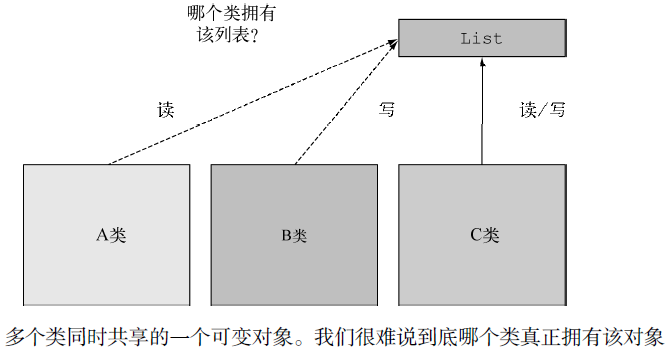
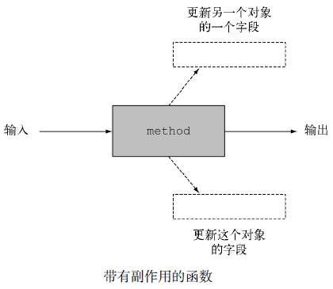
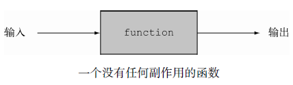
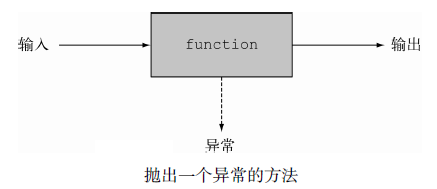
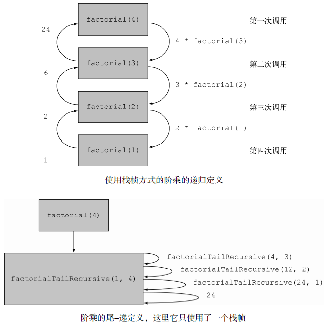

# 函数式的思考 #

[1.实现和维护系统](#实现和维护系统)

[1.1.共享的可变数据](#共享的可变数据)

[1.2.声明式编程](#声明式编程)

[1.2.1.专注于如何实现](#专注于如何实现)

[1.2.2.关注要做什么](#关注要做什么)

[1.3.为什么要采用函数式编程](#为什么要采用函数式编程)

[2.什么是函数式编程](#什么是函数式编程)

[2.1.函数式Java编程](#函数式java编程)

[2.2.引用透明性](#引用透明性)

[2.3.面向对象的编程和函数式编程的对比](#面向对象的编程和函数式编程的对比)

[2.4.函数式编程实战](#函数式编程实战)

[3.递归和迭代](#递归和迭代)

[4.小结](#小结)

## 实现和维护系统 ##

为了让程序易于使用，你还希望它具备哪些特性呢？

1. 你会希望它具有良好的结构，最好类的结构应该反映出系统的结构，这样能便于大家理解；
2. 甚至软件工程中还提供了指标，对结构的合理性进行评估，比如耦合性（软件系统中各组件之间是否相互独立）以及内聚性（系统的各相关部分之间如何协作）。

对大多数程序员而言，最关心的日常要务是代码维护时的调试：代码遭遇一些无法预期的值就有可能发生崩溃。

- 为什么会发生这种情况？
- 它是如何进入到这种状态的？

想想看你有多少代码维护的顾虑都能归咎到这一类！很明显，**函数式编程提出的“无副作用”以及“不变性”对于解决这一难题是大有裨益的**。

### 共享的可变数据 ###

无法预知的变量修改问题，都源于共享的数据结构被你所维护的代码中的多个方法读取和更新。

假设几个类同时都保存了指向某个列表的引用。

- 那么到底谁对这个列表拥有所属权呢？
- 如果一个类对它进行了修改，会发生什么情况？
- 其他的类预期会发生这种变化吗？
- 其他的类又如何得知列表发生了修改呢？
- 我们需要通知使用该列表的所有类这一变化吗？
- 抑或是不是每个类都应该为自己准备一份防御式的数据备份以备不时之需呢？

**换句话说，由于使用了可变的共享数据结构，我们很难追踪你程序的各个组成部分所发生的变化**。

假设有这样一个系统，它不修改任何数据。维护这样的一个系统将是一个无以伦比的**美梦**，因为你不再会收到任何由于某些对象在某些地方修改了某个数据结构而导致的意外报告。**如果一个方法既不修改它内嵌类的状态，也不修改其他对象的状态，使用return返回所有的计算结果**，那么我们称其为**纯粹的**或者**无副作用的**。

更确切地讲，到底哪些因素会造成副作用呢？简而言之，副作用就是函数的效果已经超出了函数自身的范畴。下面是一些例子。

- 除了构造器内的初始化操作，对类中数据结构的任何修改，包括字段的赋值操作（一个典型的例子是setter方法）。
- 抛出一个异常。
- 进行输入/输出操作，比如向一个文件写数据。

从另一个角度来看“无副作用”的话，我们就应该考虑不可变对象。不可变对象是这样一种对象，它们一旦完成初始化就不会被任何方法修改状态。**这意味着一旦一个不可变对象初始化完毕，它永远不会进入到一个无法预期的状态**。你可以放心地共享它，无需保留任何副本，并且由于它们不会被修改，还是线程安全的。

如果构成系统的各个组件都能遵守这一原则，该系统就能在完全无锁的情况下，使用多核的并发机制，因为任何一个方法都不会对其他的方法造成干扰。

### 声明式编程 ###

一般通过编程实现一个系统，有两种思考方式。

#### 专注于如何实现 ####

How to do

一种专注于**如何实现**，比如：“首先做这个，紧接着更新那个，然后……”

举个例子，如果你希望通过计算找出列表中最昂贵的事务，通常需要执行一系列的命令：

- 从列表中取出一个事务，将其与临时最昂贵事务进行比较；
- 如果该事务开销更大，就将临时最昂贵的事务设置为该事务；
- 接着从列表中取出下一个事务，并重复上述操作。

这种“如何做”风格的编程非常适合经典的面向对象编程，有些时候我们也称之为“**命令式**”

这种“如何做”风格的编程非常适合经典的面向对象编程，有些时候我们也称之为“命令式”编程，因为它的特点是它的指令和计算机底层的词汇非常相近，比如赋值、条件分支以及循环，就像下面这段代码：

	Transaction mostExpensive = transactions.get(0);
	if(mostExpensive == null)
		throw new IllegalArgumentException("Empty list of transactions")
	for(Transaction t: transactions.subList(1, transactions.size())){
		if(t.getValue() > mostExpensive.getValue()){
			mostExpensive = t;
		}
	}

#### 关注要做什么 ####

what to do

另一种方式则更加关注**要做什么**。使用Stream API你可以指定下面这样的查询：

	Optional<Transaction> mostExpensive = transactions.stream()
				.max(comparing(Transaction::getValue));

这个查询把最终如何实现的细节留给了函数库。我们把这种思想称之为内部迭代。它的巨大优势在于你的查询语句现在读起来就像是问题陈述，由于采用了这种方式，比理解一系列的命令要简洁得多。

**采用这种“要做什么”风格的编程通常被称为声明式编程**。你制定规则，给出了希望实现的目标，让系统来决定如何实现这个目标。它带来的好处非常明显，用这种方式编写的代码更加接近问题陈述了。

### 为什么要采用函数式编程 ###

**函数式编程**具体实践了声明式编程（“你只需要使用不相互影响的表达式，描述想要做什么，由系统来选择如何实现”）和**无副作用计算**，这两个思想能帮助你更容易地构建和维护系统。

一些语言的特性，比如构造操作和传递行为对于以自然的方式实现声明式编程是必要的，它们能让我们的程序更便于阅读，易于编写。你可以使用Stream将几个操作串接在一起，表达一个复杂的查询。这些都是函数式编程语言的特性

## 什么是函数式编程 ##

对于“什么是函数式编程”这一问题最简化的回答是“**它是一种使用函数进行编程的方式**”。**那什么是函数呢？**

很容易想象这样一个方法，它接受一个整型和一个浮点型参数，返回一个浮点型的结果——它也有**副作用**，随着调用次数的增加，它会不断地更新共享变量，如下图所示。

在函数式编程的上下文中，一个“**函数**”对应于一个数学函数：它接受零个或多个参数，生成一个或多个结果，并且**不会有任何副作用**。你可以把它看成一个黑盒，它接收输入并产生一些输出

这种类型的函数和你在Java编程语言中见到的函数之间的区别是非常重要的（我们无法想象，log或者 sin这样的数学函数会有副作用）。尤其是，使用同样的参数调用数学函数，它所返回的结果一定是相同的。

---

当谈论“函数式”时，我们想说的其实是“像数学函数那样——没有副作用”。由此，编程上的一些精妙问题随之而来。我们的意思是，每个函数都只能使用函数和像if-then-else这样的数学思想来构建吗？

或者，我们也允许函数内部执行一些非函数式的操作，只要这些操作的结果不会暴露给系统中的其他部分？换句话说，如果程序有一定的副作用，不过该副作用不会为其他的调用者感知，是否我们能假设这种副作用不存在呢？调用者不需要知道，或者完全不在意这些副作用，因为这对它完全没有影响。

当我们希望能界定这二者之间的区别时，我们将第一种称为**纯粹的函数式编程**，后者称为**函数式编程**。

### 函数式Java编程 ###

编程实战中，你是无法用Java语言以纯粹的函数式来完成一个程序的。

比如，Java的I/O模型就包含了带副作用的方法（调用Scanner.nextLine就有副作用，它会从一个文件中读取一行，通常情况两次调用的结果完全不同）。

不过，你还是有可能为你系统的核心组件编写接近纯粹函数式的实现。在Java语言中，如果你希望编写函数式的程序，**首先需要做的是确保没有人能觉察到你代码的副作用**，这也是函数式的含义。假设这样一个函数或者方法，它没有副作用，进入方法体执行时会对一个字段的值加一，退出方法体之前会对该字段减一。对一个**单线程**的程序而言，这个方法是没有副作用的，可以看作函数式的实现。

换个角度而言，如果另一个线程可以查看该字段的值——或者更糟糕的情况，该方法会同时被**多个线程**并发调用——那么这个方法就不能称之为函数式的实现了。

当然，你可以用**加锁**的方式对方法的方法体进行封装，掩盖这一问题，你甚至可以再次声称该方法符合函数式的约定。但是，这样做之后，你就失去了在你的多核处理器的两个核上并发执行两个方法调用的能力。它的副作用对程序可能是不可见的，不过对于程序员你而言是可见的，因为程序运行的速度**变慢**了！

我们的准则是，**被称为“函数式”的函数或方法都只能修改本地变量**。除此之外，它引用的对象都应该是不可修改的对象。通过这种规定，我们期望所有的字段都为final类型，所有的引用类型字段都指向不可变对象。后续的内容中，你会看到我们实际也允许对方法中全新创建的对象中的字段进行更新，不过这些字段对于其他对象都是不可见的，也不会因为保存对后续调用结
果造成影响。

---

我们前述的准则是不完备的，要成为真正的函数式程序还有一个附加条件，不过它在最初时不太为大家所重视。要被称为函数式，**函数或者方法不应该抛出任何异常**。关于这一点，有一个极为简单而又极为教条的解释：你不应该抛出异常，因为一旦抛出异常，就意味着结果被终止了；不再像我们之前讨论的黑盒模式那样，由return返回一个恰当的结果值。

不过，这一规则似乎又和我们实际的数学使用有冲突：虽然合法的数学函数为每个合法的参数值返回一个确定的结果，很多通用的数学操作在严格意义上称之为**局部函数式**（partial function）可能更为妥当。这种函数对于某些输入值，甚至是大多数的输入值都返回一个确定的结果；不过对另一些输入值，它的结果是未定义的，甚至不返回任何结果。

这其中一个典型的例子是除法和开平方运算，如果除法的第二操作数是0，或者开平方的参数为负数就会发生这样的情况。以Java那样抛出一个异常的方式对这些情况进行建模看起来非常自然。这里存在着一定的争执，有的作者认为抛出代表严重错误的异常是可以接受的，但是捕获异常是一种非函数式的控制流，因为这种操作**违背了**我们在黑盒模型中定义的“传递参数，返回结果”的规则，引出了代表异常处理的第三支箭头，如下图所示。

那么，如果不使用异常，你该如何对除法这样的函数进行建模呢？答案是请使用Optional<T&gt;类型：你应该避免让sqrt使用double sqrt(double)这样的函数签名，因为这种方式可能抛出异常；与之相反我们推荐你使用Optional<Double&gt; sqrt(double)——这种方式下，函数要么返回一个值表示调用成功，要么返回一个对象，表明其无法进行指定的操作。

当然，这意味着调用者需要检查方法返回的是否为一个空的Optional对象。这件事听起来代价不小，依据我们之前对函数式编程和纯粹的函数式编程的比较，从实际操作的角度出发，你可以选择在本地局部地使用异常，避免通过接口将结果暴露给其他方法，这种方式既取得了函数式的优点，又不会过度膨胀代码。

**最后，作为函数式的程序，你的函数或方法调用的库函数如果有副作用，你必须设法隐藏它们的非函数式行为**，否则就不能调用这些方法（换句话说，你需要确保它们对数据结构的任何修改对于调用者都是不可见的，你可以通过首次复制，或者捕获任何可能抛出的异常实现这一目的）

### 引用透明性 ###

“没有可感知的副作用”（不改变对调用者可见的变量、不进行I/O、不抛出异常）的这些限制都隐含着**引用透明性**。**如果一个函数只要传递同样的参数值，总是返回同样的结果**，那这个函数就是**引用透明的**。

String.replace方法就是引用透明的，因为像"raoul".replace('r','R')这样的调用总是返回同样的结果（replace方法返回一个新的字符串，用小写的r替换掉所有大写的R），而不是更新它的this对象，所以它可以被看成函数式的。

换句话说，函数无论在何处、何时调用，如果使用同样的输入总能持续地得到相同的结果，就具备了函数式的特征。

这也解释了我们为什么不把Random.nextInt看成函数式的方法。Java语言中，使用Scanner对象从用户的键盘读取输入也违反了引用透明性原则，因为每次调用nextLine时都可能得到不同的结果。不过，将两个final int类型的变量相加总能得到同样的结果，因为在这种声明方式下，变量的内容是不会被改变的。

---

引用透明性是理解程序的一个重要属性。它还包含了对代价昂贵或者需长时间计算才能得到结果的变量值的优化（通过保存机制而不是重复计算），我们通常将其称为**记忆化**或者**缓存**。

Java语言中，关于引用透明性还有一个比较复杂的问题。假设你对一个返回列表的方法调用了两次。这两次调用会返回内存中的两个不同列表，不过它们包含了相同的元素。如果这些列表被当作可变的对象值（因此是不相同的），那么该方法就不是引用透明的。如果你计划将这些列表作为单纯的值（不可修改），那么把这些值看成相同的是合理的，这种情况下该方法是引用透
明的。通常情况下，在函数式编程中，你应该选择使用引用透明的函数。

### 面向对象的编程和函数式编程的对比 ###

我们由函数式编程和（极端）典型的面向对象编程的对比入手进行介绍，最终你会发现Java8认为这些风格其实只是面向对象的一个极端。作为Java程序员，毫无疑问，你一定使用过某种函数式编程，也一定使用过某些我们称为极端面向对象的编程。由于硬件（比如多核）和程序员期望（比如使用类数据库查询式的语言去操纵数据）的变化，促使Java的软件工程风格在某种程度上愈来愈向函数式的方向倾斜。

关于这个问题有两种观点。

1. 一种支持极端的面向对象：任何事物都是对象，程序要么通过更新字段完成操作，要么调用对与它相关的对象进行更新的方法。
2. 另一种观点支持引用透明的函数式编程，认为方法不应该有（对外部可见的）对象修改。

实际操作中，Java程序员经常混用这些风格。你可能会使用包含了可变内部状态的迭代器遍历某个数据结构，同时又通过函数式的方式计算数据结构中的变量之和。

### 函数式编程实战 ###

[SubsetsMain](SubsetsMain.java)

一个示例函数式的编程练习题：给定一个列表List<value>，比如{1, 4, 9}，构造一个List<List<Integer>>，它的成员都是类表{1, 4, 9}的子集——暂时不考虑元素的顺序。{1, 4, 9}的子集是{1, 4, 9}、{1, 4}、{1, 9}、{4, 9}、{1}、{4}、{9}以及{}。

包括空子集在内，这样的子集总共有8个。每个子集都使用List<Integer>表示，这就是答案中期望的List<List<Integer>>类型。

对于“{1, 4, 9}的子集可以划分为包含1和不包含1的两部分”也需要特别解释。不包含1的子集很简单就是{4, 9}，包含1的子集可以通过将1插入到{4, 9}的各子集得到。这样我们就能利用Java，以一种简单、自然、自顶向下的函数式编程方式实现该程序了（一个常见的编程错误是认为空的列表没有子集）

	static List<List<Integer>> subsets(List<Integer> list) {
		if (list.isEmpty()) {
			List<List<Integer>> ans = new ArrayList<>();
			ans.add(Collections.emptyList());
			return ans;
		}
		Integer first = list.get(0);
		List<Integer> rest = list.subList(1,list.size());

		List<List<Integer>> subans = subsets(rest);
		List<List<Integer>> subans2 = insertAll(first, subans);
		return concat(subans, subans2);
	}

如果给出的输入是{1, 4, 9}，程序最终给出的答案是{{}, {9}, {4}, {4, 9}, {1}, {1, 9}, {1, 4}, {1, 4, 9}}。

假设缺失的方法insertAll和concat自身都是函数式的，并依此推断你的subsets方法也是函数式的，因为该方法中没有任何操作会修改现有的结构。这就是著名的归纳法。

	static List<List<Integer>> insertAll(Integer first,
		List<List<Integer>> lists) {
		List<List<Integer>> result = new ArrayList<>();
		for (List<Integer> list : lists) {
			List<Integer> copyList = new ArrayList<>();
			copyList.add(first);
			copyList.addAll(list);
			result.add(copyList);
		}
		return result;
	}

---

但是我们希望你不要这样使用

	static List<List<Integer>> concat(List<List<Integer>> a, List<List<Integer>> b) {
		a.addAll(b);
		return a;
	}

不过，我们真正建议你采用的是下面这种方式：

	static List<List<Integer>> concat(List<List<Integer>> a, List<List<Integer>> b) {
		List<List<Integer>> r = new ArrayList<>(a);
		r.addAll(b);
		return r;
	}

第二个版本的concat是纯粹的函数式。虽然它在内部会对对象进行修改（向列表r添加元素），但是它返回的结果基于参数却没有修改任何一个传入的参数。与此相反，第一个版本基于这样的事实，执行完concat(subans, subans2)方法调用后，没人需要再次使用subans的值。对于我们定义的subsets，这的确是事实，所以使用简化版本的concat是个不错的选择。不过，这也取决于你如何审视你的时间，你是愿意为定位诡异的缺陷费劲心机耗费时间呢？还是花费些许的代价创建一个对象的副本呢？

无论你怎样解释这个不太纯粹的concat方法，“只会用于第一参数可以被强制覆盖的场景，或者只会使用在这个subsets方法中，任何对subsets的修改都会遵照这一标准进行代码评审”，一旦将来的某一天，某个人发现这段代码的某些部分可以复用，并且似乎可以工作时，你未来调试的梦魇就开始了。

**请牢记：考虑编程问题时，采用函数式的方法，关注函数的输入参数以及输出结果（即你希望做什么），通常比设计阶段的早期就考虑如何做、修改哪些东西要卓有成效得多**。

## 递归和迭代 ##

[Recursion](Recursion.java)

纯粹的函数式编程语言通常不包含像while或者for这样的迭代构造器。因为这种类型的构造器经常隐藏着陷阱，诱使你修改对象。

比如，while循环中，循环的条件需要更新；否则循环就一次都不会执行，要么就进入无限循环的状态。但是，很多情况下循环还是非常有用的。

如果没有人能感知的话，函数式也允许进行变更，这意味着我们可以修改局部变量。我们在Java中使用的for-each循环，for(Apple a : apples { }如果用迭代器方式重写，代码如下：

	Iterator<Apple> it = apples.iterator();
		while (it.hasNext()) {
		Apple apple = it.next();
		// ...
	}

这并不是问题，因为改变发生时，这些变化（包括使用next方法对迭代器状态的改变以及在while循环内部对apple变量的赋值）对于方法的调用方是不可见的。但是，如果使用for-each循环，比如像下面这个搜索算法就会带来问题，因为循环体会对调用方共享的数据结构进行修改：

	public void searchForGold(List<String> l, Stats stats){
		for(String s: l){
			if("gold".equals(s)){
				stats.incrementFor("gold");
			}
		}
	}

实际上，对函数式而言，循环体带有一个无法避免的副作用：它会修改stats对象的状态，而这和程序的其他部分是共享的。

由于这个原因，纯函数式编程语言，比如Haskell直接去除了这样的带有副作用的操作！之后你该如何编写程序呢？**比较理论的答案是每个程序都能使用无需修改的递归重写，通过这种方式避免使用迭代**。使用递归，你可以消除每步都需更新的迭代变量。一个经典的教学问题是用迭代的方式或者递归的方式（假设输入值大于1）编写一个计算阶乘的函数（参数为正数），代码如下。

迭代式的阶乘计算

	static int factorialIterative(int n) {
		int r = 1;
		for (int i = 1; i <= n; i++) {
			r *= i;
		}
		return r;
	}

递归式的阶乘计算

	static long factorialRecursive(long n) {
		return n == 1 ? 1 : n * factorialRecursive(n-1);
	}

基于Stream的阶乘

	static long factorialStreams(long n){
	return LongStream.rangeClosed(1, n)
					.reduce(1, (long a, long b) -> a * b);
	}

**谈谈效率问题**。作为Java的用户，相信你已经意识到**函数式程序的狂热支持者们总是会告诉你说，应该使用递归，摒弃迭代**。然而，通常而言，执行一次递归式方法调用的开销要比迭代执行单一机器级的分支指令大不少。为什么呢？**每次执行factorialRecursive方法调用都会在调用栈上创建一个新的栈帧**，用于保存每个方法调用的状态（即它需要进行的乘法运算），这个操作会一直指导程序运行直到结束。

这意味着你**的递归迭代方法会依据它接收的输入成比例地消耗内存**。这也是为什么如果你使用一个大型输入执行factorialRecursive方法，很容易遭遇StackOverflowError异常：

	Exception in thread "main" java.lang.StackOverflowError

---

这是否意味着递归百无一用呢？当然不是！函数式语言提供了一种方法解决这一问题：尾-调优化（tail-call optimization）。基本的思想是你可以编写阶乘的一个迭代定义，不过迭代调用发生在函数的最后（所以我们说调用发生在尾部）。这种新型的迭代调用经过优化后执行的速度快很多。作为示例，下面是一个阶乘的“尾-递”（tail-recursive）定义。

>PS. 迭代与递归方法间取长补短。个人认为接下代码示例并不好。联想到《算法4th》的归并——插入排序算法，这算法才能更好地为“尾-递”的示例。

	static long factorialTailRecursive(long n) {
		return factorialHelper(1, n);
	}

	static long factorialHelper(long acc, long n) {
		return n == 1 ? acc : factorialHelper(acc * n, n-1);
	}

方法factorialHelper属于“尾-递”类型的函数，原因是递归调用发生在方法的最后。对比我们前文中factorialRecursive方法的定义，这个方法的最后一个操作是乘以n，从而得到递归调用的结果。

这种形式的递归是非常有意义的，现在我们不需要在不同的栈帧上保存每次递归计算的中间值，编译器能够自行决定复用某个栈帧进行计算。实际上，在factorialHelper的定义中，立即数（阶乘计算的中间结果）直接作为参数传递给了该方法。再也不用为每个递归调用分配单独的栈帧用于跟踪每次递归调用的中间值——通过方法的参数能够直接访问这些值。

坏消息是，目前Java还不支持这种优化。但是使用相对于传统的递归，“尾-递”可能是更好的一种方式，因为它为最终实现编译器优化开启了一扇门。很多的现代JVM语言，比如Scala和Groovy都已经支持对这种形式的递归的优化，最终实现的效果和迭代不相上下（它们的运行速度几乎是相同的）。这意味着坚持纯粹函数式既能享受它的纯净，又不会损失执行的效率。

使用Java 8进行编程时，我们有一个建议，**你应该尽量使用Stream取代迭代操作，从而避免变化带来的影响**。此外，如果递归能让你以更精炼，并且不带任何副作用的方式实现算法，你就应该用递归替换迭代。实际上，我们看到使用递归实现的例子更加易于阅读，同时又易于实现和理解（比如，我们在前文中展示的子集的例子），大多数时候编程的效率要比细微的执行时间差异重要得多。

## 小结 ##

- 从长远看，减少共享的可变数据结构能帮助你降低维护和调试程序的代价。
- 函数式编程支持无副作用的方法和声明式编程。
- 函数式方法可以由它的输入参数及输出结果进行判断。
- 如果一个函数使用相同的参数值调用，总是返回相同的结果，那么它是引用透明的。采用递归可以取得迭代式的结构，比如while循环。
- 相对于Java语言中传统的递归，“尾-递”可能是一种更好的方式，它开启了一扇门，让我们有机会最终使用编译器进行优化。
