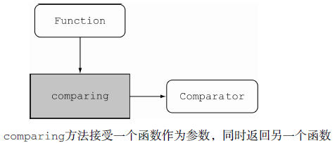
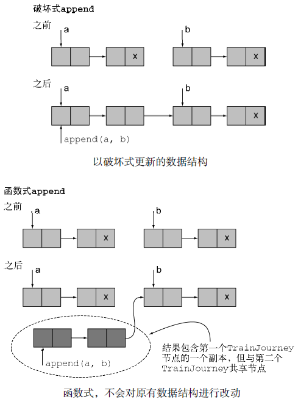
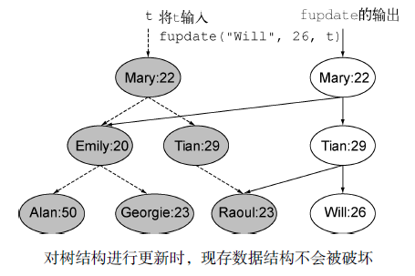
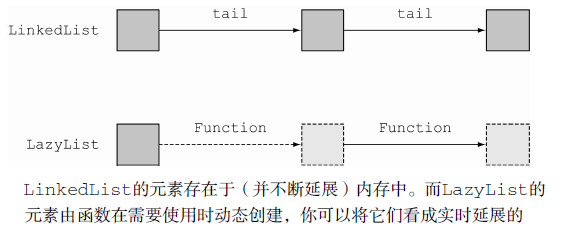

# 函数式编程的技巧 #

[1.无处不在的函数](#无处不在的函数)

[1.1.高阶函数](#高阶函数)

[1.2.副作用和高阶函数](#副作用和高阶函数)

[1.3.科里化](#科里化)

[1.4.科里化的理论定义](#科里化的理论定义)

[2.持久化数据结构](#持久化数据结构)

[2.1.破坏式更新和函数式更新的比较](#破坏式更新和函数式更新的比较)

[2.2.另一个使用Tree的例子](#另一个使用tree的例子)

[2.3.采用函数式的方法](#采用函数式的方法)

[3.Stream的延迟计算](#stream的延迟计算)

[3.1.自定义Stream](#自定义stream)

[3.1.1.第一步：构造由数字组成的Stream](#第一步构造由数字组成的stream)

[3.1.2.第二步：取得首元素](#第二步取得首元素)

[3.1.3.第三步：对尾部元素进行筛选](#第三步对尾部元素进行筛选)

[3.1.4.第四步：递归地创建由质数组成的Stream](#第四步递归地创建由质数组成的stream)

[3.1.5.坏消息](#坏消息)

[3.1.6.延迟计算](#延迟计算)

[3.2.创建你自己的延迟列表](#创建你自己的延迟列表)

[3.2.1.一个基本的链接列表](#一个基本的链接列表)

[3.2.2.一个基础的延迟列表](#一个基础的延迟列表)

[3.2.3.回到生成质数](#回到生成质数)

[3.2.4.实现一个延迟筛选器](#实现一个延迟筛选器)

[3.2.5.何时使用](#何时使用)

[4.模式匹配](#模式匹配)

[4.1.访问者设计模式](#访问者设计模式)

[4.2.用模式匹配力挽狂澜](#用模式匹配力挽狂澜)

[4.2.1.Java中的伪模式匹配](#java中的伪模式匹配)

[5.杂项](#杂项)

[5.1.缓存或记忆表](#缓存或记忆表)

[5.2.“返回同样的对象”意味着什么](#返回同样的对象意味着什么)

[5.3.结合器](#结合器)

[6.小结](#小结)

## 无处不在的函数 ##

术语“函数式编程”意指函数或者方法的行为应该像“数学函数”一样——
没有任何副作用。

对于使用函数式语言的程序员而言，这个术语的范畴更加宽泛，它还意味着函数可以像任何其他值一样随意使用：可以作为参数传递，可以作为返回值，还能存储在数据结构中。

能够像普通变量一样使用的函数称为**一等函数**（first-class function）。这是Java 8补充的全新内容：通过::操作符，你可以创建一个方法引用，像使用函数值一样使用方法，也能使用Lambda表达式（比如，(int x) -> x + 1）直接表示方法的值。Java 8中使用下面这样的方法引用将一个方法引用保存到一个变量是合理合法的：

	Function<String, Integer> strToInt = Integer::parseInt;

### 高阶函数 ###

目前为止，我们使用函数值属于一等这个事实只是为了将它们传递给Java 8的流处理操作），达到行为参数化的效果。

	Comparator<Apple> c = comparing(Apple::getWeight);

	Function<String, String> transformationPipeline
		= addHeader.andThen(Letter::checkSpelling)
		.andThen(Letter::addFooter);

函数式编程的世界里，如果函数，比如Comparator.comparing，能满足下面任一要求就可以被称为**高阶函数**（higher-order function）：

- 接受至少一个函数作为参数
- 返回的结果是一个函数

这些都和Java 8直接相关。因为Java 8中，函数不仅可以作为参数传递，还可以作为结果返回，能赋值给本地变量，也可以插入到某个数据结构。比如，一个**袖珍计算器的程序**可能有这样的一个Map<String, Function<Double, Double&gt;&gt;，它将字符串sin映射到方法Function<Double,
Double&gt;，实现对Math::sin的方法引用。

**微积分示例** 接受一个函数作为参数（比如，
(Double x) -> x \* x），又返回一个函数作为结果（这个例子中返回值是(Double x) -> 2 * x），你可以用不同的方式实现类型定义，如下所示：

	Function<Function<Double,Double>, Function<Double,Double>>

我们把它定义成Function类型（最左边的Function），目的是想显式地向你确认可以将这个函数传递给另一个函数。但是，最好使用差异化的类型定义，函数签名如下：

	Function<Double,Double> differentiate(Function<Double,Double> func)

其实二者说的是同一件事。

### 副作用和高阶函数 ###

我们了解到传递给流操作的函数应该是无副作用的，否则会发生各种各样的问题（比如错误的结果，有时由于竞争条件甚至会产生我们无法预期的结果）。**这一原则在你使用高阶函数时也同样适用**。编写高阶函数或者方法时，你无法预知会接收什么样的参数——一旦传入的参数有某些副作用，我们将会一筹莫展！

如果作为参数传入的函数可能对你程序的状态产生某些无法预期的改变，一旦发生问题，你将很难理解程序中发生了什么；它们甚至会用某种难于调试的方式调用你的代码。因此，将所有你愿意接收的作为参数的函数可能带来的副作用以文档的方式记录下来是一个不错的设计原则，最理想的情况下你接收的函数参数应该没有任何副作用！

### 科里化 ###

Currying

>科里化的概念最早由俄国数学家Moses Schönfinkel引入，而后由著名的数理逻辑学家哈斯格尔·科里（Haskell Curry）丰富和发展，科里化由此得名。它表示一种将一个带有n元组参数的函数转换成n个一元函数链的方法。

它是一种可以帮助你模块化函数、提高代码重用性的技术。

应用程序通常都会有国际化的需求，将一套单位转换到另一套单位是经常碰到的问题。

单位转换通常都会涉及转换因子以及基线调整因子的问题。比如，将摄氏度转换到华氏度的
公式是CtoF(x) = x*9/5 + 32。

所有的单位转换几乎都遵守下面这种模式：

1. 乘以转换因子
2. 如果需要，进行基线调整

你可以使用下面这段通用代码表达这一模式：

	static double converter(double x, double f, double b) {
		return x * f + b;
	}

这里x是你希望转换的数量，f是转换因子，b是基线值。但是这个方法有些过于宽泛了。通常，你还需要在同一类单位之间进行转换，比如公里和英里。当然，你也可以在每次调用converter方法时都使用3个参数，但是每次都提供转换因子和基准比较繁琐，并且你还极有可能输入错误。

>PS.与初中学的一次函数y = kx + b类似。

当然，你也可以为每一个应用编写一个新方法，不过这样就无法对底层的逻辑进行复用。这里我们提供一种简单的解法，它既能充分利用已有的逻辑，又能让converter针对每个应用进行定制。

你可以定义一个“工厂”方法，它生产带一个参数的转换方法，我们希望借此来说明科里化。下面是这段代码：

	static DoubleUnaryOperator curriedConverter(double f, double b){
		return (double x) -> x * f + b;
	}

现在，你要做的只是向它传递转换因子和基准值（f和b），它会不辞辛劳地按照你的要求返回一个方法（使用参数x）。比如，你现在可以按照你的需求使用工厂方法产生你需要的任何converter：

	DoubleUnaryOperator convertCtoF = curriedConverter(9.0/5, 32);
	DoubleUnaryOperator convertUSDtoGBP = curriedConverter(0.6, 0);
	DoubleUnaryOperator convertKmtoMi = curriedConverter(0.6214, 0);

由于DoubleUnaryOperator定义了方法applyAsDouble，你可以像下面这样使用你的converter：

	double gbp = convertUSDtoGBP.applyAsDouble(1000);

这样一来，你的代码就更加灵活了，同时它又复用了现有的转换逻辑！让我们一起回顾下你都做了哪些工作。你并没有一次性地向converter方法传递所有的参数x、f和b，相反，你只是使用了参数f和b并返回了另一个方法，这个方法会接收参数x，最终返回你期望的值x * f + b。通过这种方式，你复用了现有的转换逻辑，同时又为不同的转换因子创建了不同的转换方法。

### 科里化的理论定义 ###

科里化是一种将具备2个参数（比如，x和y）的函数f转化为使用一个参数的函数g，并且这个函数的返回值也是一个函数，它会作为新函数的一个参数。后者的返回值和初始函数的返回值相同，即f(x,y) = (g(x))(y)。

当然，我们可以由此推出：你可以将一个使用了6个参数的函数科里化成一个接受第2、4、6号参数，并返回一个接受5号参数的函数，这个函数又返回一个接受剩下的第1号和第3号参数的函数。

一个函数使用所有参数仅有部分被传递时，通常我们说这个函数是部分应用的（partially applied）。

## 持久化数据结构 ##

这一主题有各种名称，比如函数式数据结构、不可变数据结构，不过最常见的可能还要算持久化数据结构（不幸的是，这一术语和数据库中的持久化概念有一定的冲突，数据库中它代表的是“生命周期比程序的执行周期更长的数据”）。

应该注意的第一件事是，**函数式方法不允许修改任何全局数据结构或者任何作为参数传入的参数**。为什么呢？因为一旦对这些数据进行修改，两次相同的调用就很可能产生不同的结构——这违背了引用透明性原则，我们也就无法将方法简单地看作由参数到结果的映射。

### 破坏式更新和函数式更新的比较 ###

[PersistentTrainJourney](PersistentTrainJourney.java)

假设你需要使用一个可变类TrainJourney（利用一个简单的**单向链接**列表实现）表示从A地到B地的火车旅行，你使用了一个整型字段对旅程的一些细节进行建模，比如当前路途段的价格。旅途中你需要换乘火车，所以需要使用几个由onward字段串联在一起的TrainJourney对象；直达火车或者旅途最后一段对象的onward字段为null：

	class TrainJourney {
		public int price;
		public TrainJourney onward;
		public TrainJourney(int p, TrainJourney t) {
			price = p;
			onward = t;
		}
	}

假设你有几个相互分隔的TrainJourney对象分别代表从X到Y和从Y到Z的旅行。你希望创建一段新的旅行，它能将两个TrainJourney对象串接起来（即从X到Y再到Z）。

一种方式是采用简单的传统命令式的方法将这些火车旅行对象链接起来，

	static TrainJourney link(TrainJourney a, TrainJourney b){
		if (a==null) return b;
		TrainJourney t = a;
		while(t.onward != null){
			t = t.onward;
		}
		t.onward = b;
		return a;
	}

这就出现了一个问题：假设变量firstJourney包含了从X地到Y地的线路，另一个变量secondJourney包含了从Y地到Z地的线路。如果你调用link(firstJourney, secondJourney)方法， 这段代码会破坏性地更新firstJourney ， 结果secondJourney 也会加被入到firstJourney，最终请求从X地到Z地的用户会如其所愿地看到整合之后的旅程，不过从X地到Y地的旅程也被破坏性地更新了。

**这之后，变量firstJourney就不再代表从X到Y的旅程，而是一个新的从X到Z的旅程了**！ 这一改动会导致依赖原先的firstJourney 代码失效！ 假设firstJourney表示的是清晨从伦敦到布鲁塞尔的火车，这趟车上后一段的乘客本来打算要去布鲁塞尔，可是发生这样的改动之后他们莫名地多走了一站，最终可能跑到了科隆。现在你大致了解了数据结构修改的可见性会导致怎样的问题了，作为程序员，我们一直在与这种缺陷作斗争。

**函数式编程解决这一问题的方法是禁止使用带有副作用的方法**。如果你需要使用表示计算结果的数据结果，那么请创建它的一个副本而不要直接修改现存的数据结构。这一最佳实践也适用于标准的面向对象程序设计。

不过，对这一原则，也存在着一些异议，比较常见的是认为这样做会导致过度的对象复制，有些程序员会说“我会记住那些有副作用的方法”或者“我会将这些写入文档”。但这些都不能解决问题，这些坑都留给了接受代码维护工作的程序员。采用函数式编程方案的代码如下：

	static TrainJourney append(TrainJourney a, TrainJourney b){
		return a==null ? b : new TrainJourney(a.price, append(a.onward, b));
	}

很明显，这段代码是函数式的（它没有做任何修改，即使是本地的修改），它没有改动任何现存的数据结构。**不过，也请特别注意**，这段代码有一个特别的地方，它并未创建整个新TrainJourney对象的副本——如果a是n个元素的序列，b是m个元素的序列，那么调用这个函数后，它返回的是一个由n+m个元素组成的序列，这个序列的前n个元素是新创建的，而后m个元素和TrainJourney对象b是共享的。**另外，也请注意**，用户需要确保不对append操作的结果进行修改，因为一旦这样做了，作为参数传入的TrainJourney对象序列b就可能被破坏。下图解释说明了破坏式append和函数式append之间的区别。

### 另一个使用Tree的例子 ###

[PersistentTree](PersistentTree.java)

我们想讨论的对象是二叉查找树，它也是HashMap实现类似接口的方式。我们的设计中Tree包含了String类型的键，以及int类型的键值，它可能是名字或者年龄：

	class Tree {
		private String key;
		private int val;
		private Tree left, right;
		public Tree(String k, int v, Tree l, Tree r) {
			key = k; val = v; left = l; right = r;
		}
	}

	class TreeProcessor {
		public static int lookup(String k, int defaultval, Tree t) {
			if (t == null) return defaultval;
			if (k.equals(t.key)) return t.val;
			return lookup(k, defaultval,
				k.compareTo(t.key) < 0 ? t.left : t.right);
		}
		// 处理Tree的其他方法
	}

你希望通过二叉查找树找到String值对应的整型数。现在，我们想想你该如何更新与某个键对应的值（**简化起见，我们假设键已经存在于这个树中了**）：

	public static void update(String k, int newval, Tree t) {
		if (t == null) { /* 应增加一个新的节点 */ }
		else if (k.equals(t.key)) t.val = newval;
		else update(k, newval, k.compareTo(t.key) < 0 ? t.left : t.right);
	}

对这个例子，增加一个新的节点会复杂很多；最简单的方法是让update直接返回它刚遍历的树（除非你需要加入一个新的节点，否则返回的树结构是不变的）。现在，这段代码看起来已经有些臃肿了（因为update试图对树进行原地更新，它返回的是跟传入的参数同样的树，但是如果最初的树为空，那么新的节点会作为结果返回）。

	public static Tree update(String k, int newval, Tree t) {
		if (t == null)
			t = new Tree(k, newval, null, null);
		else if (k.equals(t.key))
			t.val = newval;
		else if (k.compareTo(t.key) < 0)
			t.left = update(k, newval, t.left);
		else
			t.right = update(k, newval, t.right);
		return t;
	}

注意，这两个版本的update都会对现有的树进行修改，这意味着使用树存放映射关系的所有用户都会感知到这些修改。

### 采用函数式的方法 ###

如何通过函数式的方法解决呢？你需要为新的键-值对创建一个新的节点，除此之外你还需要创建从树的根节点到新节点的路径上的所有节点。通常而言，这种操作的代价并不太大，如果树的深度为d，并且保持一定的平衡性，那么这棵树的节点总数是2^d，这样你就只需要重新创建树的一小部分节点了。

    public static Tree fupdate(String k, int newval, Tree t) {
        return (t == null) ?
            new Tree(k, newval, null, null) :
             k.equals(t.key) ?
               new Tree(k, newval, t.left, t.right) :
          k.compareTo(t.key) < 0 ?
            new Tree(t.key, t.val, fupdate(k,newval, t.left), t.right) :
            new Tree(t.key, t.val, t.left, fupdate(k,newval, t.right));
    }

这段代码中，我们通过一行语句进行的条件判断，没有采用if-then-else这种方式，目的是希望强调一个思想，那就是该函数体仅包含一条语句，**没有任何副作用**。不过你也可以按照自己的习惯，使用if-then-else这种方式，在每一个判断结束处使用return返回。

那么，update 和fupdate之间的区别到底是什么呢？

我们注意到，前文中方法update有这样一种假设，即每一个update的用户都希望共享同一份数据结构，也希望能了解程序任何部分所做的更新。因此，无论任何时候，只要你使用非函数式代码向树中添加某种形式的数据结构，请立刻创建它的一份副本，因为谁也不知道将来的某一天，某个人会突然对它进行修改，这一点非常重要（不过也经常被忽视）。

与之相反，fupdate是纯函数式的。它会创建一个新的树，并将其作为结果返回，通过参数的方式实现共享。下图对这一思想进行了阐释。你使用了一个树结构，树的每个节点包含了person对象的姓名和年龄。调用fupdate不会修改现存的树，它会在原有树的一侧创建新的节点，同时保证不损坏现有的数据结构。

这种函数式数据结构通常被称为持久化的——数据结构的值始终保持一致，不受其他部分变化的影响——这样，作为程序员的你才能确保fupdate不会对作为参数传入的数据结构进行修改。不过要达到这一效果还有一个附加条件：这个约定的另一面是，**所有使用持久化数据结构的用户都必须遵守这一“不修改”原则**。如果不这样，忽视这一原则的程序员很有可能修改fupdate的结果（比如，修改Emily的年纪为20岁）。这会成为一个例外（也是我们不期望发生的）事件，为所有使用该结构的方法感知，并在之后修改作为参数传递给fupdate的数据结构。

通过这些介绍，我们了解到fupdate可能有更加高效的方式：基于“不对现存结构进行修改”规则，对仅有细微差别的数据结构（比如，用户A看到的树结构与用户B看到的就相差不多），我们可以考虑对这些通用数据结构使用共享存储。你可以凭借编译器，将Tree类的字段key、val、left以及right声明为final执行，“**禁止对现存数据结构的修改**”这一规则；不过我们也需要注意final只能应用于类的字段，无法应用于它指向的对象，如果你想要对对象进行保护，你需要将其中的字段声明为final，以此类推。

---

你可能会说：“我希望对树结构的更新对某些用户可见（当然，这句话的潜台词是其他人看不到这些更新）。”那么，要实现这一目标，你可以通过两种方式：

1. 第一种是典型的Java解决方案（对对象进行更新时，你需要特别小心，慎重地考虑是否需要在改动之前保存对象的一份副本）。
2. 另一种是函数式的解决方案：逻辑上，你在做任何改动之前都会创建一份新的数据结构（这样一来就不会有任何的对象发生变更），只要确保按照用户的需求传递给他正确版本的数据结构就好了。
 
这一想法甚至还可以通过API直接强制实施。如果数据结构的某些用户需要进行可见性的改动，它们应该调用API，返回最新版的数据结构。对于另一些客户应用，它们不希望发生任何可见的改动（比如，需要长时间运行的统计分析程序），就直接使用它们保存的备份，因为它知道这些数据不会被其他程序修改。

有些人可能会说这个过程很像更新刻录光盘上的文件，刻录光盘时，一个文件只能被激光写入一次，该文件的各个版本分别被存储在光盘的各个位置（智能光盘编辑软件甚至会共享多个不同版本之间的相同部分），你可以通过传递文件起始位置对应的块地址（或者名字中编码了版本信息的文件名）选择你希望使用哪个版本的文件。Java中，情况甚至比刻录光盘还好很多，不再使用的老旧数据结构会被Java虚拟机自动垃圾回收掉。

## Stream的延迟计算 ##

### 自定义Stream ###

理解递归式Stream的思想

	public static Stream<Integer> primes(int n) {
		return Stream.iterate(2, i -> i + 1)
			.filter(MyMathUtils::isPrime)
			.limit(n);
	}
	public static boolean isPrime(int candidate) {
		int candidateRoot = (int) Math.sqrt((double) candidate);
		return IntStream.rangeClosed(2, candidateRoot)
					.noneMatch(i -> candidate % i == 0);
	}

不过这一方案看起来有些笨拙：你每次都需要遍历每个数字，查看它能否被候选数字整除（实际上，你只需要测试那些已经被判定为质数的数字）。

理想情况下，Stream应该实时地筛选掉那些能被质数整除的数字。这听起来有些异想天开，不过我们一起看看怎样才能达到这样的效果。

1. 你需要一个由数字构成的Stream，你会在其中选择质数。
2. 你会从该Stream中取出第一个数字（即Stream的首元素），它是一个质数（初始时，这个值是2）。
3. 紧接着你会从Stream的尾部开始，筛选掉所有能被该数字整除的元素。
4. 最后剩下的结果就是新的Stream，你会继续用它进行质数的查找。本质上，你还会回到第一步，继续进行后续的操作，所以这个算法是递归的。

#### 第一步：构造由数字组成的Stream ####

	static Intstream numbers(){
		return IntStream.iterate(2, n -> n + 1);
	}

#### 第二步：取得首元素 ####

	static int head(IntStream numbers){
		return numbers.findFirst().getAsInt();
	}

#### 第三步：对尾部元素进行筛选 ####

	static IntStream tail(IntStream numbers){
		return numbers.skip(1);
	}

	IntStream numbers = numbers();
	int head = head(numbers);
	IntStream filtered = tail(numbers).filter(n -> n % head != 0);

#### 第四步：递归地创建由质数组成的Stream ####

	static IntStream primes(IntStream numbers) {
		int head = head(numbers);
		return IntStream.concat(
				IntStream.of(head),
				primes(tail(numbers).filter(n -> n % head != 0))
			);
	}

#### 坏消息 ####

不幸的是，如果执行步骤四中的代码，你会遭遇如下这个错误：“java.lang.IllegalStateException:stream has already been operated upon or closed.”实际上，你正试图使用两个终端操作：findFirst和skip将Stream切分成头尾两部分。一旦你对Stream执行一次终端操作调用，它就永久地终止了！

#### 延迟计算 ####

除此之外，该操作还附带着一个更为严重的问题： 静态方法IntStream.concat接受两个Stream实例作参数。但是，由于第二个参数是primes方法的直接递归调用，最终会导致出现无限递归的状况。然而，对大多数的Java应用而言，Java 8在Stream上的这一限制，即“不允许递归定义”是完全没有影响的，使用Stream后，数据库的查询更加直观了，程序还具备了并发的能力。

所以，Java 8的设计者们进行了很好的平衡，选择了这一皆大欢喜的方案。不过，Scala和Haskell这样的函数式语言中Stream所具备的通用特性和模型仍然是你编程武器库中非常有益的补充。你需要一种方法推迟primes中对concat的第二个参数计算。**如果用更加技术性的程序设计术语来描述，我们称之为延迟计算、非限制式计算或者名调用**。

Scala（提供了对这种算法的支持。在Scala中，你可以用下面的方式重写前面的代码，操作符#::实现了延迟连接的功能（只有在你实际需要使用Stream时才对其进行计算）：

	def numbers(n: Int): Stream[Int] = n #:: numbers(n+1)
	def primes(numbers: Stream[Int]): Stream[Int] = {
		numbers.head #:: primes(numbers.tail filter (n -> n % numbers.head != 0))
	}

看不懂这段代码？完全没关系。我们展示这段代码的目的只是希望能让你了解Java和其他的函数式编程语言的区别。

在Java语言中，你执行一次方法调用时，传递的所有参数在第一时间会被**立即**计算出来。

但是，在Scala中，通过#::操作符，连接操作会**立刻**返回，而元素的计算会推迟到实际计算需要的时候才开始。我们需要通过Java实现延迟列表。

### 创建你自己的延迟列表 ###

[LazyLists](LazyLists.java)

Java 8的Stream以其延迟性而著称。它们被刻意设计成这样，即**延迟操作**，有其独特的原因：Stream就像是一个黑盒，它接收请求生成结果。当你向一个 Stream发起一系列的操作请求时，这些请求只是被一一保存起来。只有当你向Stream发起一个终端操作时，才会实际地进行计算。

这种设计具有显著的优点，特别是你需要对Stream进行多个操作时（你有可能先要进行filter操作，紧接着做一个map，最后进行一次终端操作reduce）；这种方式下Stream只需要遍历一次，不需要为每个操作遍历一次所有的元素。

延迟列表，它是一种更加通用的Stream形式（延迟列表构造了一个跟Stream非常类似的概念）。延迟列表同时还提供了一种极好的方式去理解高阶函数；你可以将一个函数作为值放置到某个数据结构中，大多数时候它就静静地待在那里，一旦对其进行调用（即根据需要），它能够创建更多的数据结构。

下面解释了这一思想。

#### 一个基本的链接列表 ####

	interface MyList<T> {
		T head();

		MyList<T> tail();

		default boolean isEmpty() {
			return true;
		}

		MyList<T> filter(Predicate<T> p);
	}

	static class MyLinkedList<T> implements MyList<T> {
		final T head;
		final MyList<T> tail;

		public MyLinkedList(T head, MyList<T> tail) {
			this.head = head;
			this.tail = tail;
		}

		public T head() {
			return head;
		}

		public MyList<T> tail() {
			return tail;
		}

		public boolean isEmpty() {
			return false;
		}

		public MyList<T> filter(Predicate<T> p) {
			return isEmpty() ? this : 
				p.test(head()) ? new MyLinkedList<>(head(), tail().filter(p)) : tail().filter(p);
		}
	}

	static class Empty<T> implements MyList<T> {
		public T head() {
			throw new UnsupportedOperationException();
		}

		public MyList<T> tail() {
			throw new UnsupportedOperationException();
		}

		public MyList<T> filter(Predicate<T> p) {
			return this;
		}
	}

可以构造一个示例的MyLinkedList值

	MyList<Integer> l = new MyLinkedList<>(5, new MyLinkedList<>(10, new Empty<Integer>()));

#### 一个基础的延迟列表 ####

	static class LazyList<T> implements MyList<T> {
		final T head;
		final Supplier<MyList<T>> tail;

		public LazyList(T head, Supplier<MyList<T>> tail) {
			this.head = head;
			this.tail = tail;
		}

		public T head() {
			return head;
		}

		public MyList<T> tail() {
			return tail.get();
		}

		public boolean isEmpty() {
			return false;
		}

		public MyList<T> filter(Predicate<T> p) {
			return isEmpty() ? this
					: p.test(head()) ? new LazyList<>(head(), () -> tail().filter(p)) : tail().filter(p);
		}

	}

可以像下面那样传递一个Supplier作为LazyList的构造器的tail参数，创建由数字构成的无限延迟列表了，该方法会创建一系列数字中的下一个元素：

	public static LazyList<Integer> from(int n) {
		return new LazyList<Integer>(n, () -> from(n+1));
	}

下面的代码执行会打印输出“2 3 4”

	LazyList<Integer> numbers = from(2);
	int two = numbers.head();
	int three = numbers.tail().head();
	int four = numbers.tail().tail().head();
	System.out.println(two + " " + three + " " + four);

#### 回到生成质数 ####

	public static MyList<Integer> primes(MyList<Integer> numbers) {
		return new LazyList<>(numbers.head(), 
				() -> primes(numbers.tail().filter(n -> n % numbers.head() != 0)));
	}

#### 实现一个延迟筛选器 ####

	public MyList<T> filter(Predicate<T> p) {
		return isEmpty() ? this : 
			p.test(head()) ? new LazyList<>(head(), () -> tail().filter(p)) : tail().filter(p);
	}

你可以计算出头三个质数：

	numbers = from(2);
	int prime_two = primes(numbers).head();
	int prime_three = primes(numbers).tail().head();
	int prime_five = primes(numbers).tail().tail().head();
	System.out.println(prime_two + " " + prime_three + " " + prime_five);

可以打印输出所有的质数

	static <T> void printAll(MyList<T> numbers) {
		if (numbers.isEmpty()) {
			return;
		}
		System.out.println(numbers.head());
		printAll(numbers.tail());
	}

这个程序不会永久地运行下去；它最终会由于栈溢出而失效，

#### 何时使用 ####

哪些实际的场景可以使用这些技术呢？好吧，你已经了解了如何向数据结构中插入函数（因为Java 8允许你这么做），这些函数可以用于按需创建数据结构的一部分，现在你不需要在创建数据结构时就一次性地定义所有的部分。

如果你在编写游戏程序，比如棋牌类游戏，你可以定义一个数据结构，它在形式上涵盖了由所有可能移动构成的一个树（这些步骤要在早期完成计算工作量太大），具体的内容可以在运行时创建。最终的结果是一个**延迟树**，而不是一个延迟列表。关注延迟列表，原因是它可以和Java 8的另一个新特性Stream串接起来，我们能够针对性地讨论Stream和延迟列表各自的优缺点。

---

还有一个问题就是**性能**。我们很容易得出结论，延迟操作的性能会比提前操作要好——仅在程序需要时才计算值和数据结构当然比传统方式下一次性地创建所有的值（有时甚至比实际需求更多的值）要好。不过，实际情况并非如此简单。完成延迟操作的开销，比如 LazyList中每个元素之间执行额外Suppliers调用的开销，有可能超过你猜测会带来的好处，除非你仅仅只访问整个数据结构的10%，甚至更少。

最后，还有一种微妙的方式会导致你的LazyList并非真正的延迟计算。如果你遍历LazyList中的值，比如from(2)，可能直到第10个元素，这种方式下，它会创建每个节点两次，最终创建20个节点，而不是10个。这几乎不能被称为延迟计算。问题在于每次实时访问LazyList的元素时，tail中的Supplier**都会被重复调用**；你可以设定tail中的Supplier方法仅在第一次实时访问时才执行调用，从而修复这一问题——计算的结果会**缓存**起来——效果上对列表进行了增强。要实现这一目标，你可以在LazyList的定义中添加一个私有的Optional<LazyList<T&gt;&gt;类型字段alreadyComputed，tail方法会依据情况查询及更新该字段的值。纯函数式语言Haskell就是以这种方式确保它所有的数据结构都恰当地进行了延迟。

---

我们推荐的原则是将延迟数据结构作为你编程兵器库中的强力武器。如果它们能让程序设计更简单，就尽量使用它们。如果它们会带来无法接受的性能损失，就尝试以更加传统的方式重新实现它们。

## 模式匹配 ##

[PatternMatching](PatternMatching.java)

函数式编程中还有另一个重要的方面，那就是（结构式）模式匹配。**不要将这个概念和正则表达式中的模式匹配相混淆**。

	f(0) = 1
	f(n) = n*f(n-1) otherwise

不过在Java语言中，你只能通过if-then-else语句或者switch语句实现。随着数据类型变得愈加复杂，需要处理的代码（以及代码块）的数量也在迅速攀升。使用模式匹配能有效地减少这种混乱的情况。

为了说明，我们先看一个树结构，你希望能够遍历这一整棵树。我们假设使用一种简单的数学语言，它包含数字和二进制操作符：

	class Expr { ... }
	class Number extends Expr { int val; ... }
	class BinOp extends Expr { String opname; Expr left, right; ... }

假设你需要编写方法简化一些表达式。比如，5 + 0可以简化为5。使用我们的域语言，new BinOp("+", new Number(5), new Number(0))可以简化为Number(5)。你可以像下面这样遍历Expr结构：

	Expr simplifyExpression(Expr expr) {
		if (expr instanceof BinOp
			&& ((BinOp)expr).opname.equals("+"))
			&& ((BinOp)expr).right instanceof Number
			&& ... // 变得非常笨拙
			&& ... ) {
			return (Binop)expr.left;
		}
		...
	}

你可以预期这种方式下代码会迅速地变得**异常丑陋，难于维护**。

### 访问者设计模式 ###

Java语言中还有另一种方式可以解包数据类型，那就是使用访问者（Visitor）设计模式。本质上，使用这种方法你需要创建一个单独的类，这个类封装了一个算法，可以“访问”某种数据类型。

它是如何工作的呢？访问者类接受某种数据类型的实例作为输入。它可以访问该实例的所有成员。下面是一个例子，通过这个例子我们能了解这一方法是如何工作的。首先，你需要向BinOp添加一个accept方法，它接受一个SimplifyExprVisitor作为参数，并将自身传递给它（你还需要为Number添加一个类似的方法）：

	class BinOp extends Expr{
		...
		public Expr accept(SimplifyExprVisitor v){
			return v.visit(this);
		}
	}

SimplifyExprVisitor现在就可以访问BinOp对象并解包其中的内容了：

	public class SimplifyExprVisitor {
		...
		public Expr visit(BinOp e){
			if("+".equals(e.opname) && e.right instanceof Number && …){
				return e.left;
			}
			return e;
		}
	}

### 用模式匹配力挽狂澜 ###

通过一个名为模式匹配的特性，我们能以更简单的方案解决问题。这种特性目前在Java语言中暂时还不提供，所以我们会以Scala程序设计语言的一个小例子来展示模式匹配的强大威力。

假设数据类型Expr代表的是某种数学表达式，在Scala程序设计语言中（我们采用Scala的原因是它的语法与Java非常接近），你可以利用下面的这段代码解析表达式：

	def simplifyExpression(expr: Expr): Expr = expr match {
		case BinOp("+", e, Number(0)) => e // 加0
		case BinOp("*", e, Number(1)) => e // 乘以1
		case BinOp("/", e, Number(1)) => e // 除以1
		case _ => expr // 不能简化expr
	}

模式匹配为操纵类树型数据结构提供了一个极其详细又极富表现力的方式。构建编译器或者处理业务规则的引擎时，这一工具尤其有用。注意，Scala的语法

	Expression match { case Pattern => Expression ... }

和Java的语法非常相似：

	switch (Expression) { case Constant : Statement ... }

Scala的通配符判断和Java中的default:扮演这同样的角色。这二者之间主要的语法区别在于**Scala是面向表达式的**，而**Java则更多地面向语句**，不过，对程序员而言，它们主要的区别是Java中模式的判断标签被限制在了某些基础类型、枚举类型、封装基础类型的类以及String类型。

使用支持模式匹配的语言实践中能带来的最大的好处在于，你可以避免出现大量嵌套的switch或者if-then-else语句和字段选择操作相互交织的情况。

非常明显，Scala的模式匹配在表达的难易程度上比Java更胜一筹，你只能期待未来版本的Java能支持更具表达性的switch语句。

与此同时，让我们看看如何凭借Java 8的Lambda以另一种方式在Java中实现类模式匹配。

我们在这里介绍这一技巧的目的**仅仅是**想让你了解Lambda另一个有趣的应用。

#### Java中的伪模式匹配 ####

首先，让我们看看Scala的模式匹配特性提供的匹配表达式有多么丰富。比如下面这个例子：

	def simplifyExpression(expr: Expr): Expr = expr match {
		case BinOp("+", e, Number(0)) => e
		...

它表达的意思是：“检查expr是否为BinOp，抽取它的三个组成部分（opname、left、right），紧接着对这些组成部分分别进行模式匹配——第一个部分匹配String+，第二个部分匹配变量e（它总是匹配），第三个部分匹配模式Number(0)。”

换句话说，Scala（以及很多其他的函数式语言）中的模式匹配是多层次的。**我们使用Java 8的Lambda表达式进行的模式匹配模拟只会提供一层的模式匹配**；以前面的这个例子而言，这意味着它只能覆盖BinOp(op, l, r)或者Number(n)这种用例，无法顾及BinOp("+", e, Number(0))。

首先，我们做一些稍微让人惊讶的观察。由于你选择使用Lambda，原则上你的代码里不应该使用if-then-else。你可以使用方法调用

	myIf(condition, () -> e1, () -> e2);

取代condition ? e1 : e2这样的代码。

在某些地方，比如库文件中，你可能有这样的定义（使用了通用类型T）:

	static <T> T myIf(boolean b, Supplier<T> truecase, Supplier<T> falsecase) {
		return b ? truecase.get() : falsecase.get();
	}

类型T扮演了条件表达式中结果类型的角色。原则上，你可以用if-then-else完成类似的事儿。

当然，**正常情况下用这种方式会增加代码的复杂度，让它变得愈加晦涩难懂**，因为用if-then-else就已经能非常顺畅地完成这一任务，这么做似乎有些杀鸡用牛刀的嫌疑。不过，我们也注意到，Java的switch和if-then-else无法完全实现模式匹配的思想，而Lambda表达式能以简单的方式实现单层的模式匹配——对照使用if-then-else链的解决方案，这种方式要简洁得多。

回来继续讨论类Expr的模式匹配值，Expr类有两个子类，分别为BinOp和Number，你可以定义一个方法patternMatchExpr（同样，我们在这里会使用泛型T，用它表示模式匹配的结果类型）：

	interface TriFunction<S, T, U, R>{
		R apply(S s, T t, U u);
	}

	static <T> T patternMatchExpr(
				Expr e,
				TriFunction<String, Expr, Expr, T> binopcase,
				Function<Integer, T> numcase,
				Supplier<T> defaultcase) {
		return
		(e instanceof BinOp) ?
			binopcase.apply(((BinOp)e).opname, ((BinOp)e).left, 
			((BinOp)e).right) :
		(e instanceof Number) ?
			numcase.apply(((Number)e).val) :
			defaultcase.get();
	}

最终的结果是，方法调用

	patternMatchExpr(e, (op, l, r) -> {return binopcode;},
							(n) -> {return numcode;},
							() -> {return defaultcode;});

会判断e是否为BinOp类型（如果是，会执行binopcode方法，它能够通过标识符op、l和r访问BinOp的字段），是否为Number类型（如果是，会执行numcode方法，它可以访问n的值）。这个方法还可以返回defaultcode，如果有人在将来某个时刻创建了一个树节点，它既不是BinOp类型，也不是Number类型，那就会执行这部分代码。

下面这段代码通过简化的加法和乘法表达式展示了如何使用patternMatchExpr。

    private static void simplify() {
        TriFunction<String, Expr, Expr, Expr> binopcase =
                (opname, left, right) -> {
                    if ("+".equals(opname)) {
                        if (left instanceof Number && ((Number) left).val == 0) {
                            return right;
                        }
                        if (right instanceof Number && ((Number) right).val == 0) {
                            return left;
                        }
                    }
                    if ("*".equals(opname)) {
                        if (left instanceof Number && ((Number) left).val == 1) {
                            return right;
                        }
                        if (right instanceof Number && ((Number) right).val == 1) {
                            return left;
                        }
                    }
                    return new BinOp(opname, left, right);
                };
        Function<Integer, Expr> numcase = val -> new Number(val);
        Supplier<Expr> defaultcase = () -> new Number(0);

        Expr e = new BinOp("+", new Number(5), new Number(0));
        Expr match = patternMatchExpr(e, binopcase, numcase, defaultcase);
        if (match instanceof Number) {
            System.out.println("Number: " + match);
        } else if (match instanceof BinOp) {
            System.out.println("BinOp: " + match);
        }
    }

你可以通过下面的方式调用简化的方法：

	Expr e = new BinOp("+", new Number(5), new Number(0));
	Expr match = simplify(e);
	System.out.println(match);

## 杂项 ##

### 缓存或记忆表 ###

假设你有一个无副作用的方法computeNumberOfNodes(Range)，它会计算一个树形网络中给定区间内的节点数目。让我们假设，该网络不会发生变化，即该结构是不可变的，然而调用computeNumberOfNodes方法的代价是非常昂贵的，因为该结构需要执行递归遍历。

不过，你可能需要多次地计算该结果。如果你能保证引用透明性，那么有一种聪明的方法可以避免这种冗余的开销。解决这一问题的一种比较标准的解决方案是使用记忆表（memoization）——为方法添加一个封装器，在其中加入一块缓存（比如，利用一个HashMap）——封装器被调用时，首先查看缓存，看请求的“（参数，结果）对”是否已经存在于缓存，如果已经存在，那么方法直接返回缓存的结果；否则，你会执行computeNumberOfNodes调用，不过从封装器返回之前，你会将新计算出的“（参数，结果）对”保存到缓存中。严格地说，这种方式并非纯粹的函数式解决方案，因为它会修改由多个调用者共享的数据结构，不过这段代码的封装版本的确是引用透明的。

>PS.空间换时间

	final Map<Range,Integer> numberOfNodes = new HashMap<>();
	Integer computeNumberOfNodesUsingCache(Range range) {
		Integer result = numberOfNodes.get(range);
		if (result != null){
			return result;
		}
		result = computeNumberOfNodes(range);
		numberOfNodes.put(range, result);
		return result;
	}

Java 8改进了Map接口，提供了一个名为computeIfAbsent的方法处理这样的情况。你可以用下面的方式调用computeIfAbsent方法，帮助你编写结构更加清晰的代码：

	Integer computeNumberOfNodesUsingCache(Range range) {
		return numberOfNodes.computeIfAbsent(range,
			this::computeNumberOfNodes);
	}

很明显，方法computeNumberOfNodesUsingCache是引用透明的（我们假设computeNumberOfNodes也是引用透明的）。不过，事实上numberOfNodes处于可变共享状态，并且HashMap也没有同步，这意味这该段代码**不是线程安全的**。如果多个核对numberOfNodes执行并发调用，即便不用HashMap，而是用（由锁保护的）Hashtable或者（并发无锁的）ConcurrentHashMap，可能都无法达到预期的性能，因为这中间又存在由于发现某个值不在Map中，需要将对应的“（参数，结果）对”插回到Map而引起的条件竞争。这意味着多个核上的进程可能算出的结果相同，又都需要将其加入到Map中。

从刚才讨论的各种纠结中，我们能得到的最大收获可能是，一旦并发和可变状态的对象揉到一起，它们引起的复杂度要远超我们的想象，而函数式编程能从根本上解决这一问题。当然，这也有一些例外，比如出于底层性能的优化，可能会使用缓存，而这可能会有一些影响。另一方面，如果不使用缓存这样的技巧，如果你以函数式的方式进行程序设计，那就完全不必担心你的方法是否使用了正确的同步方式，因为你清楚地知道它没有任何共享的可变状态。

### “返回同样的对象”意味着什么 ###

让我们在次回顾一下1二叉树的例子。变量t指向了一棵现存的树，依据该图，调用fupdate(fupdate("Will",26, t)会生成一个新的树，这里我们假设该树会被赋值给变量t2。。现在，假设你在新增的赋值操作中执行一次字面上和上一操作完全相同的调用，如下所示：

	t3 = fupdate("Will", 26, t);

这时t会指向第三个新创建的节点，该节点包含了和t2一样的数据。好，问题来了：fupdate是否符合引用透明性原则呢？引用透明性原则意味着“使用相同的参数（即这个例子的情况）产生同样的结果”。问题是t2和t3属于不同的对象引用，所以(t2==t3)这一结论并不成立，这样说起来你只能得出一个结论：fupdate并不符合引用透明性原则。

虽然如此，使用不会改动的持久化数据结构时，**t2和t3在逻辑上并没有差**别。 对于这一点我们已经辩论了很长时间，不过最简单的概括可能是函数式编程通常不使用==（引用相等），**而是使用equal对数据结构值进行比较**，由于数据没有发生变更，所以这种模式下fupdate是引用透明的。

>PS.需要覆盖hashCode()

### 结合器 ###

函数式编程时编写高阶函数是非常普通而且非常自然的事。高阶函数接受两个或多个函数，并返回另一个函数，实现的效果在某种程度上类似于将这些函数进行了结合。术语结合器通常用于描述这一思想。Java 8中的很多API都受益于这一思想，比如CompletableFuture类中的thenCombine方法。该方法接受两个CompletableFuture方法和一个BiFunction方法，返回另一个CompletableFuture方法。

虽然深入探讨函数式编程中结合器的特性已经超出了本书的范畴，了解结合器使用的一些特例还是非常有价值的，它能让我们切身体验函数式编程中构造接受和返回函数的操作是多么普通和自然。下面这个方法就体现了函数组合（function composition）的思想：

	static <A,B,C> Function<A,C> compose(Function<B,C> g, Function<A,B> f) {
		return x -> g.apply(f.apply(x));
	}

它接受函数f和g作为参数，并返回一个函数，实现的效果是先做f，接着做g。你可以接着用这种方式定义一个操作，通过结合器完成内部迭代的效果。让我们看这样一个例子，你希望接受一个参数，并使用函数f连续地对它进行操作（比如n次），类似循环的效果。我们将你的操作命名为repeat，它接受一个参数f，f代表了一次迭代中进行的操作，它返回的也是一个函数，返回的函数会在n次迭代中执行。像下面这样一个方法调用

	repeat(3, (Integer x) -> 2 * x);

形成的效果是x -> (2 \* (2 \* (2 \* x)))或者x -> 8 \* x。

你可以通过下面这段代码进行测试：

	System.out.println(repeat(3, (Integer x) -> 2*x).apply(10));

输出的结果是80。

你可以按照下面的方式编写repeat方法

	static <A> Function<A,A> repeat(int n, Function<A,A> f) {
		return n==0 ? x -> x : compose(f, repeat(n-1, f));
	}

## 小结 ##

- 一等函数是可以作为参数传递，可以作为结果返回，同时还能存储在数据结构中的函数。
- 高阶函数接受至少一个或者多个函数作为输入参数，或者返回另一个函数的函数。Java中典型的高阶函数包括comparing、andThen和compose。
- 科里化是一种帮助你模块化函数和重用代码的技术。
- 持久化数据结构在其被修改之前会对自身前一个版本的内容进行备份。因此，使用该技术能避免不必要的防御式复制。
- Java语言中的Stream不是自定义的。
- 延迟列表是Java语言中让Stream更具表现力的一个特性。延迟列表让你可以通过辅助方法（supplier）即时地创建列表中的元素，辅助方法能帮忙创建更多的数据结构。
- 模式匹配是一种函数式的特性，它能帮助你解包数据类型。它可以看成Java语言中switch语句的一种泛化。
- 遵守“引用透明性”原则的函数，其计算结构可以进行缓存。
- 结合器是一种函数式的思想，它指的是将两个或多个函数或者数据结构进行合并。
